# 嵌入式学习笔记

## 前言

学习51单片机也好，32单片机也好，都是需要

数据结构学习推荐：https://www.bilibili.com/video/BV1Fv4y1f7T1/?spm_id_from=333.1007.top_right_bar_window_custom_collection.content.click&vd_source=11229edcf13f6771b9da6563ab9a19ff

Git仓库（代码都在这里）：https://gitee.com/hadikh/reference-code

立创天空星资料：https://wiki.lckfb.com/zh-hans/tkx/tkx-stm32f407vxt6/beginner/download.html

学习嵌入式可以参加的比赛：蓝桥杯（单片机组和嵌入式组），一般不推荐嵌入式组，单片机组更容易进国赛；嵌入式芯片设计大赛：物联网大赛：全国电子设计大赛：

这里列举的不全，只是本人参加过的一些比赛而已。

## 第一部分：工程建立

### keil5+cubemx安装

安装教程：https://blog.csdn.net/m0_74056439/article/details/142500127?ops_request_misc=%257B%2522request%255Fid%2522%253A%2522dac2d49554d42360d7f4f5171127201d%2522%252C%2522scm%2522%253A%252220140713.130102334.pc%255Fall.%2522%257D&request_id=dac2d49554d42360d7f4f5171127201d&biz_id=0&utm_medium=distribute.pc_search_result.none-task-blog-2~all~first_rank_ecpm_v1~rank_v31_ecpm-2-142500127-null-null.142
**这里有一点需要注意：电脑用户名称不能是中文，否侧后续使用会有各种奇怪的BUG，具体查看方法如下**，解决办法，淘宝30块找人解决。

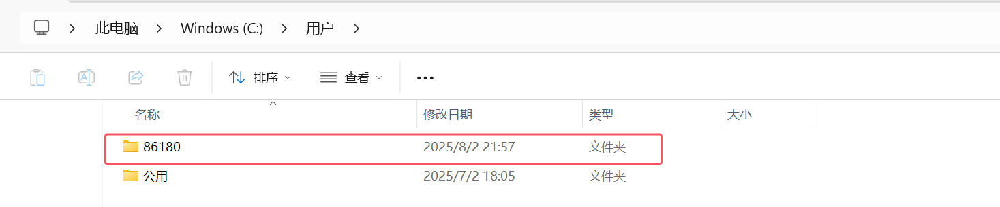

### cubemx配置

我这里使用STM32F407VET6为例，其他型号的单片机（STM32）配置过程大差不差。

这里说明一下，你使用不同的芯片，需要下载不同的芯片资料包，如果你觉得下载太慢，也可以从本地导入，至于这个本地导入的芯片资料从那里来，就要自己想一下办法了，这里附上本地导入的方法。


当你导入资料包之后，点击
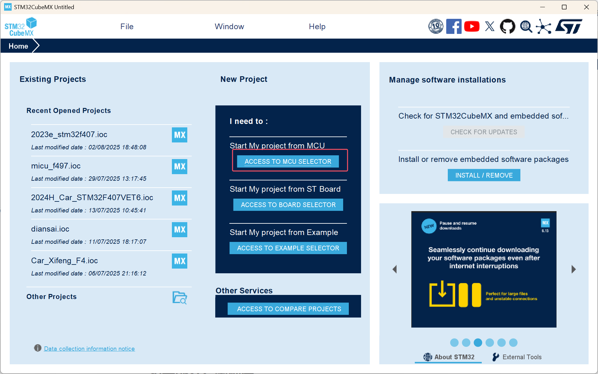

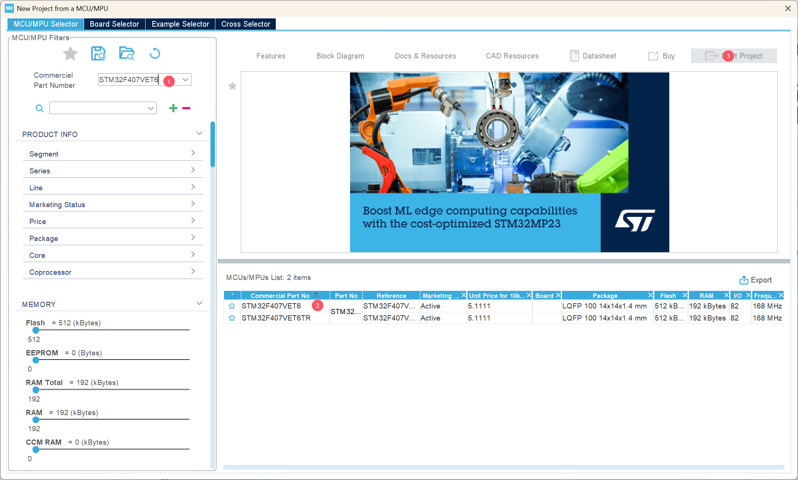

进入芯片图形化界面之后，首先需要配置**时钟**和**调试模式**

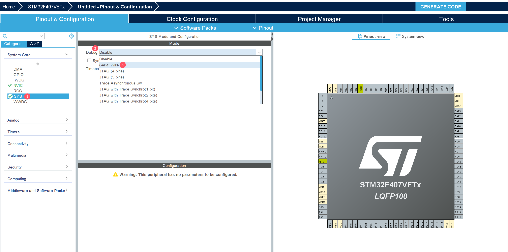

配置高速时钟，如果后续需要使用到RTC的话，可以按同样的方法配置低速时钟
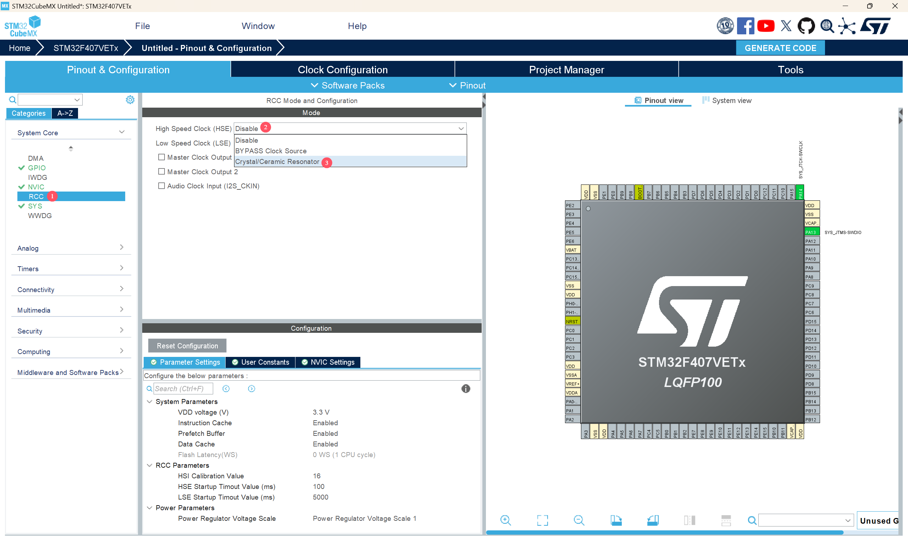

这里配置好之后，需要点一下回车，软件会把你红色的部分自动修改（并非指红色序号）

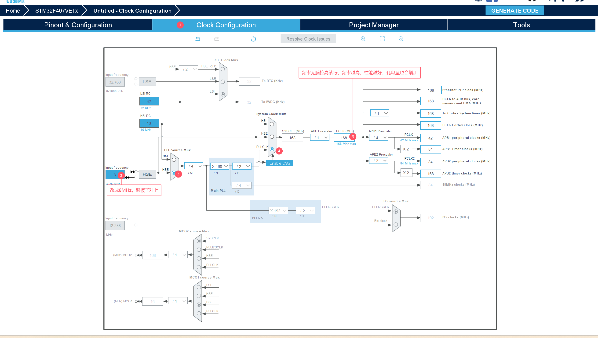

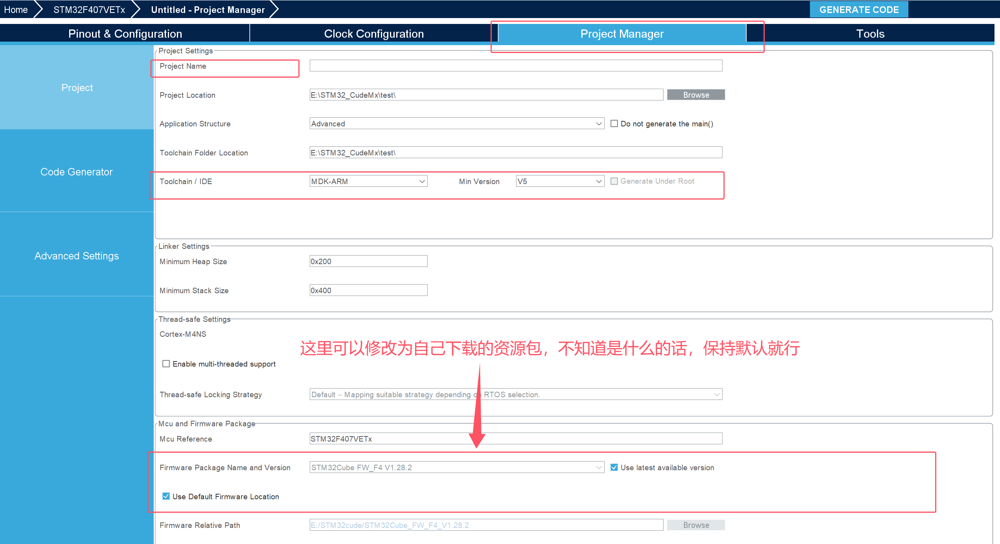

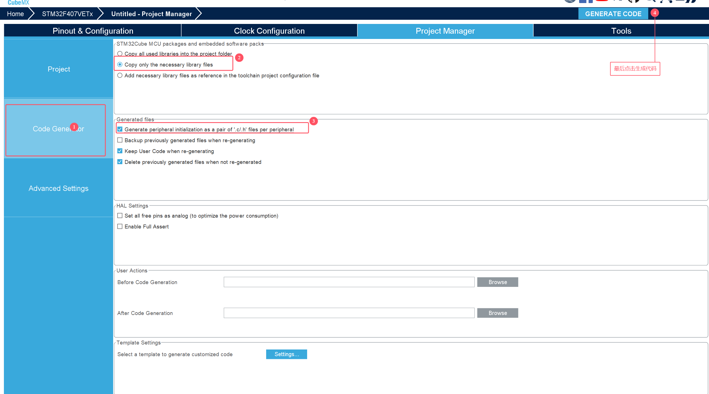

### keil5配置

首先点击魔法棒，勾选微库，配置文件路径，配置下载器。

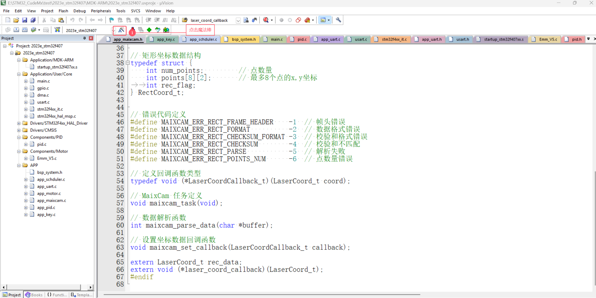

第二步，勾选微库

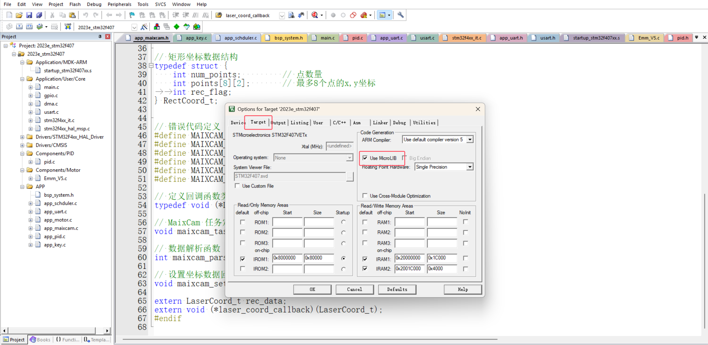

第三步，添加文件夹路径
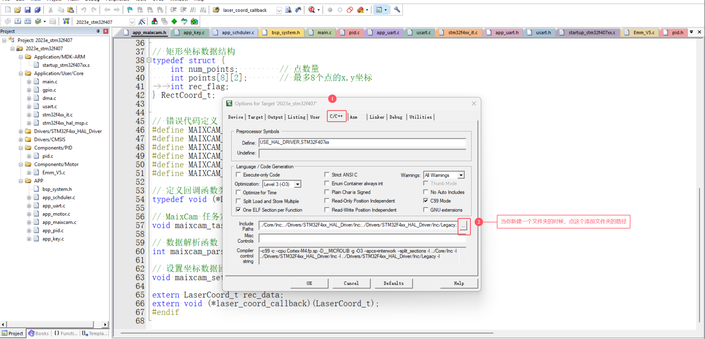

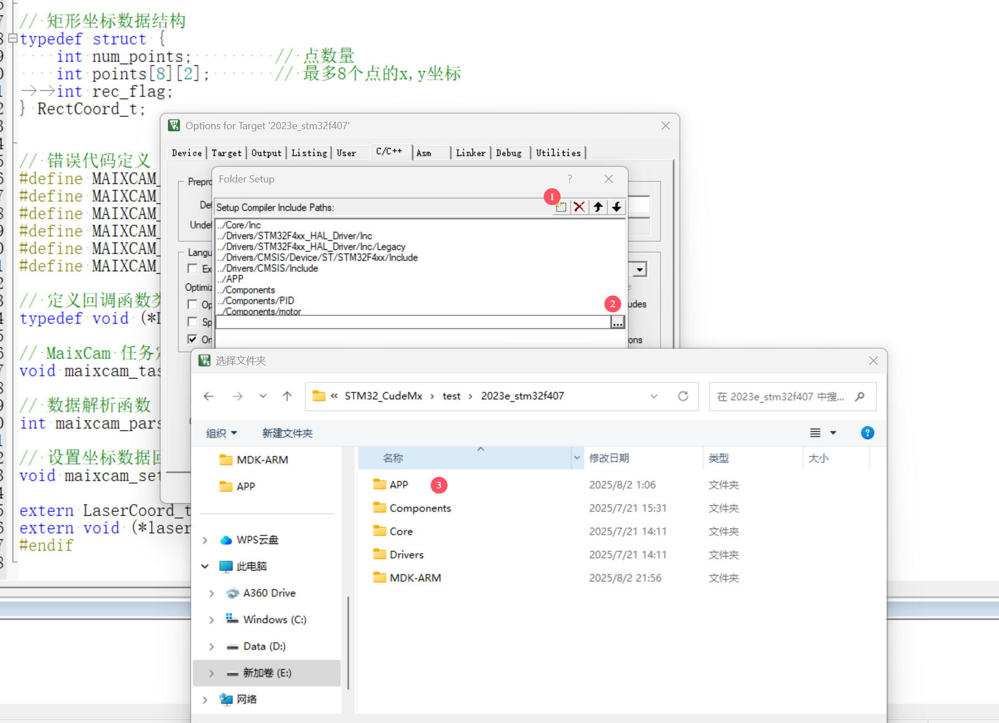

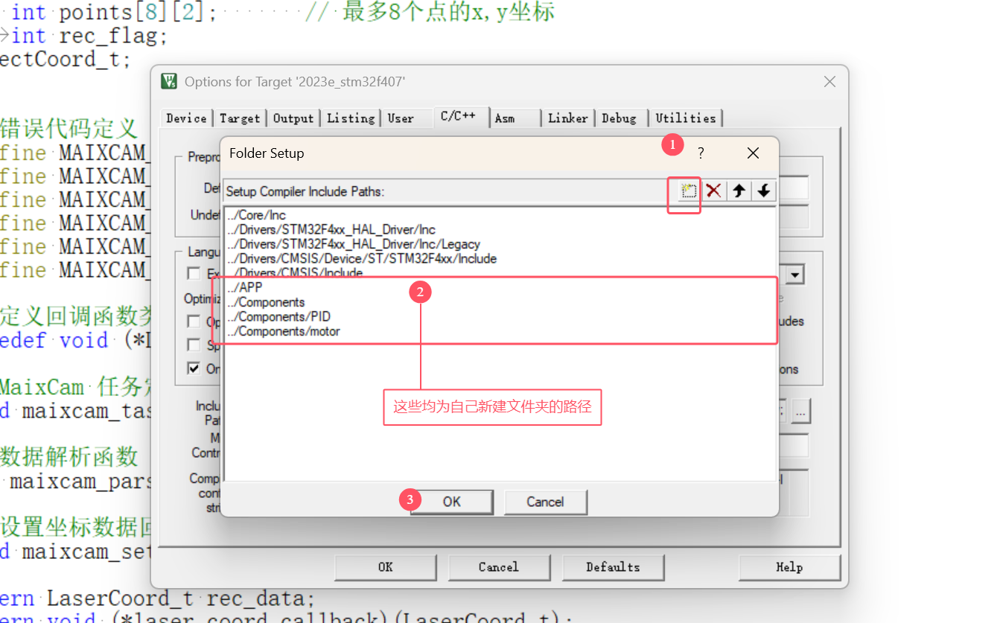

第四步，烧录器配置

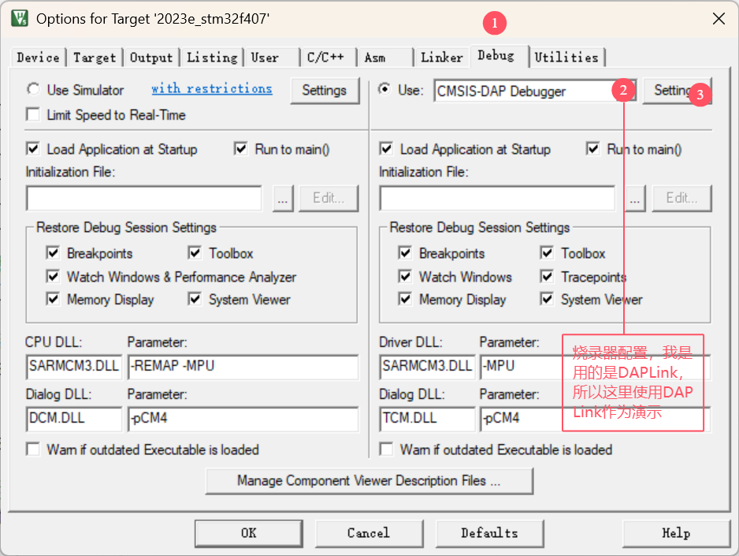

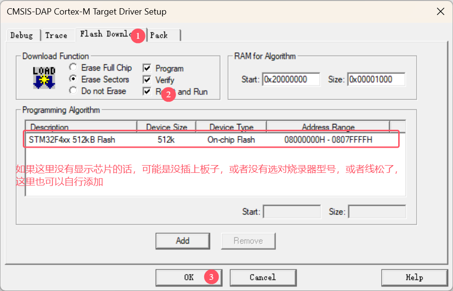

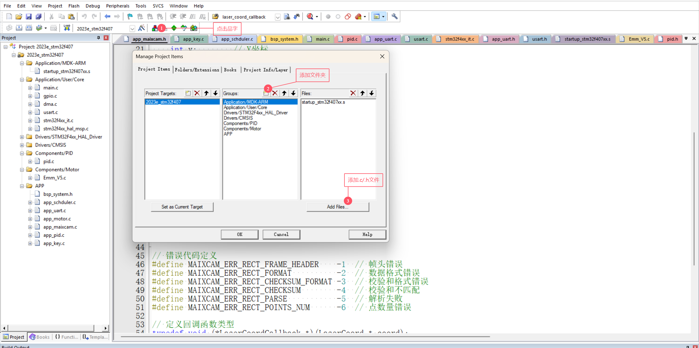

点击编译

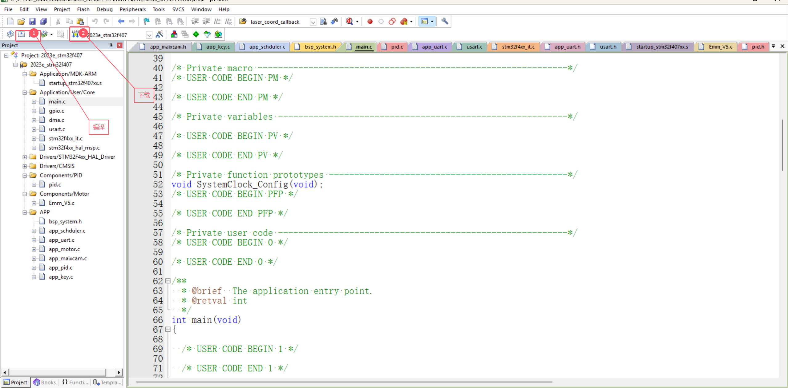

编译没有问题之后，这里简单介绍一下由cubemx创建的main.c文件的结构，通常包含了系统的主要程序流程和初始化配置。对于如何组织和写入自己的代码，有些规范的区域被预留了，通常是为了保证代码的可维护性、模块化以及与自动生成的代码的兼容性。我们可以分几个部分来了解如何使用这些区域：

1. **头文件的包含**

```c
/* USER CODE BEGIN Includes */
#include "bsp_system.h"
/* USER CODE END Includes */
```

- **目的**：这部分用于包含你的项目中所需要的额外头文件。比如，你自己编写的硬件抽象层（BSP）或者驱动程序等。
- **为什么要在这里写**：`USER CODE BEGIN Includes` 和 `USER CODE END Includes` 标记了可以自由修改的区域。在这些区域内写头文件不会影响到自动生成的初始化代码，避免头文件引入的冲突。

2. **私有变量的定义**

```c
/* USER CODE BEGIN PV */

/* USER CODE END PV */
```

- **目的**：这里通常定义私有的全局变量，用于保存你自己项目中的状态信息或硬件配置。
- **为什么要在这里写**：在 `USER CODE BEGIN PV` 和 `USER CODE END PV` 内定义变量，避免和自动生成的变量冲突，并保持代码结构的清晰。

3. **私有函数原型**

```c
/* USER CODE BEGIN PFP */

/* USER CODE END PFP */
```

- **目的**：这个区域可以定义一些私有的函数原型，供 `main.c` 文件内部调用使用。你可以在这里声明你自己实现的辅助函数。
- **为什么要在这里写**：这样做可以保证函数原型与自动生成的函数配置不冲突，也保持代码的清晰与模块化。

4. **用户自定义代码区域**

```c
/* USER CODE BEGIN 0 */

/* USER CODE END 0 */
```

- **目的**：这个区域通常是用户自定义的代码区域，你可以在这里编写代码，比如系统初始化、硬件控制等。通常在 `main()` 函数初始化后，会放一些自定义的硬件初始化或操作代码。
- **为什么要在这里写**：此区域被明确标注为用户代码区域。因为 `USER CODE BEGIN 0` 和 `USER CODE END 0` 会被 STM32CubeMX 工具自动识别，这样即使你重新生成代码，你的自定义代码也会被保留。

5. **主程序逻辑**

```c
/* USER CODE BEGIN 1 */

/* USER CODE END 1 */
```

- **目的**：这个区域是 `main()` 函数中的用户自定义代码位置。你可以在这里进行系统初始化，调用各类外设的初始化函数，启动任务等。
- **为什么要在这里写**：在这里写代码可以确保你的自定义逻辑不会被 STM32CubeMX 重新生成代码时覆盖。

6. **外设初始化后**

```c
/* USER CODE BEGIN 2 */

/* USER CODE END 2 */
```

- **目的**：这里通常放置在外设初始化之后的自定义代码，比如启动外设、处理外设状态等。
- **为什么要在这里写**：这部分代码是在外设初始化后运行的，所以你可以在此处编写控制外设的代码。

7. **无限循环部分**

```c
/* USER CODE BEGIN WHILE */

/* USER CODE END WHILE */
```

- **目的**：这个部分是 `while(1)` 无限循环中的用户自定义代码位置。可以在这里编写你的任务调度或执行周期性任务的代码。
- **为什么要在这里写**：通过在这里编写代码，你可以确保代码不会被重新生成时覆盖。并且代码清晰地分离了系统初始化与实际运行逻辑。

8. **其他区域**

```c
/* USER CODE BEGIN 3 */

/* USER CODE END 3 */
```

- **目的**：这个区域通常是 `main()` 函数中 `while` 循环外的其他自定义代码位置。你可以在这里放置一些额外的控制逻辑或者周期性操作。
- **为什么要在这里写**：这个区域为你提供了更细粒度的自定义代码插入点，避免了对其他功能区域的干扰。

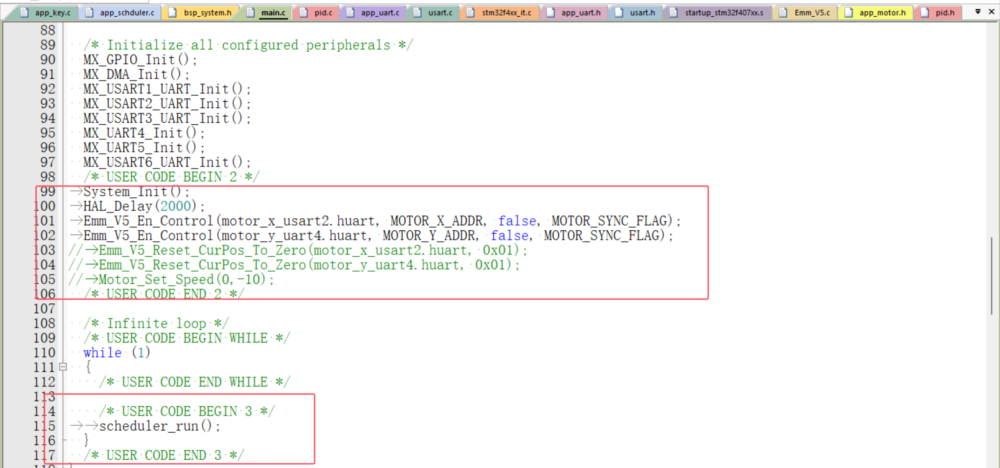

说了那么多，环境也配置好了，接下来应该知道51单片机和32单片机的区别

### 有何区别

51 单片机和 STM32 单片机分别代表两种不同的微控制器架构，它们在性能、功能、开发环境等方面有显著的差异。下面我们来详细比较这两种单片机：

1. **架构与核心**

- **51 单片机**：基于 8 位架构，采用的是 **8051** 微处理器的核心（如 AT89 系列），有一些衍生品。
  - **处理器位宽**：8 位，即每次处理的数据为 8 位。
  - **速度**：工作频率一般较低（通常在 12MHz 到 50MHz 之间）。
  - **内存**：通常较小，RAM 和 ROM 存储有限。
  - **处理能力**：适合处理一些较简单的任务，低功耗且较为成熟稳定。
- **STM32 单片机**：基于 **ARM Cortex-M** 内核，具有 32 位架构（如 STM32F1、STM32F4、STM32H7 等系列）。
  - **处理器位宽**：32 位，每次处理的数据为 32 位。
  - **速度**：工作频率可以高达几百 MHz，性能远远超过 51 单片机。
  - **内存**：提供更大的内存，通常具备更丰富的 RAM 和 Flash 存储。
  - **处理能力**：适合复杂计算、大量数据处理、实时控制等，具备更多外设和高效的中断处理。

2. **性能差异**

- **51 单片机**：计算能力较弱，适合一些低速、低功耗的应用场合。处理速度相对较慢，执行简单的控制任务、数据采集和处理。
- **STM32 单片机**：高性能，支持浮点运算、复杂算法、图形处理等功能，适合需要高速度计算、数据处理、图像处理等的复杂应用。

3. **开发环境和工具**

- **51 单片机**：开发工具较为简单，许多开发者使用基于汇编语言或 C 语言的开发环境。常见的开发工具包括 Keil 和 SDCC。
- **STM32 单片机**：开发环境更现代，支持丰富的库和框架，通常使用 **STM32CubeMX** 和 **STM32CubeIDE** 等工具，开发者可以更快速地配置外设和生成代码。此外，STM32 支持更多的开发语言和库（如 HAL 库、FreeRTOS 等）。

4. **外设和功能**

- **51 单片机**：外设相对简单，通常提供 UART、I2C、SPI、PWM、ADC 等基本外设。每个外设接口的配置较为简单，但也较为局限。
- **STM32 单片机**：外设丰富，支持更多的高级外设，如高速 ADC、DAC、CAN、Ethernet、USB、LCD 控制器、硬件加速器（如加密模块、DSP、FPU）等。支持更多的通信协议，适合更复杂的项目。

5. **功耗**

- **51 单片机**：功耗低，适合一些低功耗应用，如传感器节点、简单控制系统等。
- **STM32 单片机**：也有低功耗模式，但由于其高性能，整体功耗通常高于 51 单片机，尤其在高频运行时。

6. **开发成本**

- **51 单片机**：成本较低，适合一些简单的、成本敏感的应用。
- **STM32 单片机**：虽然单片机本身的价格相对较高，但考虑到它提供的高性能和丰富外设，适合一些复杂项目的需求。

7. **应用领域**

- **51 单片机**：多用于简单的嵌入式应用，如小家电、学生实验、简单的控制系统等。
- **STM32 单片机**：广泛应用于汽车电子、工业自动化、智能家居、无人机、机器人、医疗设备等高性能要求的领域。

### ROM or RAM?

**既然上面提到ROM,RAM，那接下来就讲一下与这些有关的知识**

应用程序内存的一部分用于存储所有需要被执行的命令，另一部分存储全局变量，贯穿整个程序或者说应用程序的生命周期。存储器的一部分称为**栈**，用于存储所有有关函数的调用信息，存储所有局部变量。**堆**是不固定的，我们可以请求内存，程序运行从**堆**中读取数据，这就是**malloc**所做的事。

**RAM (Random-Access Memory)**：

- **是什么：**“随机存取存储器”。它的特点是**读写速度非常快**，可以随机访问任何一个存储单元，但它是**易失性**存储器。这意味着一旦单片机断电，RAM 中的所有内容都会立即丢失。
- **作用：** RAM 是单片机**运行程序时**用来存放**临时数据和变量**的地方。CPU 在执行程序时，需要频繁地读写数据，这些数据就存放在 RAM 中。
- **通常存放：**
  - **程序运行时产生的变量：** 包括全局变量、静态变量、局部变量（在堆栈上）。
  - **堆栈 (Stack)：** 函数调用时的返回地址、函数参数、局部变量等都存放在这里。
  - **堆 (Heap)：** 程序运行时动态申请的内存空间。
  - **临时缓冲区：** 比如接收或发送数据时的缓冲区、处理数据时的中间结果等。
  - **（部分或全部）程序代码：** 在某些高性能单片机或特定应用中，为了提高执行速度，会将 Flash 中的程序代码复制到 RAM 中执行。
- **类比：** 就像电脑的内存条，是程序运行时工作的地方，用来存放当前正在使用的数据和程序的一部分。

**ROM（Read-Only Memory）**

ROM（只读存储器）是一种非易失性存储器，通常用于存储程序代码和系统固件。它的特点是数据不可修改（或者说只能在特定情况下修改），即一旦数据写入后，除非有特定操作，否则无法改变内容。

**ROM的类型及作用**：

1. **Flash ROM (闪存)**：
   - **是什么**：是一种可以在电源关闭后保存数据的非易失性存储器，通常用于存储程序代码。在许多现代嵌入式系统中，Flash 被用作存储程序（固件）和配置信息。
   - **作用**：Flash 存储了嵌入式系统的 **应用程序代码**，这些代码在系统启动时被加载并执行。
   - **特点**：可以通过编程设备在需要时进行修改（例如固件更新），但相比于 RAM，它的 **读写速度较慢**。
2. **ROM（传统只读存储器）**：
   - **是什么**：ROM 是一种只允许读取的数据存储器，在制造时就写入了固定的数据，无法修改。常用于存储系统启动时需要执行的基本程序，如 **引导程序（Bootloader）**。
   - **作用**：ROM 常用于存储固定的系统启动代码、内核代码或一些不可更改的配置数据。
   - **特点**：读取速度较快，但无法修改数据。
3. **EPROM (可擦写可编程只读存储器)**：
   - **是什么**：EPROM 允许在特定条件下擦除并重新编程，通常使用紫外线擦除数据。EPROM 常用于开发阶段，用户可以修改代码。
   - **作用**：可用于存储系统固件和配置文件，但不常见于嵌入式应用中，因为擦除和重写过程较为复杂。
4. **EEPROM（电可擦除可编程只读存储器）**：
   - **是什么**：EEPROM 是一种可以通过电流进行数据擦除和重写的存储器。它比 EPROM 更容易编程和擦除。
   - **作用**：通常用于存储较小的、需要频繁更新的数据，如 **用户设置**、 **校准数据** 或 **配置参数**。其速度较慢，写入次数有限。

------

**ROM 在嵌入式系统中的作用**：

1. **存储应用程序代码**：
    ROM 主要用于存储嵌入式系统的 **应用程序代码**，即 CPU 启动时需要执行的命令。因为 ROM 是非易失性的，它的数据不会在系统断电后丢失。

   在嵌入式开发中，ROM 存储的程序代码是系统的核心部分，包括启动代码、操作系统内核和应用程序。每次系统启动时，CPU 会从 ROM 中读取并执行这些指令。

2. **存储系统引导程序（Bootloader）**：
    ROM 中存储的引导程序是嵌入式系统启动时的第一个程序，它负责初始化硬件并加载操作系统或应用程序。

3. **系统配置数据**：
    许多嵌入式系统使用 ROM 存储一些固定的配置数据，例如设备的出厂设置、硬件参数等。这些数据在设备运行期间是不会改变的，因此适合存储在 ROM 中。

4. **降低成本和功耗**：
    相比于 RAM，ROM 通常具备更低的功耗，且通常容量较小。它是嵌入式系统中存储不可变代码和配置的理想选择，因为它不需要消耗大量的能量来保持数据。

5. **不可篡改的安全性**：
    对于安全性要求较高的系统，ROM 可以用于存储加密密钥、授权码或防篡改的代码，因为 ROM 中的数据不可轻易修改，这为系统提供了一层保护。

------

**RAM 与 ROM 的区别**：

| 特性         | **RAM**                                              | **ROM**                                                      |
| ------------ | ---------------------------------------------------- | ------------------------------------------------------------ |
| **存储内容** | 临时数据和程序运行时的变量（如堆栈、堆、局部变量等） | 程序代码、引导程序、系统固件等                               |
| **可写性**   | 可读写，程序运行时频繁修改                           | 只读（传统 ROM）；可以擦写（EPROM/EEPROM）；可以编程（Flash） |
| **易失性**   | 易失性（断电后数据丢失）                             | 非易失性（断电后数据不会丢失）                               |
| **访问速度** | 非常快                                               | 较慢，尤其是传统 ROM                                         |
| **用途**     | 程序运行时存储临时数据、变量、堆栈、堆等             | 存储程序代码、固件、配置数据等                               |

------

**栈与堆的关系**：

在程序运行时，**栈（Stack）** 和 **堆（Heap）** 作为 RAM 中的两部分区域，用于存储不同类型的数据。它们的作用可以类比为不同的存储方式：

- **栈**：用于存储函数调用时的局部变量和函数的返回地址。当调用一个函数时，相关数据会被压入栈中，函数执行完毕后数据会从栈中弹出。栈的大小是固定的，一旦超出限制会发生栈溢出（Stack Overflow）。
- **堆**：用于动态分配内存，例如使用 `malloc`、`calloc` 等函数动态申请内存。堆的内存大小在运行时可以动态扩展，内存释放需要手动管理。如果管理不当，可能会发生内存泄漏。

**在cubemx中堆和栈的大小可以自行修改**

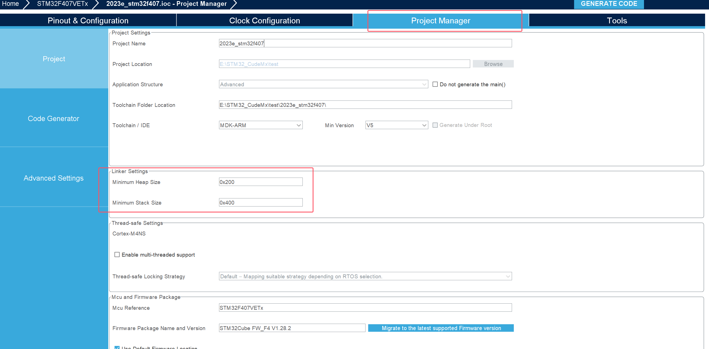

## 第二部分：基础篇

### GPIO

GPIO又称**通用输入输出**，可以配置为输出模式，输出模式，模拟输出模式，或者其它功能引脚，如下图所示。
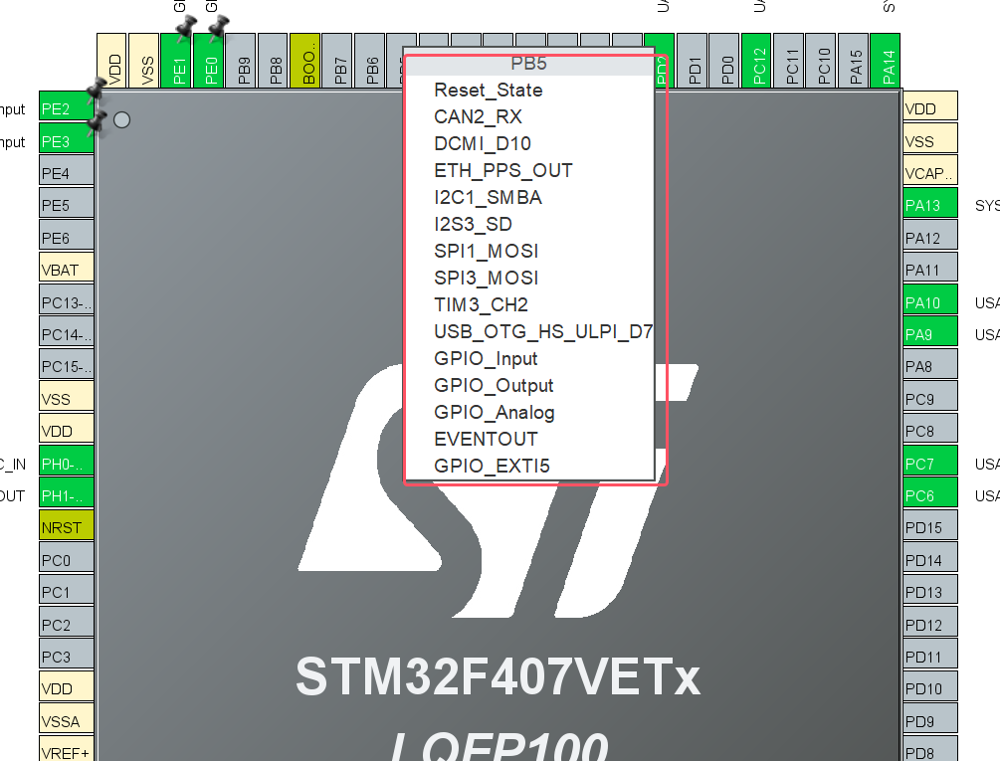

这里先学习GPIO的输入模式和输出模式，这两种模式通常用于按键（输入）或者灯（输出），学完这节，就可以达成成就“点灯大师”了。当然输入/输出模式不止用于这些场景，还可以用于导通MOS管来控制一个元件的开关，从而进入低功耗模式，这也是一种很常见的场景。这里就不多赘述。

我这里开发板使用的是嘉立创的天空星，相关资料可以从这里获取https://wiki.lckfb.com/zh-hans/tkx/tkx-stm32f407vxt6/beginner/key-principle.html，如果使用的是最小系统板加面包的话，可以自行参考下图进行连线，这张图可能比较乱。（这里的PA10和PA9是串口的接线，不用的话，可以不接）


这是我使用天空星的接线
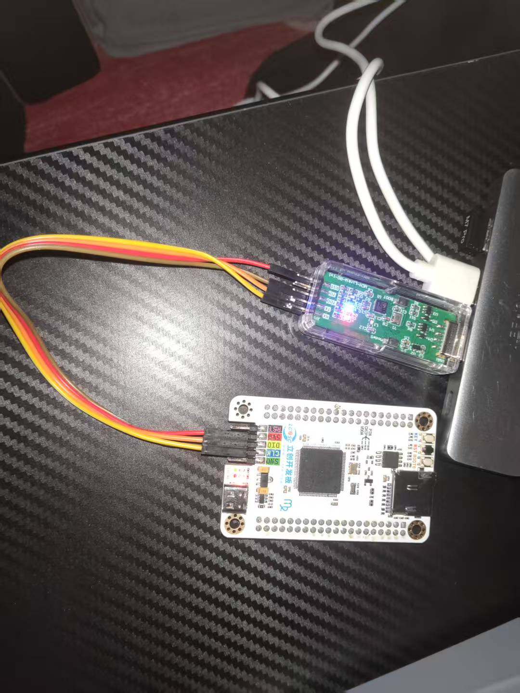

接下来进行软件上的配置，这里会先进行配置，然后再说明为什么这样配置，至于代码，我会在每个代码下放一个**README.md**的文档对代码进行解释，这里只会对HAL库中的一些API进行解释。

#### 软件配置

首先建立一个空白工程，这个空白工程按照第一部分配置进行，这个工程配置之后，可以一直使用，没必要每写一部分代码就建一个工程。

建立空白工程之后，就要使用GPIO对按键和灯进行操作，至于要使用那一个GPIO，最小系统板加面包板的用户可以自行决定，使用其它开发板的话，这个开发板一般是有一个按键和一个LED的，我这里以嘉立创的天空星为例。

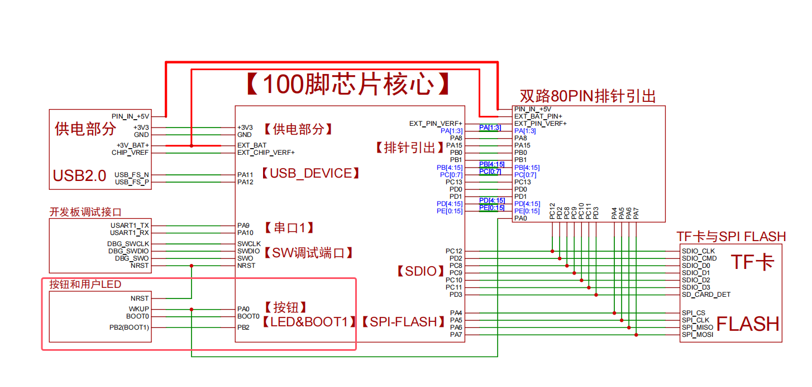

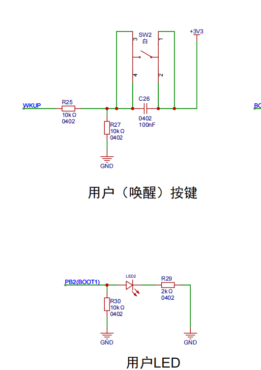

从原理图可以看出来，用户按键对应的是**PA0**，用户LED对应**PB2**，而且这两个GPIO是通过下拉电阻进行的一个接地连接，也就是默认是一个低电平的。

通过上面的原理图可以了解到，LED 灯的负极接到了电源地，LED 灯的正极连接到了单片机的 GPIO 口上，通过 LED 灯的驱动原理，只需要将 GPIO 配置为高电平即可点亮 LED 灯。对应用户 LED 就是使能 PB2 口输出高电平即可点亮用户 LED。（这段话复制于嘉立创的天空星开发文档）。从这里就可以看出LED是高电平点亮，低电平熄灭。

按键也是一个道理，按键没有按下，GPIO读取的是低电平，按键按下GPIO读取的是高电平。这里电容的作用是用于硬件消抖，至于为什么要消抖，可以自行查阅资料作为笔记，我们这里除了硬件消抖还使用了软件进行消抖，会在代码中进行体现。

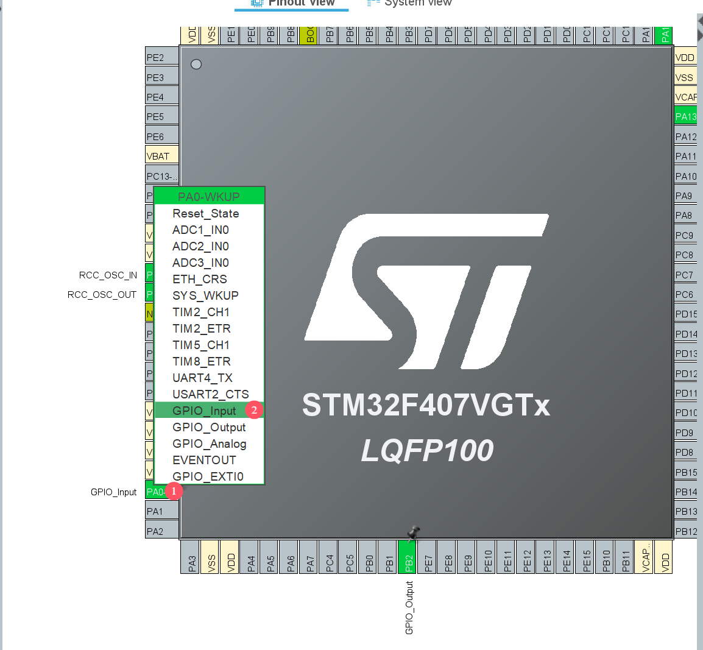

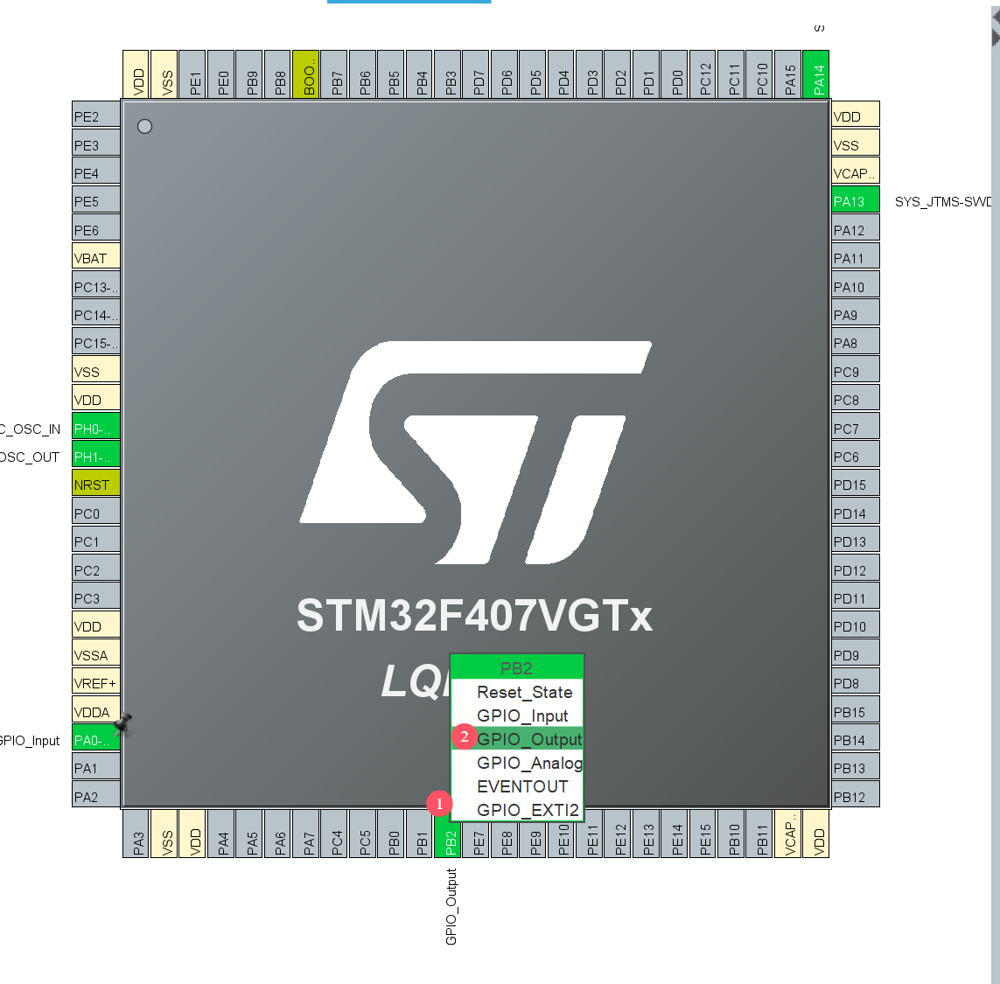

跟据原理图，我们将PA0配置为输入模式，将PB2配置为输出模式。

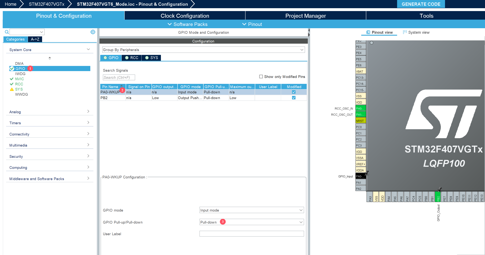

这里我们将PA0配置为**下拉输入**（因为原理图接的是下拉电阻）。

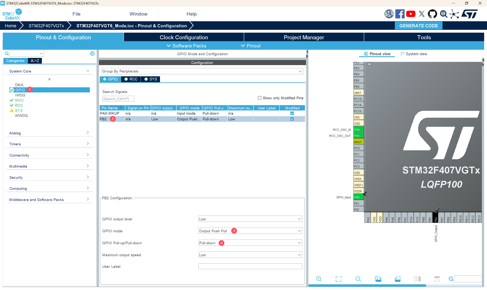

将PB2配置为**推挽输出**，初始电平为**低电平**（LED熄灭），同样配置为下拉模式。这里配置好之后，点击生成代码即可。

#### 知识补充

**GPIO Output Level（输出电平）**

- 仅对输出模式有效。
- `Low` 表示初始输出低电平（0V），`High` 表示初始输出高电平（VCC）。
- 例：`PB2` 设置为 `Low`，上电后就是低电平。

 **GPIO Mode（模式）**

- 决定引脚是输入、输出还是复用功能。常见模式：
  - **Input mode**：输入模式，用于读取外部信号。
  - **Output Push Pull**（推挽输出）：可以输出高电平和低电平。
  - **Output Open Drain**（开漏输出）：只能输出低电平，高电平需外部上拉电阻。
  - **Alternate Function**（复用功能）：引脚用于 UART、SPI、I2C 等外设通信。
  - **Analog**（模拟模式）：用于 ADC/DAC 等模拟输入输出。

 **GPIO Pull-up/Pull-down（上下拉）**

- 控制引脚在悬空时的默认电平：
  - **Pull-up**：上拉电阻，将引脚默认为高电平。
  - **Pull-down**：下拉电阻，将引脚默认为低电平。
  - **No pull-up/pull-down**：不接内部上下拉电阻。
- 例：`PA0` 设为 `Pull-down`，没信号时默认为低电平。

**Maximum Output Speed（最大输出速度）**

- 决定引脚电平切换速度，影响功耗和 EMI（电磁干扰）：
  - **Low**：低速，功耗低，适合控制 LED、继电器等。
  - **Medium**：中速，适合一般通信。
  - **High**：高速，适合高速信号。
  - **Very High**：超高速，适合高速外设（SPI、时钟输出等）。

#### 例程代码

这是一个按键控制LED开关的代码，读者可以自行实现按键长按，双击，或不同按键组合使用控制不同效果的代码。

```c
//app_led.h
#ifndef __APP_LED_H__
#define __APP_LED_H__

#include "bsp_system.h"

extern uint8_t ucLed;

void led_proc(void);
void system_init(void);


#endif

```

```c
//app_led.c
//注释部分的代码不需要管，这是蓝桥杯嵌入式的LED控制代码
#include "app_led.h"

//uint8_t ucled[8] = {1, 0, 0, 0, 0, 0, 0, 0};

//void led_disp(uint8_t *ucled)
//{
//	uint8_t temp = 0x00;
//	static uint8_t temp_old = 0xff;

//	for (uint8_t i = 0; i < 8; i++)
//	{
//		temp |= (ucled[i] << i);
//	}

//	if (temp != temp_old)
//	{
//        	//清除gpioc的高位字节
//		GPIOC->ODR &= 0x00ff;
//		//设置gpioc的高位为temp的相反值
//		GPIOC->ODR |= ~(temp << 8);
//		//设置gpiod的第二位
//		GPIOD->BSRR |= (0X01 << 2);
//		//重置gpiod的第二位
//		GPIOD->BRR |= (0X01 << 2);
//		//更新状态
//		temp_old = temp;
//	}
//}

uint8_t ucLed = 0; //高电平为亮

void led_disp(uint8_t ucled)
{
	uint8_t now_state = 0;
	static uint8_t old_state = 1;
	
	now_state = ucled;
	
	if(now_state != old_state)
	{
		HAL_GPIO_WritePin(GPIOB,GPIO_PIN_2,now_state);
		
		old_state = now_state;
	}
}

void led_proc(void)
{
	led_disp(ucLed);
}

void system_init(void)
{
	HAL_GPIO_WritePin(GPIOA,GPIO_PIN_0,GPIO_PIN_RESET);
	HAL_GPIO_WritePin(GPIOB,GPIO_PIN_2,GPIO_PIN_RESET);
}


```

```c
//app_button.h
#ifndef __APP_BUTTON_H__
#define __APP_BUTTON_H__

#include "bsp_system.h"

void key_proc(void);

#endif

```

```c
//app_button.c
#include "app_button.h"

uint8_t key_val; //当前按键状态
uint8_t key_old; //前一按键状态
uint8_t key_up; //释放的按键
uint8_t key_down; //按下的按键

uint8_t key_read(void)
{
	uint8_t temp = 0;

	if (HAL_GPIO_ReadPin(GPIOA, GPIO_PIN_0) == GPIO_PIN_SET)
		temp = 1;

	return temp;
}

void key_proc(void)
{
	key_val = key_read();

	key_down = key_val & (key_val ^ key_old);

	key_up = ~key_val & (key_val ^ key_old);

	key_old = key_val;
	
	if(key_down)
	{
		ucLed ^= 1;
	}
}

```

代码解释我会放在readme.md文档中，这里不再解释。这里按键的代码可以使用状态机去实现，至于状态机是什么，怎么使用，如何解耦，这里挖个坑，读者自行查阅资料进行思考。

------

**1. HAL_GPIO_WritePin()**

```c
HAL_GPIO_WritePin(GPIOB, GPIO_PIN_2, now_state);
```

**作用**：设置某个 GPIO 引脚的电平（高或低）。
 **函数原型**：

```c
void HAL_GPIO_WritePin(GPIO_TypeDef *GPIOx, uint16_t GPIO_Pin, GPIO_PinState PinState);
```

**参数**：

1. `GPIOx`：GPIO 端口，比如 `GPIOA`、`GPIOB`、`GPIOC`…
2. `GPIO_Pin`：具体的引脚，比如 `GPIO_PIN_0`、`GPIO_PIN_1`…
3. `PinState`：要输出的电平状态：
   - `GPIO_PIN_SET` → 高电平（1）
   - `GPIO_PIN_RESET` → 低电平（0）

**在代码里的用途**：

- 在 `led_disp()` 里，用它给 `PB2` 这个引脚输出电平，从而控制 LED 亮或灭。
- 在 `system_init()` 里，用它把 `PA0` 和 `PB2` 先设为低电平。

------

**2. HAL_GPIO_ReadPin()**

```c
if (HAL_GPIO_ReadPin(GPIOA, GPIO_PIN_0) == GPIO_PIN_SET)
```

**作用**：读取某个 GPIO 引脚的当前电平。
 **函数原型**：

```c
GPIO_PinState HAL_GPIO_ReadPin(GPIO_TypeDef *GPIOx, uint16_t GPIO_Pin);
```

**参数**：

1. `GPIOx`：GPIO 端口，比如 `GPIOA`、`GPIOB`…
2. `GPIO_Pin`：具体的引脚，比如 `GPIO_PIN_0`、`GPIO_PIN_1`…

**返回值**：

- `GPIO_PIN_SET` → 高电平
- `GPIO_PIN_RESET` → 低电平

**在代码里的用途**：

- 在 `key_read()` 里读取 `PA0` 引脚的电平，如果是高电平（`GPIO_PIN_SET`），表示按键被按下。

------


### 定时器

这里是对定时器的如何快速上手，定时器详细的知识可以参考这篇文章https://blog.csdn.net/qq_44016222/article/details/123507270?ops_request_misc=%257B%2522request%255Fid%2522%253A%2522612e79a36dd76d911f07b4320250b37b%2522%252C%2522scm%2522%253A%252220140713.130102334..%2522%257D&request_id=612e79a36dd76d911f07b4320250b37b&biz_id=0&utm_medium=distribute.pc_search_result.none-task-blog-2~all~top_positive~default-1-123507270-null-null.142

下面关于定时器的解释，可以先学习定时器的**计时器，PWM模式，输入捕获模式，编码器模式**，还有定时器的**基本结构**一定要清楚，不然对定时器的一些相关计算会很绕。

定时器（Timer）是微控制器（MCU）中用于执行定时任务的硬件模块。它主要用于产生精准的时间延迟或生成定时中断，并且通常与其他外设（如计数器、PWM、编码器等）配合使用。

#### **定时器类型**

STM32 的定时器有多种类型，按功能可以大致分为以下几类：

- **基础定时器（Basic Timers）**：只具备基本的计数功能，主要用于周期性中断产生或作为 DAC 触发定时器。它们没有输入捕获或输出比较功能。

- **通用定时器（General-purpose Timers）**：具有输入捕获、输出比较、PWM 生成等功能，可以用于多种任务，比如测量信号周期、生成 PWM 信号、控制 LED 亮度等。

- **高级定时器（Advanced Timers）**：除了具备通用定时器的所有功能外，还增加了一些用于电机控制和功率转换应用的功能，比如死区时间插入、互补 PWM 输出等。它们有 16 位或 32 位的计数器，适合更复杂的应用。

#### **定时器的基本结构**

STM32 的定时器一般由以下几个主要部分组成：

**计数器（Counter）**

   - 计数器是定时器的核心部件，用于根据输入时钟的频率进行计数。定时器的计数器可以是 16 位或 32 位。
   - 可以配置为**递增计数**（Upcounter）、**递减计数**（Downcounter）或**中心对齐模式**（Center-aligned mode）。
   - **预分频器（Prescaler）**

   - 预分频器用于对输入时钟进行分频。通过设置预分频器，可以使定时器的计数频率比输入时钟频率低。预分频器的值可以设置为从 `0` 到 `65535`，预分频后的频率为：
     
     $$
     \text{计数频率} = \frac{\text{时钟频率}}{\text{(预分频器值 + 1)}}
     $$
     
   - 例如，如果时钟频率为 72 MHz，预分频器值设置为 71，那么计数频率为 1 MHz。

**自动重装载寄存器（ARR, Auto-Reload Register）**

   - 当计数器达到这个寄存器中设置的值时，会发生**溢出**或**下溢**事件（根据计数模式），并且计数器会根据模式选择重置或翻转。该寄存器用于定义计数器的最大值。
   - 例如，如果计数器设置为递增模式并且 ARR 值设置为 999，那么计数器会从 0 计数到 999，然后重新从 0 开始。

**比较寄存器（CCR, Capture/Compare Register）**

   - 比较寄存器用于在输出比较和输入捕获模式下存储定时器的值。它可以在与计数器的值相比较时触发事件，例如在输出比较模式下触发 PWM 信号。

**中断和 DMA 支持**

   - 定时器可以配置产生中断，比如当计数器溢出（计数到 ARR 的值）时，或者当捕获输入信号时。中断可以让处理器进行相应处理。
   - 还可以通过 DMA（直接存储器访问）方式将数据从定时器传输到内存或从内存传输到定时器，从而减轻 CPU 的负担。

#### **定时器的主要工作模式**

**计时器模式（Timer Mode）**

   - 在这个模式下，定时器的主要作用是生成精确的时间延迟或定时。定时器每经过一段时间会溢出，并生成一个中断。通过调节预分频器和自动重装载寄存器的值，可以控制溢出时间。

**计数器模式（Counter Mode）**

   - 在这个模式下，定时器可以对外部事件进行计数。定时器在外部信号（如输入脉冲）到来时递增或递减。
   - 应用：可以用作事件计数器，比如计数外部输入信号的脉冲数。

**输入捕获模式（Input Capture Mode）**

   - 该模式用于测量外部信号的频率或脉冲宽度。当外部信号到达定时器引脚时，定时器将当前计数器值存储到输入捕获寄存器中。这可以用于计算输入信号的周期或脉宽。
   - 典型应用：测量 PWM 信号的周期和占空比、测量外部信号的频率。

**输出比较模式（Output Compare Mode）**

   - 在该模式下，定时器将计数器的值与输出比较寄存器中的值进行比较。如果它们相等，则可以触发特定的输出事件（如改变引脚电平状态），这用于产生精确的输出控制信号。
   - 应用：生成方波、控制 GPIO 引脚的状态、产生周期性中断。

**PWM 模式（PWM Mode）**

   - 脉宽调制（PWM）是通过定时器生成的一种占空比可调的周期性信号。PWM 信号可以用于控制电机、LED 亮度等。
   - PWM 信号的频率由自动重装载寄存器（ARR）决定，而占空比由比较寄存器（CCR）决定。

**编码器接口模式（Encoder Interface Mode）**

   - 该模式主要用于读取旋转编码器的信号，通过捕捉编码器的脉冲信号来计算旋转的角度或位置。STM32 定时器可以直接连接到正交编码器的两个输出信号，从而实时获取旋转数据。
   - 应用：在电机控制中读取位置反馈信息。

#### **典型应用**

- **时间基准**：可以配置定时器生成周期性中断，用于实现定时操作或时间基准，如定时任务、延时函数等。
- **PWM 生成**：可以通过定时器生成 PWM 信号，用于控制电机、LED 亮度调节等。
- **外部信号测量**：使用输入捕获模式，可以测量外部信号的频率、周期、脉宽等。
- **正交编码器读取**：通过定时器的编码器接口模式，可以读取正交编码器的位置信息，常用于电机的控制反馈。
- **脉冲计数**：使用定时器的计数模式，可以计数外部输入的脉冲信号，用于事件计数等应用。

#### 简单的任务调度器实现

**为什么要使用任务调度器**

1. “普通放在 `while(1)` 循环”：大循环（Super Loop）模式

想象一下你是一个厨师，厨房里所有的事情（切菜、炒菜、烧水、煮饭）都由你一个人**顺序完成**。

```c
int main(void)
{
    // ... 初始化代码 ...

    while(1)
    {
        // 检查按键
        // 读传感器
        // 控制LED
        // 处理串口数据
        // ... 所有功能代码都写在这里 ...
    }
}
```

**缺点：**

- **阻塞问题 (Blocking)**：
  - 如果你在 `while(1)` 里写了一个很耗时的操作（比如一个延时很长的 `HAL_Delay()`，或者一个复杂的计算），那么在这个操作完成之前，**其他所有的代码都必须等着**。
  - 就像厨师在切一个很难切的菜，其他所有的活都得停下来。如果这时水开了，他也没法去关。这会导致系统**响应不及时**。
- **实时性差 (Poor Real-time)**：
  - 你很难精确地控制某个任务在固定的时间间隔内执行。比如你想让 LED 每 10ms 闪烁一次，但如果前面的按键处理花了 50ms，那 LED 闪烁就不准了。
- **代码耦合度高 (High Coupling)**：
  - 所有功能混在一起，代码会变得非常长，难以阅读和维护。
  - 修改一个功能可能会不小心影响到另一个功能。
- **功能扩展困难 (Difficult to Extend)**：
  - 每次增加新功能，你都要小心翼翼地插入到 `while(1)` 的某个位置，并考虑它会不会影响其他功能的时间。

------

2. “使用任务调度器”模式：时间片轮询调度（Time-Slicing Polling Scheduler）

想象一下，你还是那个厨师，但你现在有了**助手**，并且你们有一张**任务清单和时间表**：

- **调度器**就是你的“智能管家”。
- **任务**（`led_proc`、`key_proc`）就是“切菜”、“炒菜”等具体的工作。
- **`HAL_GetTick()`** 就是你们不停看的“时钟”。

```c
// 主循环只做一件事：运行调度器
int main(void)
{
    // ... 初始化代码 ...

    while(1)
    {
        scheduler_run(); // 调度器不停地查看哪个任务到时间了，然后执行它
    }
}

// 调度器内部逻辑（伪代码）
void scheduler_run(void)
{
    // 遍历任务列表
    for each task in tasks:
        if (当前时间 - 任务上次执行时间 >= 任务周期)
        {
            执行这个任务;
            更新任务上次执行时间;
        }
}
```

**优势：**

- **非阻塞 (Non-Blocking / Pseudo-Parallelism)**：
  - 每个任务只执行一小部分代码，然后立即返回，把 CPU 让给下一个任务检查。
  - 这样，即使某个任务“忙了一会儿”，也不会长时间霸占 CPU，其他任务也能及时得到处理。就像厨师切完一块菜就看看其他活，水开了就赶紧去关。
- **更好的实时性和时序控制 (Better Real-time & Timing)**：
  - 你可以为每个任务设置精确的执行周期（`rate_ms`），调度器会努力确保它们按时执行。这对于需要精确控制的场合（比如控制电机、通信协议）非常重要。
- **模块化和可维护性 (Modularity & Maintainability)**：
  - 每个功能（`led_proc`、`key_proc`）都封装成独立的函数，互不干扰。
  - 代码结构清晰，易于阅读、理解和调试。
- **易于功能扩展 (Easy to Extend)**：
  - 增加新功能只需要定义一个新的 `task_t` 结构体，将其添加到 `scheduler_task` 数组中，并在 `scheduler_init()` 中更新任务数量即可。
  - 你不需要去修改 `while(1)` 内部的复杂逻辑。
- **资源管理 (Resource Management)**：
  - 虽然这个简单的调度器没有解决所有资源竞争问题，但它为后续更复杂的操作系统（RTOS）打下了基础，这些系统可以更好地管理共享资源。

这里先放上任务调度器的代码，同样，代码的详细讲解我也会放在代码文件的README.md中。这里C语言基础不好的话，可能比较难懂，不懂的地方问问AI即可。

``` c
//app_schduler.h
#ifndef __APP_SCHDULER_H__
#define __APP_SCHDULER_H__

#include "bsp_system.h"

void scheduler_init(void);
void scheduler_run(void);
void system_init(void);
#endif

```

```c
//app_schduler.c
#include "app_schduler.h"

//全局变量，用于存储任务数量
uint8_t task_num;

typedef struct{

	void (*task_func)(void); //需要调用的函数
	uint32_t rate_ms; //函数运行周期
	uint32_t last_ms; //函数上次运行时间
}task_t;

static task_t scheduler_task[]={

	{led_proc,10,0},
	{key_proc,10,0},
};


void scheduler_init(void)
{
	task_num = sizeof(scheduler_task)/sizeof(task_t);
	
}

void scheduler_run(void)
{
	for(uint8_t i=0; i<task_num; i++)
	{
		uint32_t now_time = HAL_GetTick(); //获取当前时间
		
		if(now_time >= scheduler_task[i].rate_ms + scheduler_task[i].last_ms)
		{
			scheduler_task[i].last_ms = now_time;
			
			scheduler_task[i].task_func();
		}
	}
}

void system_init(void)
{
	HAL_GPIO_WritePin(GPIOA,GPIO_PIN_0,GPIO_PIN_RESET);
	HAL_GPIO_WritePin(GPIOB,GPIO_PIN_2,GPIO_PIN_RESET);
	
	scheduler_init();
}

```

```c
//main.c
int main(void)
{

  /* USER CODE BEGIN 1 */

  /* USER CODE END 1 */

  /* MCU Configuration--------------------------------------------------------*/

  /* Reset of all peripherals, Initializes the Flash interface and the Systick. */
  HAL_Init();

  /* USER CODE BEGIN Init */

  /* USER CODE END Init */

  /* Configure the system clock */
  SystemClock_Config();

  /* USER CODE BEGIN SysInit */

  /* USER CODE END SysInit */

  /* Initialize all configured peripherals */
  MX_GPIO_Init();
  /* USER CODE BEGIN 2 */
	system_init(); //系统初始化函数
  /* USER CODE END 2 */

  /* Infinite loop */
  /* USER CODE BEGIN WHILE */
  while (1)
  {
    /* USER CODE END WHILE */

    /* USER CODE BEGIN 3 */
		scheduler_run(); //不同之处
  }
  /* USER CODE END 3 */
}
```


##### 基于系统滴答定时器

只需要在上一个工程进行如下操作即可。

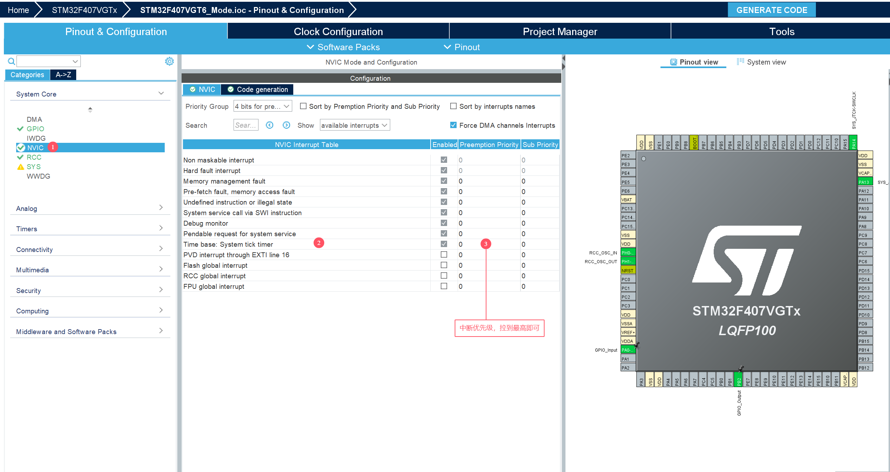

滴答定时器（SysTick Timer）是 **ARM Cortex-M 系列内核**自带的一个**简单、精确、可自动递减**的定时器，常用来做周期性任务调度，比如 RTOS 的时基（Tick）、延时、心跳灯等。

`HAL_GetTick()` 是 **STM32 HAL 库** 提供的一个函数，它的作用是**返回系统从启动到现在经过的时间（单位是毫秒 ms）**。

简单理解：
 它就像一块秒表，从系统上电/复位开始，开始不停计时，`HAL_GetTick()` 每次调用都会告诉你秒表的当前数值（以毫秒为单位）。

##### 手动配置一个1ms的定时器

在使用定时器的时候注意这个定时是挂载在那个总线上的，不同的总线的频率是不一样的。

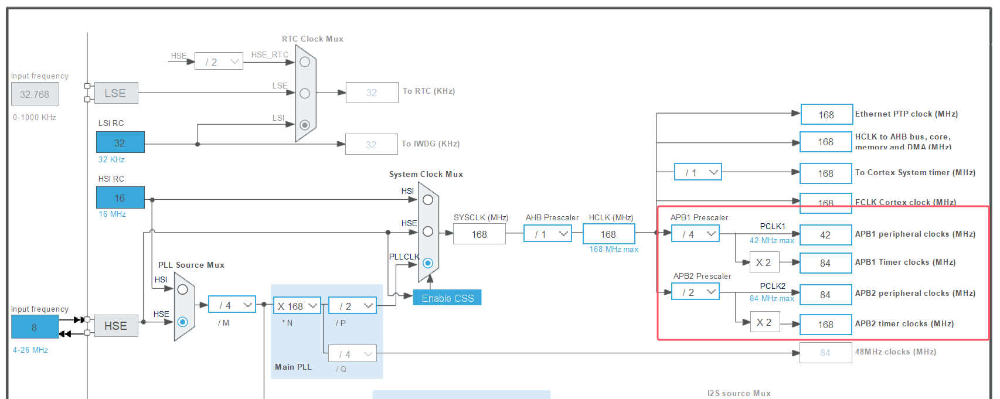

------

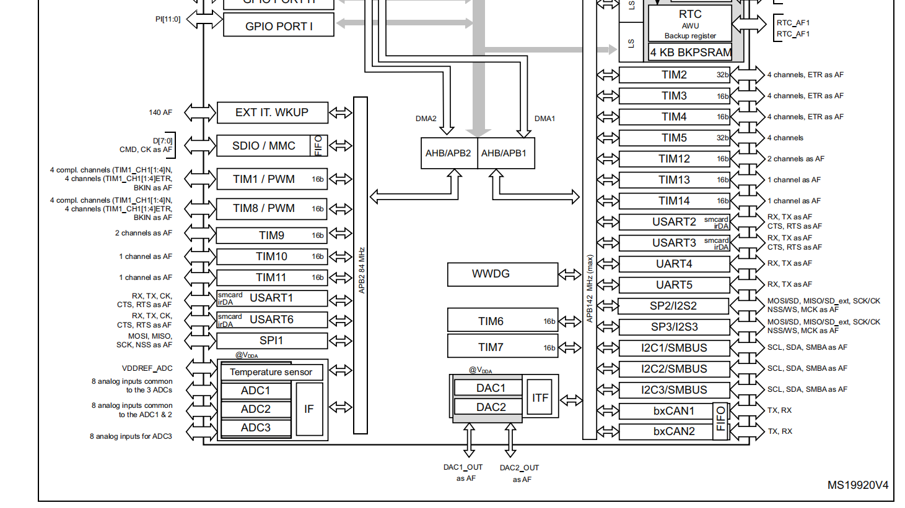

###### 软件配置

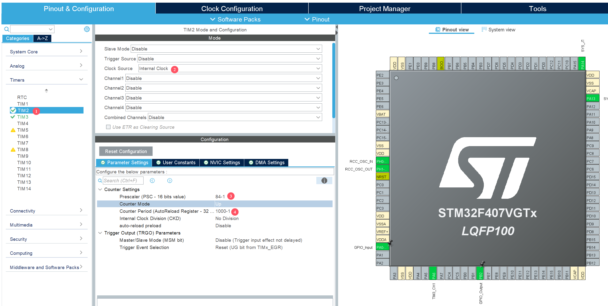

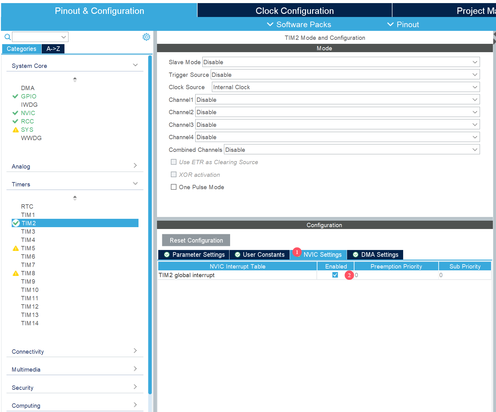

然后点击生成代码。

###### 知识补充

**理解定时器的工作原理**

定时器就像一个不停数数的时钟。

- 它有一个**时钟源**，决定它数数的快慢。
- 它有一个**分频器 (Prescaler)**，可以把时钟源的速度降下来，让它数得慢一些。
- 它有一个**周期值 (Period)**，当计数器数到这个值时，就会触发一次“事件”（比如中断），然后计数器又从头开始数。
- 周期值可以看成是**ARR（自动重装载）值**。

所以，我们想要的中断时间（比如 1ms），可以通过下面的公式计算出来：

**中断时间 = (Period + 1) / (定时器时钟频率 / (Prescaler + 1))**

这个公式可以简化成：

**中断时间 = (Period + 1) \* (Prescaler + 1) / 定时器时钟频率**

我们的目标是让这个 `中断时间 = 1ms`。

- **第一步：确定定时器 2 的时钟频率**
  - `TIM2` 的输入时钟频率 = APB2 频率 = 168,000,000 Hz (168 MHz)
- **第二步：理解 `Prescaler` (预分频器) 的作用**
  设置了 `Prescaler = 168 - 1;`。
  - `Prescaler = 167`。
  - 这意味着：定时器每收到 168 个时钟信号，它内部的计数器才真正加 1。
  - 经过分频后的计数器频率（也就是定时器实际数数的频率） = 定时器时钟频率 / (Prescaler + 1)
  - 计数器频率 = 168,000,000 Hz / (167 + 1) = 168,000,000 Hz / 168 = 1,000,000 Hz (1 MHz)。
  - **小白理解**：经过这个分频器，定时器现在每秒钟会数 1,000,000 次。换句话说，每数 1 次，就过去了 1 微秒 (µs)。
- **第三步：理解 `Period` (周期) 的作用**
  设置了 `ARR = 1000 - 1;`。
  - `Period = 999`。
  - 这意味着：定时器从 0 开始数，数到 999 之后，就会产生一个中断信号，然后计数器又回到 0，重新开始数。
  - 产生一次中断所需要的计数次数 = Period + 1 = 999 + 1 = 1000 次。
- **第四步：计算最终的中断时间**
  - 每次中断需要数 1000 次。
  - 计数器每 1 次是 1 微秒 (µs)。
  - 所以，中断时间 = 1000 次 * 1 微秒/次 = 1000 微秒 = 1 毫秒 (ms)。

###### 例程代码

```c
//app_schduler.c
#include "app_schduler.h"

//全局变量，用于存储任务数量
uint8_t task_num;

uint32_t task_tick; //系统时钟

typedef struct{

	void (*task_func)(void); //需要调用的函数
	uint32_t rate_ms; //函数运行周期
	uint32_t last_ms; //函数上次运行时间
}task_t;

static task_t scheduler_task[]={

	{led_proc,10,0},
	{key_proc,10,0},
};


/**
  * @brief          定时器2中断服务函数,1ms一次中断
  * @param[in]      htim:定时器
  * @retval         none
  */
void HAL_TIM_PeriodElapsedCallback(TIM_HandleTypeDef *htim)
{
	if (htim->Instance == htim2.Instance)
	{
		task_tick++;
	}
}

void scheduler_init(void)
{
	task_num = sizeof(scheduler_task)/sizeof(task_t);
	
}

void scheduler_run(void)
{
	for(uint8_t i=0; i<task_num; i++)
	{
//		uint32_t now_time = HAL_GetTick(); //获取当前时间
		
		uint32_t now_time = task_tick;
		
		if(now_time >= scheduler_task[i].rate_ms + scheduler_task[i].last_ms)
		{
			scheduler_task[i].last_ms = now_time;
			
			scheduler_task[i].task_func();
		}
	}
}

void system_init(void)
{
	HAL_GPIO_WritePin(GPIOA,GPIO_PIN_0,GPIO_PIN_RESET);
	HAL_GPIO_WritePin(GPIOB,GPIO_PIN_2,GPIO_PIN_RESET);
	
	scheduler_init();
}

```

新增加了一个定时器中断回调函数，当定时器产生周期中断（这里是 1ms 一次）时，HAL 库会**自动调用**这个函数。

```c
//main.c
/**
  * @brief  The application entry point.
  * @retval int
  */
int main(void)
{

  /* USER CODE BEGIN 1 */

  /* USER CODE END 1 */

  /* MCU Configuration--------------------------------------------------------*/

  /* Reset of all peripherals, Initializes the Flash interface and the Systick. */
  HAL_Init();

  /* USER CODE BEGIN Init */

  /* USER CODE END Init */

  /* Configure the system clock */
  SystemClock_Config();

  /* USER CODE BEGIN SysInit */

  /* USER CODE END SysInit */

  /* Initialize all configured peripherals */
  MX_GPIO_Init();
  MX_TIM2_Init();
  /* USER CODE BEGIN 2 */
	system_init();
	//新增代码
	HAL_TIM_Base_Start_IT(&htim2); //启用定时器中断
  /* USER CODE END 2 */

  /* Infinite loop */
  /* USER CODE BEGIN WHILE */
  while (1)
  {
    /* USER CODE END WHILE */

    /* USER CODE BEGIN 3 */
		scheduler_run();
  }
  /* USER CODE END 3 */
}
```

------

1. 代码中定时器回调函数的位置

```c
/**
  * @brief          定时器2中断服务函数,1ms一次中断
  * @param[in]      htim:定时器
  * @retval         none
  */
void HAL_TIM_PeriodElapsedCallback(TIM_HandleTypeDef *htim)
{
	if (htim->Instance == htim2.Instance)
	{
		task_tick++;
	}
}
```

这个函数是**HAL库的定时器周期中断回调函数**，意思是：

- 当定时器产生周期中断（这里是 1ms 一次）时，HAL 库会**自动调用**这个函数。

- 在这个回调函数中，程序判断是不是定时器 2 的中断：

  ```c
  if (htim->Instance == htim2.Instance)
  ```

  如果是，就执行：

  ```c
  task_tick++;
  ```

  这会让**系统时钟计数变量 `task_tick`**每毫秒加 1，为后面的任务调度做时间基准。

###### 什么是回调函数？

**回调函数（Callback Function）是由你定义、但不是你直接调用**，而是**由系统、库函数、或其他代码在特定事件发生时自动调用**的函数。

在这个例子中：

- `HAL_TIM_PeriodElapsedCallback()` 是你自己写的。
- 你并没有在代码里直接调用它。
- 当 **定时器溢出**（每 1ms 一次）时，HAL 库会**自动帮你调用**它，这就是**回调**。

可以这么理解：

> 回调函数就像你留给外卖员的电话号码，你不会自己打给自己，但外卖到了（事件发生）外卖员会打给你（系统帮你调用）。

------

3. 回调函数的作用

在嵌入式系统中，回调函数常用于：

1. **事件驱动**：某件事发生时自动运行特定代码（比如按键按下、数据接收完成）。
2. **解耦逻辑**：主程序不用一直去轮询检查事件，而是让事件自己“通知”主程序。
3. **提高效率**：减少 CPU 空转等待的时间。
4. **代码结构清晰**：把事件处理逻辑集中到对应的回调函数中。

------

4. 在代码里回调的作用

这个回调函数的作用是：

- **作为定时器的中断处理逻辑**，在每 1ms 定时器溢出时执行。
- 维护一个**毫秒级的系统时基**变量 `task_tick`。
- 让后面的 `scheduler_run()` 可以用 `task_tick` 来判断是否该执行任务（比如 `led_proc` 和 `key_proc`）。

#### PWM方波生成

##### 什么是PWM

PWM定义：脉冲宽度调制（PulseWidthModulation，PWM）简称脉宽调制。通俗讲，PWM是一种对模拟信号电平进行数字编码的方法。通过高分辨率计数器的使用，方波的占空比被调制用来对一个具体模拟信号的电平进行编码。PWM信号仍然是数字的，因为在给定的任何时刻，满幅值的直流供电要么完全有(ON)，要么完全无(OFF)。电压或电流源是以一种通(ON)或断(OFF)的重复脉冲序列被加到模拟负载上去的。通的时候即是直流供电被加到负载上的时候，断的时候即是供电被断开的时候。只要带宽足够，任何模拟值都可以使用PWM进行编码。

占空比定义：占空比就是高电平所占整个周期的时间，如下图所示:


第一个PWM波，周期为10ms，高电平的时间为4ms，所以占空比为40%，同理第二个PWM波为60%，第三个为80%。

PWM的频率： PWM的频率的整个周期的倒数，所以说上图PWM的周期为1/0.01，也就是100HZ。改变PWM的频率是通过改变整个的周期实现的。所以通过改变高低电平总共的时间、改变高电平占总周期的比例就可以实现任意频率、任意占空比的PWM波。

PWM的用途和优点：电机调速、功率调制、PID调节、通信等等，配置简单、抗干扰能力强，从处理器到被控系统信号都是数字形式的，无需进行数模转换。并且让信号保持为数字形式可将噪声影响降到最小，噪声只有在强到足以将逻辑1改变为逻辑0或将逻辑0改变为逻辑1时，也才能对数字信号产生影响，这是PWM用于通信的主要原因。

具体内容可以自行查看：https://blog.csdn.net/Firefly_cjd/article/details/108139898?ops_request_misc=&request_id=&biz_id=102&utm_term=stm32pwm%E8%BE%93%E5%87%BA&utm_medium=distribute.pc_search_result.none-task-blog-2~all~sobaiduweb~default-2-108139898.142

##### 软件配置

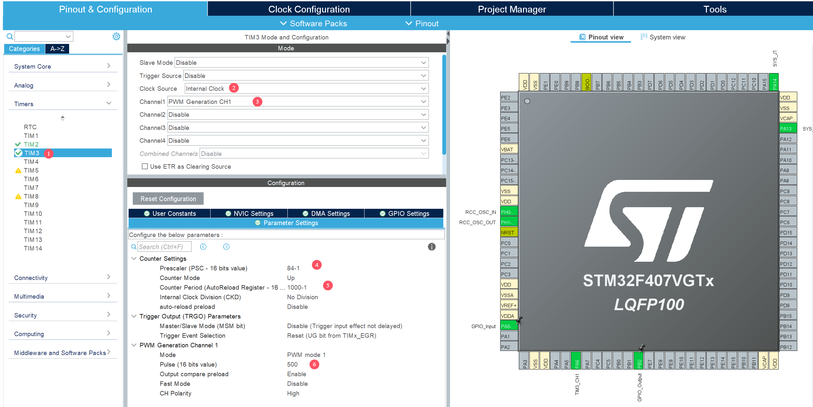


效果如图所示，1KHz，50%占空比。

##### 知识补充

说明

1. 预分频系数**Prescale**：配置成主频（84MHz）-1

2. 需要引用头文件，需要在主函数中添加

   ```c
    #include“tim.h"
   
   HAL_TIM_PWM_Start(&htim1,TIM_CHANNEL_1);
   ```

3. 当时钟源频率为 84 MHz 时，配置 **Prescaler = 84 - 1** 和 **Counter Period = 1000 - 1** 是为了得到合适的 PWM 信号频率。我们可以通过计算来理解为什么选择这种配置。

   ##### 1. **Prescaler = 84 - 1**

   Prescaler 用于分频时钟源。你时钟源的频率是 84 MHz，而 Prescaler 配置为 84-1，意味着时钟频率将被分频为 84。具体计算如下：
   $$
   f_{\text{timer}} = \frac{f_{\text{clk}}}{\text{Prescaler}} = \frac{84 \, \text{MHz}}{84} = 1 \, \text{MHz}
   $$


   因此，经过分频后，定时器的时钟频率变为 1 MHz。

2. **Counter Period = 1000 - 1**

   Counter Period (也称为自动重装载寄存器 ARR) 的值决定了 PWM 的周期。配置为 1000-1 意味着定时器将从 0 计数到 999，然后溢出，生成一个 PWM 周期。

   定时器的周期计算公式为：
$$
   T_{\text{PWM}} = \frac{1}{f_{\text{timer}}} \times \text{Counter Period}
$$
   将值代入：
$$
   T_{\text{PWM}}=\frac{1}{1 MHz}×1000=1 ms
$$
   因此，PWM 信号的频率为：
$$
   f_{\text{PWM}}=\frac{1}{T_{\text{PWM}}}=\frac{1}{1 ms}=1 kHz
$$

3. **为什么这样配置？**

   这个配置的目的是将 84 MHz 的时钟源通过 Prescaler 和 Counter Period 转换为 1 kHz 的 PWM 信号。这种频率的 PWM 信号通常用于一些对精度要求较高的控制场景，比如**电机控制**、音频信号调制或其他低频率应用。

   ##### 总结

   - **Prescaler = 84 - 1**：将 84 MHz 的时钟源分频为 1 MHz。
   - **Counter Period = 1000 - 1**：使定时器在 1000 个时钟周期内溢出，生成一个 PWM 周期。
   - **PWM 信号频率 = 1 kHz**：最终得到的 PWM 信号频率为 1 kHz。
   - **Pulse**：设置PWM的占空比。

   这个配置的目的可能是为了生成一个精确的 1 kHz 的 PWM 信号，适合用于控制或者信号调制等场景。

##### 例程代码

```c
//app_pwm.h
#ifndef __APP_PWM_H__
#define __APP_PWM_H__

#include "bsp_system.h"

int pwm_set_duty(TIM_HandleTypeDef *htim, uint32_t channel, float duty);

#endif

```

```c
//app_pwm.c
#include "app_pwm.h"

/**
 * @brief 设置 PWM 占空比
 * @param htim  定时器句柄
 * @param duty  占空比（0.0 ~ 100.0 %）
 * @return int 0 表示成功，-1 表示参数错误
 */
int pwm_set_duty(TIM_HandleTypeDef *htim, uint32_t channel, float duty)
{
	// 检查通道有效性
	if(channel != TIM_CHANNEL_1 && channel != TIM_CHANNEL_2 &&
			channel != TIM_CHANNEL_3 && channel != TIM_CHANNEL_4)
	{
			return -1; // 无效通道
	}
	
	// 检查定时器句柄有效性
	if (htim == NULL)
	{
			return -1; // 空指针
	}
	
	// 防止 duty 超出范围
	if (duty < 0.0f) duty = 0.0f;
	if (duty > 100.0f) duty = 100.0f;

	// 计算比较值：ARR 决定 PWM 总周期
	// 占空比 = CCR / (ARR+1)
	if(channel == TIM_CHANNEL_1)
	{
		htim->Instance->CCR1 = (htim->Instance->ARR + 1) * (duty / 100.0f);
	}
	else if(channel == TIM_CHANNEL_2)
	{
		htim->Instance->CCR2 = (htim->Instance->ARR + 1) * (duty / 100.0f);
	}
	else if(channel == TIM_CHANNEL_3)
	{
		htim->Instance->CCR3 = (htim->Instance->ARR + 1) * (duty / 100.0f);
	}
	else if(channel == TIM_CHANNEL_4)
	{
		htim->Instance->CCR4 = (htim->Instance->ARR + 1) * (duty / 100.0f);
	}
	
	return 0;
}

```

```c
//main.c
/**
  * @brief  The application entry point.
  * @retval int
  */
int main(void)
{

  /* USER CODE BEGIN 1 */

  /* USER CODE END 1 */

  /* MCU Configuration--------------------------------------------------------*/

  /* Reset of all peripherals, Initializes the Flash interface and the Systick. */
  HAL_Init();

  /* USER CODE BEGIN Init */

  /* USER CODE END Init */

  /* Configure the system clock */
  SystemClock_Config();

  /* USER CODE BEGIN SysInit */

  /* USER CODE END SysInit */

  /* Initialize all configured peripherals */
  MX_GPIO_Init();
  MX_TIM2_Init();
  MX_TIM3_Init();
  /* USER CODE BEGIN 2 */
	system_init();
	 
	HAL_TIM_Base_Start_IT(&htim2);
	HAL_TIM_PWM_Start(&htim3,TIM_CHANNEL_1);
	
	pwm_set_duty(&htim3,TIM_CHANNEL_1,20); //新增代码
  /* USER CODE END 2 */

  /* Infinite loop */
  /* USER CODE BEGIN WHILE */
  while (1)
  {
    /* USER CODE END WHILE */

    /* USER CODE BEGIN 3 */
		scheduler_run();
  }
  /* USER CODE END 3 */
}
```

```c
//bsp_system.h
#ifndef __BSP_SYSTEM_H__
#define __BSP_SYSTEM_H__

#include "main.h"
#include "tim.h"
#include "gpio.h"

#include "app_led.h"
#include "app_button.h"
#include "app_schduler.h"
#include "app_pwm.h"

#endif

```

效果如图

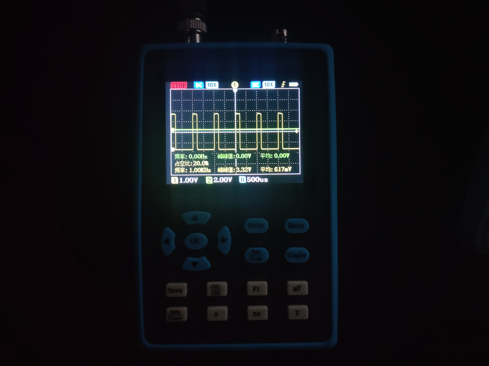
 你的代码用的是 **STM32 HAL 库**，主要跟定时器（TIM）和 PWM 有关。

------

1. `TIM_HandleTypeDef *htim` 是什么？

- 这是 **定时器句柄**，可以理解成“这个定时器的身份证”。
- STM32 HAL 库里，每个外设（定时器、串口、I2C 等）都有自己的“句柄”结构体，里面记录了这个外设的配置和寄存器地址。
- `TIM_HandleTypeDef` 是定时器专用的句柄类型。
- 你用 `*htim` 就是把某个定时器的身份证传给这个函数，让它知道要操作的是哪一个定时器。

------

2. `channel` 是什么？

- PWM 一般由定时器的 **输出通道** 生成，比如 `TIM_CHANNEL_1` 表示定时器的第 1 路输出。
- 一个定时器可以有多个通道（1、2、3、4），每个通道都可以输出一个独立的 PWM 波。
- 这里的 `channel` 决定了函数修改的是哪一路的占空比。

------

3. `htim->Instance` 是什么？

- `htim` 是句柄，`htim->Instance` 就是 **这个定时器的寄存器集合**。
- 比如你用的是 `TIM3`，那么 `htim->Instance` 就等于 `TIM3` 的寄存器基地址。
- 你在 `htim->Instance->CCR1` 里写东西，就是直接修改定时器的 **捕获比较寄存器（CCR1）**。

------

4. `ARR`、`CCR1`、占空比的关系

- `ARR`（Auto-Reload Register）自动重装载寄存器：
   控制 PWM 的周期（也就是频率）。

- `CCR1`（Capture/Compare Register 1）：
   控制 PWM 的高电平持续时间。

- 占空比公式：

  占空比=CCRARR+1×100%占空比 = \frac{CCR}{ARR + 1} \times 100\%

- 所以 `(htim->Instance->ARR + 1) * (duty / 100.0f)` 就是把占空比（0~100%）转换成寄存器能用的数值。

------

5. 代码运行流程（简单口语化）

1. **检查输入**
   - 看通道是不是 1~4 之间的合法值。
   - 看定时器句柄是不是空的。
   - 把 `duty` 限制在 0~100 之间。
2. **计算比较值**
   - 用公式算出对应的 `CCR` 值。
3. **写入寄存器**
   - 把算好的值写到对应通道的 `CCR` 寄存器里，这样 PWM 波形就会更新占空比。

------

6. 跟 HAL 库的关系

虽然你没直接调用像 `HAL_TIM_PWM_Start()` 这样的 HAL 库函数，这段代码还是在 **操作 HAL 库提供的数据结构**：

- `TIM_HandleTypeDef` → HAL 定义的定时器句柄结构。
- `Instance` → HAL 里指向硬件寄存器的指针。
- `CCR1 ~ CCR4`、`ARR` → 这些寄存器名都是 HAL 头文件里定义好的硬件映射。

**`HAL_TIM_PWM_Start(TIM_HandleTypeDef *htim, uint32_t Channel)`**

- **`htim`** → 定时器句柄，比如 `&htim1`（里面保存了定时器的配置和硬件地址）。
- **`Channel`** → 选择定时器的哪个通道输出，比如 `TIM_CHANNEL_1`、`TIM_CHANNEL_2`。

`HAL_TIM_PWM_Start()` 就是 **让定时器开始输出 PWM 波形**。
 它相当于一个“启动开关”，不调用它，定时器虽然配置好了，但引脚上不会有波形输出。

#### 编码器模式

https://blog.csdn.net/qq_48361010/article/details/135413772?ops_request_misc=&request_id=&biz_id=102&utm_term=stm32%20%E7%BC%96%E7%A0%81%E5%99%A8%E6%B5%8B%E9%80%9F&utm_medium=distribute.pc_search_result.none-task-blog-2~all~sobaiduweb~default-6-135413772.142

**编码器**
两相编码器（正交编码器）：两相编码器由 A 相和 B 相组成，相位差为 90 度。当旋转方向为顺时针时，A 相先变化，然后 B 相变化；当旋转方向为逆时针时，B 相先变化，然后 A 相变化。通过检测相位差变化，可以确定旋转的方向。STM32 单片机可以使用定时器的正交编码器模式（Encoder Mode）来实现两相编码器的接口。


编码器的两个输入引脚，就是每个定时器的CH1和CH2引脚，CH3和CH4不能接编码器。最终的实验现象，编码器有两个输出，一个是A相，一个是B相，然后接入到STM32，定时器的编码器接口，编码器的接口自动控制定时器时基单元中的CNT计数器，进行自增或自减。比如初始化之后，CNT初始值为0，然后编码器右转，CNT就++，右转产生一个脉冲，CNT就加一次，比如右转产生10个脉冲后，停下来，那么这个过程CNT就由0自增到10，停下来，编码器左转，CNT就–，左转产生一个脉冲，CNT就自减一次， 比如编码器再左转产生5个脉冲，那CNT就在原来10的基础上自减5，停下来。
  编码器接口，其实就相当于是一个带有方向控制的外部时钟，同时控制着CNT的计数时钟和计数方向，这样CNT的值就表示了编码器的位置。如果我们每隔一段时间取一次编码器的值，再把CNT清零，那么每次取出来的值就表示了编码器的速度。
  编码器测速实际上就是测频法测正交脉冲的频率，CNT计次，然后每隔一段时间取一次计次，这就是测频法的思路。编码器计次能根据旋转方向，不仅能自增计次还能自减计次，是一个带方向的测速。
每个高级定时器和通用定时器都拥有1个编码器接口。

这里只是使用其中一个定时器作为例子，自己使用的时候可以按照实际要求进行选。

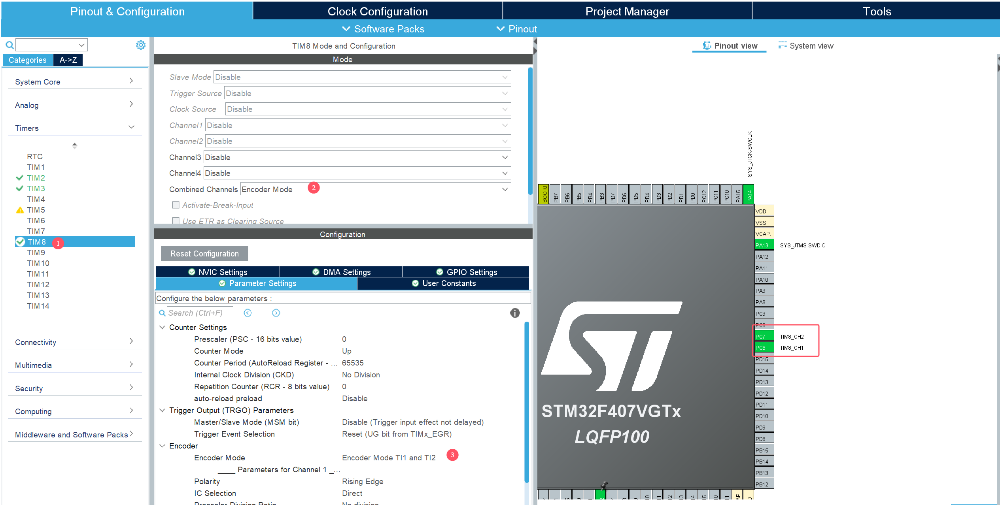

说明：

Counter Period：是脉冲数记录的上限，注意，通用定时器是32位的计数器，高级定时器是16位的计数器，所以通用定时器最多可以设置为2^32-1，而高级定时器最多只能设置为2^16-1；

Encoder Mode：编码器脉冲采样模式，这里选择通道1和通道2模式，对应编码器的AB相都采样的模式；

##### 例程代码

```c
//encoder_driver.h

#ifndef __ENCODER_DRIVER_H__
#define __ENCODER_DRIVER_H__

#include "bsp_system.h"

// 编码器每转一圈的脉冲数 (PPR)
#define ENCODER_PPR (500 * 20 * 4) // 500线/相, 20倍减速比, 4倍频
// 车轮直径 (单位: 厘米)
#define WHEEL_DIAMETER_CM 4.8f

// 自动计算周长和采样时间
#define PI 3.14159265f
#define WHEEL_CIRCUMFERENCE_CM (WHEEL_DIAMETER_CM * PI)
#define SAMPLING_TIME_S 0.01f // 采样时间, 与 Scheduler 中的任务周期一致 (10ms)

/**
 * @brief 编码器数据结构体
 */
typedef struct
{
  TIM_HandleTypeDef *htim; // 定时器
  unsigned char reverse; // 编码器的方向是否反转。0-正常，1-反转
  int16_t count;          // 当前采样周期内的原始计数值
  int32_t total_count;    // 累计总计数值
  float speed_cm_s;     // 计算出的速度 (cm/s)
} Encoder;

void Encoder_Driver_Init(Encoder* encoder, TIM_HandleTypeDef *htim, unsigned char reverse);
void Encoder_Driver_Update(Encoder* encoder);

extern Encoder left_encoder;
extern Encoder right_encoder;

#endif


```

```c
//encoder_driver.c
#include "encoder_driver.h"

/**
 * @brief 初始化编码器驱动
 */
void Encoder_Driver_Init(Encoder* encoder, TIM_HandleTypeDef *htim, unsigned char reverse)
{
  encoder->htim = htim;
  encoder->reverse = reverse;
  
  // 启动定时器的编码器模式
  HAL_TIM_Encoder_Start(encoder->htim, TIM_CHANNEL_ALL);

  // 清零计数器
  __HAL_TIM_SetCounter(encoder->htim, 0);

  // 初始化数据结构
  encoder->count = 0;
  encoder->total_count = 0;
  encoder->speed_cm_s = 0.0f;
}

/**
 * @brief 更新编码器数据 (应周期性调用, 例如10ms一次)
 */
void Encoder_Driver_Update(Encoder* encoder)
{
  // 1. 读取原始计数值
  encoder->count = (int16_t)__HAL_TIM_GetCounter(encoder->htim);
  
  // 2. 处理编码器反向
  encoder->count = encoder->reverse == 0 ? encoder->count : -encoder->count;

  // 3. 清零硬件计数器，为下个周期做准备
  __HAL_TIM_SetCounter(encoder->htim, 0);

  // 4. 累计总数
  encoder->total_count += encoder->count;

  // 5. 计算速度 (cm/s)
  // 速度 = (计数值 / PPR) * 周长 / 采样时间
  encoder->speed_cm_s = (float)encoder->count / ENCODER_PPR * WHEEL_CIRCUMFERENCE_CM / SAMPLING_TIME_S;
}


```

### USART串口通信

同样这里只会简单介绍一下什么串口，如何使用，跟通信相关的内容可以查看这篇文章

https://blog.csdn.net/k666499436/article/details/124354165?ops_request_misc=%257B%2522request%255Fid%2522%253A%2522ba7ad36eb15c8e23662baac9e5075b3e%2522%252C%2522scm%2522%253A%252220140713.130102334.pc%255Fall.%2522%257D&request_id=ba7ad36eb15c8e23662baac9e5075b3e&biz_id=0&utm_medium=distribute.pc_search_result.none-task-blog-2~all~first_rank_ecpm_v1~rank_v31_ecpm-14-124354165-null-null.142

视频讲解：https://www.bilibili.com/video/BV1y34y147s5/?spm_id_from=333.337.search-card.all.click&vd_source=11229edcf13f6771b9da6563ab9a19ff

#### 基本概念

USART-**通用同步异步收发器**(Universal Synchronous Asynchronous Receiver and Transmitter)是一个串行通信设备，可以灵活地与外部设备进行全双工数据交换。有别于 USART 还有一个UART(Universal Asynchronous Receiver and Transmitter)，它是在 USART 基础上**裁剪掉了同步通信功能（时钟同步），只有异步通信**。简单区分同步和异步就是看通信时需不需要对外提供时钟输出，我们平时用的串口通信基本都是 UART。

串行通信一般是以帧格式传输数据，即是一帧一帧的传输，每帧包含有起始信号、数据信息、校验信息(由我们自己设置)、停止信号。

串口最主要的特点是：

- **简单**：通常只需要两根线：发送线（TX）和接收线（RX），再加上一个公共地线（GND）。
- **异步**：意思是发送方和接收方不需要一个共同的时钟线来同步数据。它们各自内部都有一个时钟，只要双方约定好通信速度就行了。这也是它比 SPI、I2C 等通信方式更简单的一点。

**串口通信的关键参数**

要让两个设备通过串口通信成功，它们必须“说同一种语言”，也就是所有参数都必须一致。主要有以下几个：

1. **波特率 (Baud Rate)**：
   - 理解：这是数据传输的速度，表示每秒传输的“符号”数量，在简单理解上可以近似认为是每秒传输的比特数 (bps)。
   - 举例：常用的有 9600、19200、115200 等。数值越大，传输速度越快。双方波特率必须一致。
2. **数据位 (Data Bits/Word Length)**：
   - 理解：每次发送一个字节数据时，实际数据占用的位数。
   - 举例：通常是 8 位。也有 7 位或 9 位的选项。 就像每次说一个词，这个词是8个字还是9个字组成。
3. **校验位 (Parity Bit)**：
   - 理解：一个可选的用于简单错误检测的位。 就像在每次说一个词后，额外加一个“检查码”，看这个词有没有说错。
   - 类型：
     - **无 (None)**：不使用校验位，最常用。
     - **奇校验 (Odd)**：数据位中1的个数加上校验位后为奇数。
     - **偶校验 (Even)**：数据位中1的个数加上校验位后为偶数。
     - **Mark/Space**：不常用。
   - 注意：只能检测出奇数位的错误，对于偶数位错误或多位错误无法检测。
4. **停止位 (Stop Bits)**：
   - 理解：用于标识一个数据帧的结束。 就像每说完一个词，要停顿一下，这个停顿的时间就是停止位。
   - 举例：通常是 1 位，也有 0.5 位、1.5 位或 2 位的。

**最常见的配置是 115200-8-N-1**：即波特率 115200，8 位数据位，无校验位，1 位停止位。

**串口的硬件连接**

- **TX (Transmit)**：发送数据线。连接到对方的 RX。
- **RX (Receive)**：接收数据线。连接到对方的 TX。
- **GND (Ground)**：公共地线。所有通信的设备都必须共地，否则电压参考不一致，通信会失败。

举例：STM32 的某个 UART_TX 引脚接到 USB 转 TTL 模块的 RX 引脚，STM32 的 UART_RX 引脚接到 USB 转 TTL 模块的 TX 引脚，最后将两个设备的 GND 连接起来。

#### DMA 解释（小白友好版）

##### 1. **DMA 是什么？（简单定义）**

DMA 全称是 **Direct Memory Access**，翻译成“直接内存访问”。它是一种硬件机制（芯片里的一个小模块），让数据可以“自己”从一个地方搬到另一个地方，而不用CPU（中央处理器，你的微控制器大脑）一直盯着。

- **通俗比喻**：平时接收串口数据（像之前的代码），是用中断（interrupt）：数据来了，CPU被“叫醒”去处理一个字节，然后继续干活。这就像你做饭时，每来一个快递（数据字节），你都要停下手里的活去开门、拿东西、放好，再回去做饭。很累，对吧？
- DMA 就像雇了个机器人助手：你告诉它“帮我把快递直接放到冰箱里，别打扰我”，机器人就自动搬运。你（CPU）可以专心做饭（跑其他代码），等机器人搬完一大批再告诉你“搞定啦”。

简单说：DMA 让数据传输（比如串口接收）变成“自动模式”，CPU 只需开头设置一下和结尾检查一下，中间不参与，节省时间和精力。

##### 2. **为什么用 DMA？（好处和场景）**

在嵌入式系统（像STM32芯片）里，CPU 要干很多事：控制LED、读传感器、跑算法等。如果用中断接收数据：

- 数据多或快时，CPU 被频繁中断，效率低（像你被快递打扰100次）。
- 可能丢数据或延时。

DMA 的好处：

- **高效**：数据直接从串口硬件搬到内存缓冲区（你的数组），CPU 不用管每个字节。
- **省电省时**：CPU 可以睡会儿或干别的事，尤其适合大数据传输（比如接收长命令、图片数据）。
- **可靠**：DMA 有自己的通道（像专用公路），不会干扰CPU。
- **缺点**：设置比中断复杂点（要配置硬件寄存器），但用STM32的HAL库，很简单。

什么时候用？如果你接收的数据量大（不止4字节），或系统忙碌，就用DMA。比如：接收传感器数据流、WiFi模块数据等。

##### 3. **DMA 在串口接收中怎么工作？（流程图解）**

DMA 专门有个模式叫“外围设备到内存”（Peripheral to Memory），串口是“外围设备”，内存是你的缓冲区。

- **步骤（像配方一样）**：
  1. **设置DMA**：在代码开头，告诉DMA：“用这个通道，源头是串口的数据寄存器，目的地是我的缓冲区数组，大小是多少字节。”
     - STM32有DMA控制器（DMA1或DMA2），每个串口有专用DMA通道（比如USART1_RX用DMA2_Stream2）。
  2. **启动DMA接收**：用HAL库函数，像 `HAL_UART_Receive_DMA(&huart1, usart_rx_buffer, buffer_size);`。这告诉串口：“用DMA收数据，放进缓冲区。”
  3. **数据来了**：串口硬件自动把字节传给DMA，DMA 直接存到内存。CPU 不管！
  4. **完成时**：DMA 收满指定大小，或串口检测到空闲（idle），会触发中断或标志。CPU 再去处理（解析数据）。
     - 你可以用回调函数（如 `HAL_UART_RxCpltCallback`）来知道“收完了”。
- **对比你之前的代码**：
  - 之前：中断一个字节一个字节收（HAL_UART_Receive_IT，每次1字节）。
  - 用DMA：一次设置收一大批（比如100字节），DMA 自动全收好。

##### 4. **STM32 上怎么用 DMA？（小提示，不用慌）**

既然你用STM32 HAL库，超级简单！先在CubeMX（配置工具）里启用DMA：

- 在CubeMX的UART设置里，选“Add DMA Requests”，为RX加DMA通道。

- 生成代码后，在你的代码里：

  - 初始化：调用 `HAL_UART_Receive_DMA` 代替 `HAL_UART_Receive_IT`。

  - 处理：用空闲中断（UART Idle Interrupt）检测数据结束（因为串口数据可能不固定长）。

  - 示例伪代码（别直接抄，结合你的）：

    ```c
    // 在初始化里
    HAL_UART_Receive_DMA(&huart1, usart1_debug.usart_rx_buffer, sizeof(usart1_debug.usart_rx_buffer));
    
    // 在回调或主循环检查收完，解析数据
    if (DMA收完标志) {
        uart_data_proc((const char*)usart1_debug.usart_rx_buffer);
        // 重启DMA接收
    }
    ```

详细代码可以一步步试，网上有教程（比如搜“STM32 UART DMA RX”）。如果卡住，告诉我你的具体问题，我帮你优化代码。

#### 软件配置

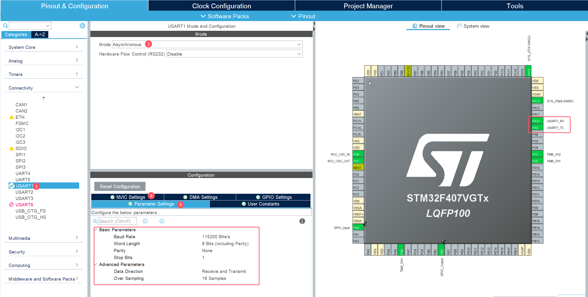

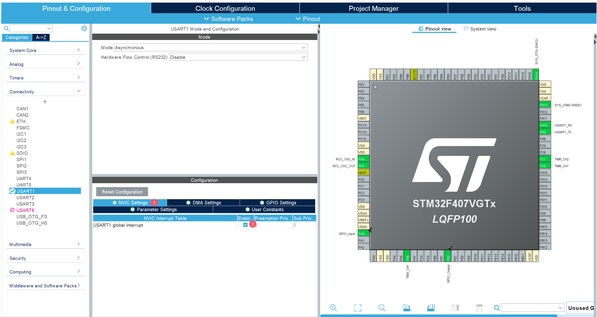

然后点击生成代码即可。

DMA部分配置，这里可以在上一步的基础上继续配置。

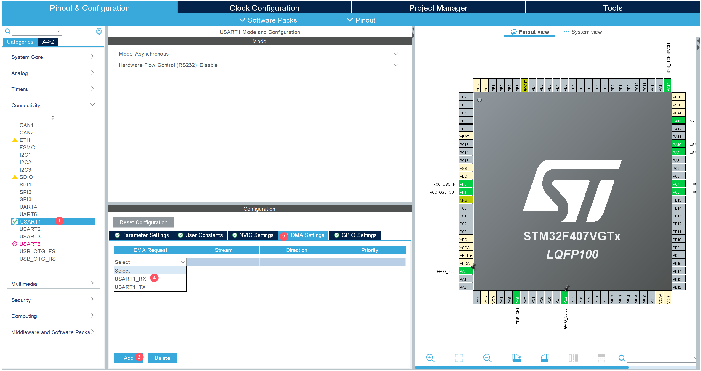

#### 例程代码

这个的例程代码有两个，一个是超时解析，一个DMA接收，同样代码相关的解释依旧会放在README.md文档中。这里可以自行学习一下环形缓冲区。

这里附上环形缓冲区的学习地址。

https://www.rt-thread.org/document/site/#/rt-thread-version/rt-thread-standard/programming-manual/device-ipc/ringbuffer/ringbuffer

##### 串口中断+超时解析

这里有一个需要注意的点，就是你配置好串口没有问题之后，写好代码，试一下这个串口是不是真的没有问题，我一般的测试方法是用一个USB转TTL模块，连接电脑和配置好的串口，上位机发送一串字符串，看一下单片机是否会把这个字符串返回到上位机（这一部分的代码需要自己写，已在例程代码中表明位置），测试好没有问题之后，才能够接下去做其它准备。

上位机发送数据，单片机没有进行回显的，看看下面这些做好没有

- 共地了吗？
- 线接对了吗？（RX接TX,TX接RX,GND接GND）
- 波特率是一样的吗？
- 数据格式是对的吗？
- debug了吗？
- 能进入串口中断吗？
- 缓存区收到数据了吗？

```c
//app_usart.h
#ifndef __APP_USART_H__
#define __APP_USART_H__

#include "bsp_system.h"

typedef struct
{
	uint8_t usart_rx_buffer[512];   // 串口数据存放数组，根据你的需求调整大小
	volatile int usart_index;       // 串口数据索引 (volatile 关键字很重要，因为它在中断和主循环中都被访问)
	volatile uint32_t usart_tick;   // 最后一次接收数据时间戳 (volatile)
	uint32_t difftime;              // 时间差
	UART_HandleTypeDef* huart;		//串口句柄
} Usart_Data;

int Usart_Manager_Init(Usart_Data* uart_user, UART_HandleTypeDef* huart);
void UART_Init(void);
void UART_Timeout_Check(void);
#endif

```

```c
//app_usart.c
#include "app_usart.h"


#define TIMEOUT 100

#define FRAME_HEADER  0xAA     // 定义帧头
#define FRAME_FOOTER  0xFF     // 定义帧尾
#define CMD_LENGTH    4        // 命令数据长度，固定为4字节

Usart_Data usart1_debug;       // 用于存储UART接收数据的结构体

void usart_printf(UART_HandleTypeDef *huartx, char *str, ...) 
{
	int len = 0;
	char string[256]; 
	va_list arg;

	va_start(arg, str);
	len = vsprintf(string, str, arg);
	va_end(arg);

	if (len > 0)
	{
			HAL_UART_Transmit(huartx, (uint8_t *)string, len, HAL_MAX_DELAY);
	}
}

/**
  * @brief  初始化 UART 接收模块。
  *         此函数应在 CubeMX 生成的 UART 初始化之后调用。
  * @param  None
  * @retval None
  */
void UART_Init(void)
{
	// 初始化接收缓冲区和索引
	memset(usart1_debug.usart_rx_buffer, 0, sizeof(usart1_debug.usart_rx_buffer));
	usart1_debug.usart_index = 0;
	usart1_debug.usart_tick = HAL_GetTick();

	// 启动 UART 接收中断，每次只接收一个字节。
	HAL_UART_Receive_IT(&huart1, &usart1_debug.usart_rx_buffer[usart1_debug.usart_index], 1); //超时解析时使用
	
	Usart_Manager_Init(&usart1_debug,&huart1);
}

/**
  * @brief  初始化串口管理结构体，并将其与一个UART句柄关联
  * @param  usart_private_data: 指向要被初始化的串口管理结构体
  * @param  huart: 指向要关联的HAL库UART句柄
  * @retval 0 表示成功, -1 表示失败 (传入了空指针)
  */
int Usart_Manager_Init(Usart_Data* uart_user, UART_HandleTypeDef* huart)
{
	if(uart_user == NULL || huart == NULL)
	{
		return -1;
	}
	
	uart_user->huart = huart;
//	uart_user->uart_flag = 0;
	memset(uart_user->usart_rx_buffer,0,sizeof(uart_user->usart_rx_buffer));
	
	return 0;
}

/**
  * @brief  UART 接收完成中断回调函数。
  *         这个函数需要放在 `stm32fxxx_it.c` 文件中，或者如果你自定义了中断处理，
  *         确保你的中断服务函数中调用了 `HAL_UART_IRQHandler()`。
  *         这个回调函数会被 HAL 库自动调用。
  * @param  huart: UART 句柄
  * @retval None
  */
void HAL_UART_RxCpltCallback(UART_HandleTypeDef *huart)
{
	if (huart->Instance == USART1)
	{
		// 1. 更新最后一次接收数据的时间戳
		usart1_debug.usart_tick = HAL_GetTick();

		// 2. 增加接收索引
		usart1_debug.usart_index++;
		
		// 3. 检查接收缓冲区是否已满，防止溢出。
		if (usart1_debug.usart_index >= sizeof(usart1_debug.usart_rx_buffer))
		{
            // 缓冲区溢出，可能是一个错误或者数据包过大。
            memset(usart1_debug.usart_rx_buffer, 0, sizeof(usart1_debug.usart_rx_buffer));
            usart1_debug.usart_index = 0;
            HAL_UART_Receive_IT(&huart1, &usart1_debug.usart_rx_buffer[usart1_debug.usart_index], 1);
            return; // 提前退出，不再尝试接收到溢出位置
		}
		// 4. 重新启动接收下一个字节到当前索引位置。
		HAL_UART_Receive_IT(&huart1, &usart1_debug.usart_rx_buffer[usart1_debug.usart_index], 1);
	}
}

/**
 * @brief 处理接收到的UART数据帧
 * 
 * @param cmd 输入的命令数据
 * @return int 返回处理结果，成功返回0，失败返回-1
 */
int uart_data_proc(const char* cmd)
{
	// 检查指针是否为空或者命令长度是否为4
	if (cmd == NULL || strlen(cmd) != CMD_LENGTH)
	{
        return -1;  // 无效命令，返回失败
	}
	
	// 检查帧头和帧尾是否符合预期
	if (cmd[0] != FRAME_HEADER || cmd[3] != FRAME_FOOTER)
	{
        return -1;  // 无效的帧头或帧尾，返回失败
	}
	
	// 如果设备码是0x01，进一步检查功能码
	if (cmd[1] == 0x01)  // 设备码是 0x01
	{
        // 功能码是0x01，表示关灯
        if (cmd[2] == 0x01)
        {
                // 执行关灯操作
                ucLed = 0;
        }
        // 功能码是0x01，表示开灯
        else if (cmd[2] == 0x02)
        {
                // 执行开灯操作
                ucLed = 1;
        }
	}
	
	return 0;  // 处理成功，返回0
}


/**
  * @brief  串口超时检查与数据解析函数。
  *         此函数应在主循环 (while(1)) 中频繁调用，以持续检测数据包结束。
  * @param  None
  * @retval None
  */
void UART_Timeout_Check(void)
{
	// 只有当接收缓冲区中有数据 (usart_index != 0) 时才检查超时。
	if (usart1_debug.usart_index != 0)
	{
		
		usart1_debug.usart_rx_buffer[usart1_debug.usart_index] = '\0';
		//解析串口指令，执行相应操作
		uart_data_proc((const char*)usart1_debug.usart_rx_buffer);
		usart_printf(usart1_debug.huart,"usart:%s\r\n",usart1_debug.usart_rx_buffer); //数据回显，测试串口是否有问题
		
		// 清空缓冲区和重置索引
		memset(usart1_debug.usart_rx_buffer, 0, sizeof(usart1_debug.usart_rx_buffer));
		usart1_debug.usart_index = 0;
		usart1_debug.huart->pRxBuffPtr = &usart1_debug.usart_rx_buffer[0];
	}
}

```

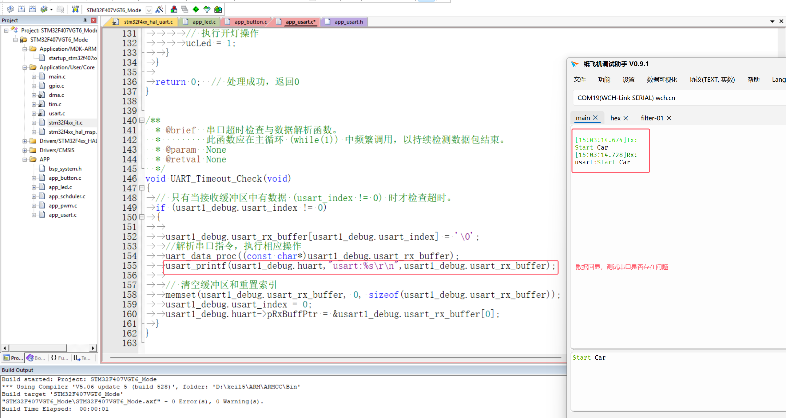

##### 串口+DMA中断接收

```c
//app_usart.h
#ifndef __APP_USART_H__
#define __APP_USART_H__

#include "bsp_system.h"

typedef struct
{
	uint8_t usart_rx_buffer[512];   // 串口数据存放数组，根据你的需求调整大小
	uint8_t usart_rx_dma_buffer[512];   // 串口数据存放数组，根据你的需求调整大小
	volatile int usart_index;       // 串口数据索引 (volatile 关键字很重要，因为它在中断和主循环中都被访问)
	volatile uint32_t usart_tick;   // 最后一次接收数据时间戳 (volatile)
	uint32_t difftime;              // 时间差
	UART_HandleTypeDef* huart;			//串口句柄
	uint8_t uart_flag;							//判断是否进入串口空闲中断(新增部分)
} Usart_Data;

int Usart_Manager_Init(Usart_Data* uart_user, UART_HandleTypeDef* huart);
void UART_Init(void);
void UART_Timeout_Check(void);
#endif

```

```c
//app_usart.c
#include "app_usart.h"


#define TIMEOUT 100

#define FRAME_HEADER  0xAA     // 定义帧头
#define FRAME_FOOTER  0xFF     // 定义帧尾
#define CMD_LENGTH    4        // 命令数据长度，固定为4字节

Usart_Data usart1_debug;			// 用于存储UART接收数据的结构体

extern DMA_HandleTypeDef hdma_usart1_rx;

void usart_printf(UART_HandleTypeDef *huartx, char *str, ...) 
{
	int len = 0;
	char string[256]; 
	va_list arg;

	va_start(arg, str);
	len = vsprintf(string, str, arg);
	va_end(arg);

	if (len > 0)
	{
			HAL_UART_Transmit(huartx, (uint8_t *)string, len, HAL_MAX_DELAY);
	}
}

/**
  * @brief  初始化 UART 接收模块。
  *         此函数应在 CubeMX 生成的 UART 初始化之后调用。
  * @param  None
  * @retval None
  */
void UART_Init(void)
{
	// 初始化接收缓冲区和索引
	memset(usart1_debug.usart_rx_buffer, 0, sizeof(usart1_debug.usart_rx_buffer));
	usart1_debug.usart_index = 0;
	usart1_debug.usart_tick = HAL_GetTick();

//	// 启动 UART 接收中断，每次只接收一个字节。
//	HAL_UART_Receive_IT(&huart1, &usart1_debug.usart_rx_buffer[usart1_debug.usart_index], 1); //超时解析时使用

	//启动UART DMA 接收中断，会在字符接收完毕触发 UART 空闲中断
	HAL_UARTEx_ReceiveToIdle_DMA(&huart1,(uint8_t *)&usart1_debug.usart_rx_dma_buffer,sizeof(usart1_debug.usart_rx_dma_buffer)); //DMA 接收时使用
	__HAL_DMA_DISABLE_IT(&hdma_usart1_rx,DMA_IT_HT); //关闭 DMA 半满中断
	
	Usart_Manager_Init(&usart1_debug,&huart1);
}

/**
  * @brief  初始化串口管理结构体，并将其与一个UART句柄关联
  * @param  usart_private_data: 指向要被初始化的串口管理结构体
  * @param  huart: 指向要关联的HAL库UART句柄
  * @retval 0 表示成功, -1 表示失败 (传入了空指针)
  */
int Usart_Manager_Init(Usart_Data* uart_user, UART_HandleTypeDef* huart)
{
	if(uart_user == NULL || huart == NULL)
	{
		return -1;
	}
	
	uart_user->huart = huart;
//	uart_user->uart_flag = 0;
	memset(uart_user->usart_rx_buffer,0,sizeof(uart_user->usart_rx_buffer));
	
	return 0;
}

///**
//  * @brief  UART 接收完成中断回调函数。
//  *         这个函数需要放在 `stm32fxxx_it.c` 文件中，或者如果你自定义了中断处理，
//  *         确保你的中断服务函数中调用了 `HAL_UART_IRQHandler()`。
//  *         这个回调函数会被 HAL 库自动调用。
//  * @param  huart: UART 句柄
//  * @retval None
//  */
//void HAL_UART_RxCpltCallback(UART_HandleTypeDef *huart)
//{
//	if (huart->Instance == USART1)
//	{
//		// 1. 更新最后一次接收数据的时间戳
//		usart1_debug.usart_tick = HAL_GetTick();

//		// 2. 增加接收索引
//		usart1_debug.usart_index++;
//		
//		// 3. 检查接收缓冲区是否已满，防止溢出。
//		if (usart1_debug.usart_index >= sizeof(usart1_debug.usart_rx_buffer))
//		{
//			// 缓冲区溢出，可能是一个错误或者数据包过大。
//			memset(usart1_debug.usart_rx_buffer, 0, sizeof(usart1_debug.usart_rx_buffer));
//			usart1_debug.usart_index = 0;
//			HAL_UART_Receive_IT(&huart1, &usart1_debug.usart_rx_buffer[usart1_debug.usart_index], 1);
//			return; // 提前退出，不再尝试接收到溢出位置
//		}
//		// 4. 重新启动接收下一个字节到当前索引位置。
//		HAL_UART_Receive_IT(&huart1, &usart1_debug.usart_rx_buffer[usart1_debug.usart_index], 1);
//	}
//}


void HAL_UARTEx_RxEventCallback(UART_HandleTypeDef *huart, uint16_t Size)
{
	if(huart->Instance == USART1)
	{
		usart1_debug.uart_flag = 1;
		strncpy((char*)usart1_debug.usart_rx_buffer,(const char*)usart1_debug.usart_rx_dma_buffer,Size);
		memset(usart1_debug.usart_rx_dma_buffer,0,sizeof(usart1_debug.usart_rx_dma_buffer));
		//重新启用 DMA 接收
		HAL_UARTEx_ReceiveToIdle_DMA(&huart1,(uint8_t *)&usart1_debug.usart_rx_dma_buffer,sizeof(usart1_debug.usart_rx_dma_buffer)); //DMA 接收时使用
	}
}

/**
 * @brief 处理接收到的UART数据帧
 * 
 * @param cmd 输入的命令数据
 * @return int 返回处理结果，成功返回0，失败返回-1
 */
int uart_data_proc(const char* cmd)
{
	// 检查指针是否为空或者命令长度是否为4
	if (cmd == NULL || strlen(cmd) != CMD_LENGTH)
	{
		return -1;  // 无效命令，返回失败
	}
	
	// 检查帧头和帧尾是否符合预期
	if (cmd[0] != FRAME_HEADER || cmd[3] != FRAME_FOOTER)
	{
		return -1;  // 无效的帧头或帧尾，返回失败
	}
	
	// 如果设备码是0x01，进一步检查功能码
	if (cmd[1] == 0x01)  // 设备码是 0x01
	{
		// 功能码是0x01，表示关灯
		if (cmd[2] == 0x01)
		{
				// 执行关灯操作
				ucLed = 0;
		}
		// 功能码是0x01，表示开灯
		else if (cmd[2] == 0x02)
		{
				// 执行开灯操作
				ucLed = 1;
		}
	}
	
	return 0;  // 处理成功，返回0
}


/**
  * @brief  串口超时检查与数据解析函数。
  *         此函数应在主循环 (while(1)) 中频繁调用，以持续检测数据包结束。
  * @param  None
  * @retval None
  */
void UART_Timeout_Check(void)
{
	// 只有当接收缓冲区中有数据 (usart_index != 0) 时才检查超时。
//	if (usart1_debug.usart_index != 0)
//	{
//		
//		usart1_debug.usart_rx_buffer[usart1_debug.usart_index] = '\0';
//		//解析串口指令，执行相应操作
//		uart_data_proc((const char*)usart1_debug.usart_rx_buffer);
//		usart_printf(usart1_debug.huart,"usart:%s\r\n",usart1_debug.usart_rx_buffer);
//		
//		// 清空缓冲区和重置索引
//		memset(usart1_debug.usart_rx_buffer, 0, sizeof(usart1_debug.usart_rx_buffer));
//		usart1_debug.usart_index = 0;
////		usart1_debug.huart->pRxBuffPtr = &usart1_debug.usart_rx_buffer[0]; //超时解析时使用
//	}
	
	
	/*UART DMA 接收*/
	if(usart1_debug.uart_flag != 1)
	{
		return;
	}
	
	usart1_debug.uart_flag = 0; //重置标志位
	
	usart_printf(usart1_debug.huart,"usart:%s\r\n",usart1_debug.usart_rx_buffer);
	
	memset(usart1_debug.usart_rx_buffer, 0, sizeof(usart1_debug.usart_rx_buffer));
	usart1_debug.usart_index = 0;
}

```

我这里的使用串口控制一个灯开关只是一个举例，读者应该具备举一反三的能力，尝试使用蓝牙模块，4g模块，ESP8266模块，zigbee模块这些具备远程，无线通信的模块来使你自己项目功能更加使用与丰富。

### IIC通信

I2C是嵌入式里超级常见的通信协议，用来让你的STM32芯片和外部设备“聊天”，比如传感器、显示屏或内存芯片。别担心，我会用最简单的话解释，就像讲故事一样。想象I2C像一条“共享公交线”，多个设备挂在上面，STM32是“司机”发命令，其他设备是“乘客”回应。

#### **I2C 是什么**

- **全称**：Inter-Integrated Circuit，总线协议。由飞利浦（现在NXP）发明，用于芯片间短距离通信。
- **通俗比喻**：像小区里的公交车系统：
  - **两条线**：SCL（时钟线，像公交车的“发车铃”），SDA（数据线，像公交车的“座位和对话”）。两条线就够，省引脚！
  - **主从模式**：STM32通常是“主机”（Master），发命令控制；外部设备是“从机”（Slave），如EEPROM内存或温度传感器。主机决定谁说话，从机听命令。
  - **地址系统**：每个从机有独特地址（7位或10位，像公交站牌），主机先喊“嘿，地址0x68的乘客，上车！”然后传数据。
  - **速度**：标准100kHz，快模式400kHz，高速度3.4MHz。短距离（几厘米到米），抗干扰用上拉电阻（像拉绳稳住线）。
- **为什么用I2C？**：简单（只2线），支持多设备（挂多个从机），适合读写传感器数据。比串口（UART）更省线，但不适合超长距离或超大数据。

常见应用：读MPU6050陀螺仪、写OLED屏显示、存数据到AT24C02 EEPROM（如果打过蓝桥杯单片机的同学，对这个应该不陌生）。

####  **STM32 上 I2C 的硬件特点**

详细的IIC内容可以查看嘉立创的文档：https://wiki.lckfb.com/zh-hans/tkx/tkx-stm32f407vxt6/beginner/i2c-principle.html

STM32（比如F1、F4系列）有内置I2C外设（Peripheral），像芯片里的“小邮局”。每个STM32有1-3个I2C接口（I2C1、I2C2等），引脚复用（比如PB6 SCL、PB7 SDA）。

- **模式**：支持主机/从机、多主机，但入门用主机。
- **中断/DMA**：像串口一样，能用中断（数据来时自动通知）或DMA（自动批量传数据，高效）。
- **HAL库支持**：STM32CubeMX和HAL库让配置超简单，不用手动写寄存器。

注意：I2C容易受噪声干扰，用短线、加4.7kΩ上拉电阻（VCC拉到SCL/SDA）。

**I2C时序图**


空闲状态：IIC总线的SDA和SCL两条信号线**同时处于高电平时**，规定位总线的空闲状态。此时各个器件的输出级场效应管均处在截止状态，即释放总线，由两条信号线各自的上拉电阻把电平拉高。

起始信号：当SCL为高电平期间，SDA有高到低的跳变；启动信号是一种电平跳变时序信号，而不是一个电平信号。


停止信号：当SCL为高电平期间，SDA由低到高的跳变；停止信号也是一种高电平跳变时序信号，而不是一个电平信号（ 起始信号和停止信号一般由主机产生）。


应答信号：I2C 还提供了一种称为“ACK/NACK”（应答/非应答）的确认机制。如果一个设备接收到数据，它将通过在 SDA 线上拉低电平来发送一个应答信号以通知发送方数据已被接收。相反，如果数据被损坏或未接收，接收设备将发送非应答信号。（在 SDA 上保持高电平）。

应答信号


非应答信号


数据的有效性：IIC总线进行数据传输时，时钟信号为高电平期间，数据线上的数据必须保持稳定，只有在时钟线上的信号为低电平期间，数据线上的高电平或低电平状态才允许变化。SDA数据线在SCL的每个时钟周期传输一位数据。（数据在SCL的上升沿到来之前就需准备好。并在下降沿到来之前必须稳定  ）。


#### **通信流程**

I2C 通信流程按照以下步骤进行：

- 主控向总线发送开始信号。
- 主控将要通信的设备地址和读写位（R/W）发送到总线上。
- 设备接收到地址后发送应答信号，主控接收到应答信号后发送数据或继续发送地址。
- 设备接收到数据后发送应答信号，主控接收到应答信号后可以继续发送数据或者停止通信。
- 主控向总线发送停止信号。

主机向从机发送数据


主机向从机读取数据


### SPI通信

详细的SPI内容可以查看嘉立创的文档：https://wiki.lckfb.com/zh-hans/tkx/tkx-stm32f407vxt6/beginner/spi-principle.html

#### **SPI 是什么**

- **全称**：Serial Peripheral Interface，串行外围接口。由摩托罗拉发明，用于芯片间快速通信。
- **通俗比喻**：像老板（主机）和员工（从机）的电话会议：
  - **4条线**：MOSI（主机输出，从机输入，像老板说话线）、MISO（主机输入，从机输出，像员工汇报线）、SCLK（时钟线，像节拍器同步大家）、SS/CS（片选线，像点名“嘿，你来汇报”）。
  - **主从模式**：STM32通常是“主机”（Master），控制节奏；外部设备是“从机”（Slave），如SD卡、闪存、显示屏或传感器。主机发时钟信号，大家同步。
  - **全双工**：可以同时发和收数据（老板说时员工也能回），不像I2C半双工。
  - **速度**：高达几十MHz（比I2C快10-100倍），短距离（几厘米到米），适合大数据传输如读SD卡文件。
- **为什么用SPI？**：快、简单（无地址，只片选），支持多从机（每个从机一个CS线）。比I2C快，但线多（4条 vs. 2条）。常见应用：读闪存数据、驱动TFT屏、通信ADC转换器。

注意：SPI没标准，所有设备可能模式稍不同（数据手册查）。

#### **SPI 怎么工作**

SPI是同步串行通信：主机发时钟脉冲（SCLK），每个脉冲移1位数据（通常8位/字节）。

- **基本流程（像打电话）**：
  1. **片选激活**：主机拉低CS线（点名从机“醒醒”）。
  2. **发数据**：主机在MOSI线上发字节（位移寄存器推位），同时从MISO收从机回的数据。SCLK提供节拍（上升/下降沿采样）。
  3. **模式设置**：有4种模式（CPOL/CPHA）：
     - CPOL：时钟空闲电平（0低/1高）。
     - CPHA：采样相位（0第一个沿采样/1第二个沿）。
     - 常见模式0：空闲低，第一个上升沿采样。从机手册查匹配。
  4. **结束**：发完拉高CS，重置。
- **一主多从**：主机多个CS引脚，每个从机一个CS。像老板点不同员工。
- **数据格式**：MSB先（高位先发）或LSB先，手册指定。字长8/16位。

比喻：主机像鼓手（SCLK打节拍），边打边说（MOSI），听回应（MISO）。

SPI接线


#### 软件配置

我这里使用的是天空星自带的W25Q128，片选方式这里选择**软件方式**，时钟分频选择 4 分频，根据 W25Q128 的数据手册说明，W25Q128 的 SPI 时钟可以达到 30MHz，而我们的 SPI0 的时钟来源为 PCLK2=84MHz（具体可以查看定时那里的一个图），SPI 的配置中必须要求进行分频，分频之后的频率是 21MH，低于 30Mhz，W25Q1282 完全可以兼容。

CPOL时钟空闲电平选择高电平，CPHA采样相位选择第二个相位，这里需要注意的是引脚的问题，在定时器配置PWM那里我使用PA6作为PWM波形生成的引脚，这里需要改一下，改成PA6作为SPI1_MISO引脚。

使用其它开发板可以从这里购买：https://item.taobao.com/item.htm?abbucket=15&id=696502079504&ns=1

资料下载链接：https://pan.baidu.com/s/1Ja9SLPanIVsQZKmxhAFTfw

资料提取码：8888

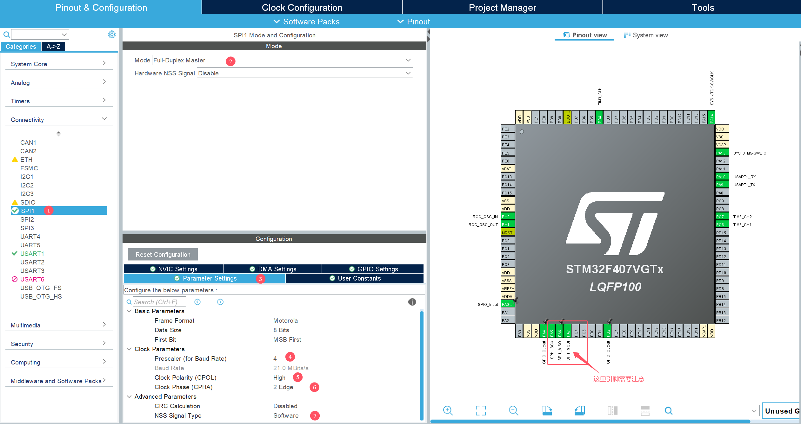

#### 例程代码

https://wiki.lckfb.com/zh-hans/tkx/tkx-stm32f407vxt6/beginner/spi.html

代码是我从嘉立创那里移植的，主要修改的是`W25QXX_CS_ON(x)`和`spi_read_write_byte`将其修改使用HAL库的函数，这样就可以使用了。

```c
//app_spi.h
#ifndef __APP_SPI_H__
#define __APP_SPI_H__

#include "bsp_system.h"

#define BSP_SPI_NSS_RCU        GPIOA             // CS引脚时钟
#define BSP_SPI_NSS            GPIO_PIN_4        // 软件CS

#define W25QXX_CS_ON(x)  HAL_GPIO_WritePin(BSP_SPI_NSS_RCU,BSP_SPI_NSS,x ? GPIO_PIN_SET : GPIO_PIN_RESET);

void W25Q128_Init(void);
uint8_t spi_read_write_byte(uint8_t dat);
uint16_t W25Q128_ReadID(void);
void W25Q128_WriteEnable(void);
void W25Q128_WaitBusy(void);
void W25Q128_EraseSector(uint32_t addr);
void W25Q128_Write(uint8_t* buffer, uint32_t addr, uint16_t numbyte);
void W25Q128_Read(uint8_t* buffer, uint32_t read_addr, uint16_t read_length);

#endif
```

```c
//app_spi.c
#include "app_spi.h"

void W25Q128_Init(void) 
{
	W25QXX_CS_ON(1);
}

// 发收单字节（全双工）
uint8_t spi_read_write_byte(uint8_t dat) 
{
	uint8_t rx_data;
	HAL_SPI_TransmitReceive(&hspi1, &dat, &rx_data, 1, HAL_MAX_DELAY);  // 阻塞模式，超时无限
	return rx_data;
}

// 读 ID
uint16_t W25Q128_ReadID(void) 
{
	uint16_t temp = 0;
	uint8_t dummy = 0xFF;
	W25QXX_CS_ON(0);
	spi_read_write_byte(0x90);  // 命令
	spi_read_write_byte(0x00);  // 地址
	spi_read_write_byte(0x00);
	spi_read_write_byte(0x00);
	temp = spi_read_write_byte(dummy) << 8;  // 制造商 ID
	temp |= spi_read_write_byte(dummy);      // 设备 ID
	W25QXX_CS_ON(1);
	return temp;
}

// 写使能
void W25Q128_WriteEnable(void) 
{
	W25QXX_CS_ON(0);
	spi_read_write_byte(0x06);
	W25QXX_CS_ON(1);
}

// 等不忙
void W25Q128_WaitBusy(void) 
{
	uint8_t status;
	do {
			W25QXX_CS_ON(0);
			spi_read_write_byte(0x05);
			status = spi_read_write_byte(0xFF);
			W25QXX_CS_ON(1);
	} while (status & 0x01);  // BUSY bit=1 等
}

// 擦除扇区（addr 是扇区号 0~4095）
void W25Q128_EraseSector(uint32_t addr) 
{
	addr *= 4096;  // 转首地址
	W25Q128_WriteEnable();
	W25Q128_WaitBusy();
	W25QXX_CS_ON(0);
	spi_read_write_byte(0x20);
	spi_read_write_byte((addr >> 16) & 0xFF);
	spi_read_write_byte((addr >> 8) & 0xFF);
	spi_read_write_byte(addr & 0xFF);
	W25QXX_CS_ON(1);
	W25Q128_WaitBusy();
}

// 写数据（自动擦除）
void W25Q128_Write(uint8_t* buffer, uint32_t addr, uint16_t numbyte) 
{
	W25Q128_EraseSector(addr / 4096);  // 先擦扇区
	W25Q128_WriteEnable();
	W25Q128_WaitBusy();
	W25QXX_CS_ON(0);
	spi_read_write_byte(0x02);
	spi_read_write_byte((addr >> 16) & 0xFF);
	spi_read_write_byte((addr >> 8) & 0xFF);
	spi_read_write_byte(addr & 0xFF);
	for (uint16_t i = 0; i < numbyte; i++) {
			spi_read_write_byte(buffer[i]);
	}
	W25QXX_CS_ON(1);
	W25Q128_WaitBusy();
}

// 读数据
void W25Q128_Read(uint8_t* buffer, uint32_t read_addr, uint16_t read_length) 
{
	W25QXX_CS_ON(0);
	spi_read_write_byte(0x03);
	spi_read_write_byte((read_addr >> 16) & 0xFF);
	spi_read_write_byte((read_addr >> 8) & 0xFF);
	spi_read_write_byte(read_addr & 0xFF);
	for (uint16_t i = 0; i < read_length; i++) {
			buffer[i] = spi_read_write_byte(0xFF);  // 发 dummy 收数据
	}
	W25QXX_CS_ON(1);
}

```

测试代码

```c
	HAL_Delay(200);
	
	uint8_t buff[20] = {0};

	usart_printf(usart1_debug.huart,"\r\n=========【开始】========\r\n");

	usart_printf(usart1_debug.huart,"\r\n【1】擦除扇区0......\r\n");
	W25Q128_EraseSector(0);
	usart_printf(usart1_debug.huart,"完成！\r\n");
	HAL_Delay(200);

	usart_printf(usart1_debug.huart,"\r\n【2】读 ID......\r\n");
	usart_printf(usart1_debug.huart,"ID = 0x%X\r\n", W25Q128_ReadID());

	usart_printf(usart1_debug.huart,"\r\n【3】读 0 地址 10 字节......\r\n");
	W25Q128_Read(buff, 0, 10);
	usart_printf(usart1_debug.huart,"数据: %s\r\n", buff);
	HAL_Delay(200);

	usart_printf(usart1_debug.huart,"\r\n【4】写 “立创开发板” 到 0 地址......\r\n");
	W25Q128_Write((uint8_t *)"立创开发板", 0, 10);
	HAL_Delay(200);
	usart_printf(usart1_debug.huart,"完成！\r\n");

	usart_printf(usart1_debug.huart,"\r\n【5】再读 10 字节......\r\n");
	memset(buff, 0, sizeof(buff));  // 清 buff
	W25Q128_Read(buff, 0, 10);
	usart_printf(usart1_debug.huart,"数据: %s\r\n", buff);
	HAL_Delay(1000);

	usart_printf(usart1_debug.huart,"\r\n【6】擦除清数据......\r\n");
	W25Q128_EraseSector(0);
	HAL_Delay(200);

	usart_printf(usart1_debug.huart,"\r\n=========【结束】========\r\n");
```

现象如下

```
[12:06:18.111]Rx:

=========【开始】========

【1】擦除扇区0......
完成！

【2】读 ID......
ID = 0xEF17

【3】读 0 地址 10 字节......
数据: ���������� //这里乱码的原因是上一次已经将数据擦除了，读取出来的都是ff

【4】写 “立创开发板” 到 0 地址......
完成！

【5】再读 10 字节......
数据: 立创开发板

[12:06:19.782]Rx:

【6】擦除清数据......

=========【结束】========
```

**HAL_SPI_TransmitReceive**

1. **是什么？（基本介绍）**

- **全名**：`HAL_StatusTypeDef HAL_SPI_TransmitReceive(SPI_HandleTypeDef *hspi, uint8_t *pTxData, uint8_t *pRxData, uint16_t Size, uint32_t Timeout)`
- **作用**：在 SPI 主机模式下，同时发送 (Transmit) 和接收 (Receive) 数据。适合全双工通信（如读 Flash ID：发命令收 ID）。
- **返回**：HAL_OK（成功）、HAL_ERROR（失败）、HAL_BUSY（忙）、HAL_TIMEOUT（超时）。
- **为什么叫 TransmitReceive**？SPI 是同步全双工：发数据时，MISO 线会同时收数据（即使从机不回，也收 dummy）。不像 UART 半双工。
- **模式**：阻塞模式（等完成再返回），有超时保护。HAL 还有中断/DMA 版（非阻塞，如 HAL_SPI_TransmitReceive_IT 或 _DMA）。

2. **参数解释（每个什么意思）**

- **SPI_HandleTypeDef \*hspi**：SPI 句柄指针。像“身份证”，指向你的 SPI 配置（如 &hspi1，从 MX_SPI1_Init 生成）。告诉函数用哪个 SPI（SPI1/2 等）。
- **uint8_t \*pTxData**：发送数据缓冲区指针。像“寄出的包裹”，指向要发的数据数组（uint8_t 是字节）。发 1 字节就 &dat，发多字节就 buffer。
- **uint8_t \*pRxData**：接收数据缓冲区指针。像“收到的回信”，指向存收数据的数组。大小至少 Size 字节。
- **uint16_t Size**：传输字节数。发/收多少字节（最大 65535）。如发 1 命令 + 收 2 ID，就 Size=命令字节 + 地址 + 收字节（看协议）。
- **uint32_t Timeout**：超时时间 (ms)。等多久算失败。HAL_MAX_DELAY 是无限等（阻塞到完）。实际用 1000ms 等，避免卡死

### ADC/DAC

## 第三部分：提高篇

### 让车动起来

#### 驱动电机

#### 电机测速

#### PID

#### 陀螺仪

#### 灰度传感器

### 让云台动起来

## 第四部分：扩展篇

### 智能管家小项目（PCB+代码+前后端+上云）

### 滤波算法

在 MPU6050 代码中，提到了两种常见的姿态估计算法：**互补滤波（Complementary Filter）\**和\**四元数（Quaternions）**。这两者都是融合加速度计和陀螺仪数据以得到更准确的姿态估计（即滚转角、俯仰角、偏航角）。下面将分别介绍这两种算法。

### **互补滤波**

互补滤波是一种简单且常用的传感器融合算法。它的主要思想是将加速度计和陀螺仪的数据结合起来，弥补各自的不足。具体来说：

- **加速度计**提供了与重力相关的方向信息（例如，姿态角度），但它容易受到加速度变化（如震动）和不精确的重力方向估计的影响。
- **陀螺仪**提供了与角速度相关的信息，能够连续跟踪物体的角度变化，但它会随着时间的推移产生漂移。

互补滤波的基本原理是：

- **低通滤波器**：用来处理加速度计的输出，因为加速度计更适合提供低频的姿态变化信息。
- **高通滤波器**：用来处理陀螺仪的输出，能够抵消低频漂移，保持实时的角度变化。

#### **互补滤波公式：**

假设我们已经有了加速度计和陀螺仪的数据：

- $$
  \theta_{\text{acc}}：从加速度计计算出的角度
  $$

  

- $$
  \theta_{\text{gyro}}：从陀螺仪积分得到的角度
  $$

  

- $$
  \tau：时间步长
  $$

  

- $$
  \alpha：滤波器的权重系数
  $$

  

在互补滤波中，角度的更新是通过以下公式来完成的：
$$
θfiltered(t)= \alpha \cdot (\theta_{\text{filtered}}(t-1) + \theta_{\text{gyro}} \cdot \Delta t) + (1 - \alpha) \cdot \theta_{\text{acc}}
$$


- **加速度计角度**
  $$
  （θacc）
  $$
  是基于加速度计的原始数据计算出来的，通过加速度计的三个轴的加速度值来推算出物体的角度（通常用 
  $$
  θacc= \arctan(\frac{Ay}{Az})
  $$
  来估算）。

- **陀螺仪角度**
  $$
  （θgyro）
  $$
  通过对角速度进行积分得到。

### **四元数算法**

四元数是一种数学结构，用来表示三维空间中的旋转。相比欧拉角，四元数避免了“万向节死锁”问题，可以更稳定和精确地描述三维旋转。

四元数通过四个数来表示旋转（q0,q1,q2,q3q_0, q_1, q_2, q_3）。其优点在于，它不容易出现欧拉角中的奇异性问题。四元数能够表示所有的空间旋转，且计算效率较高。

在四元数算法中，传感器（加速度计和陀螺仪）的数据通过更新四元数来计算物体的姿态（滚转角、俯仰角、偏航角）。

**四元数更新：**

四元数 q=[q0,q1,q2,q3]q = [q_0, q_1, q_2, q_3] 代表从参考轴到物体的旋转。四元数的更新由以下步骤完成：

1. **加速度计和陀螺仪数据转换为四元数的增量**：

   - 使用加速度计计算得到一个参考向量，用来校正四元数的偏差。
   - 使用陀螺仪的角速度来更新四元数。

2. **四元数更新公式**：
   四元数 qq 的更新基于以下步骤：

   - 首先，计算陀螺仪的角速度转化为四元数增量：
     $$
     q˙=\frac{1}{2} q \cdot \omega
     $$
     其中，qq是当前的四元数，ω 是陀螺仪的角速度。

   - 然后，利用加速度计数据来修正四元数：

     - 如果加速度计和当前四元数的估算结果相差较大，则修正四元数的方向。
     - 使用一个“比例-积分”控制器（如卡尔曼滤波器或互补滤波器）来动态调整权重。

3. **计算姿态角（滚转、俯仰、偏航角）**：
   根据更新后的四元数，可以计算出对应的滚转角（roll）、俯仰角（pitch）和偏航角（yaw）：
   $$
   roll= \arctan \left( \frac{2 (q_0 q_1 + q_2 q_3)}{1 - 2(q_1^2 + q_2^2)} \right)
   $$

   $$
   pitch= \arcsin(2(q_0 q_2 - q_3 q_1))
   $$

   $$
   yaw= \arctan \left( \frac{2 (q_0 q_3 + q_1 q_2)}{1 - 2(q_2^2 + q_3^2)} \right)
   $$

   

### **总结**

- **互补滤波**：简单、计算量小，适用于资源受限的系统。它通过加权组合加速度计和陀螺仪的数据来提供稳定的姿态估计，但需要调节合适的权重（通常是通过经验选择）。

## Git仓库代码

假设你现在有一个名为 `NewProject` 的新文件夹，你想把它添加到 `E:\University\Gitcode` 这个 Git 仓库中。

------

### **上传新文件夹的通用步骤**

1. **进入你的本地 Git 仓库目录**
    打开你的终端（PowerShell 或 Git Bash），使用 `cd` 命令进入到你的 Git 仓库的根目录。

   ```powershell
   cd E:\University\Gitcode
   ```

2. **将新文件夹放入仓库目录**
    将你要上传的新文件夹（例如 `NewProject`）复制或移动到这个 `E:\University\Gitcode` 目录下。

   完成后，你的目录结构看起来会是这样：

   ```
   E:\University\Gitcode
   ├── .git/
   ├── Timer/
   ├── NewProject/  <-- 你想上传的新文件夹
   ├── ... (其他文件/文件夹)
   ```

3. **检查 Git 状态 (可选但强烈推荐)**
    在添加文件之前，先用 `git status` 看看当前仓库的状态。你会看到 `NewProject/` 文件夹显示为 `Untracked files` (未跟踪的文件)。

   ```powershell
   git status
   ```

   你会看到类似：

   ```
   Untracked files:
     (use "git add <file>..." to include in what will be committed)
           NewProject/
   ```

4. **将新文件夹添加到暂存区 (`git add`)**
    现在告诉 Git 你想把 `NewProject` 这个文件夹加入到下一次提交中。

   ```powershell
   git add NewProject
   ```

   *提示：* 如果你想添加所有新文件和已修改的文件（不包括已删除的），也可以用 `git add .`。但为了精确控制，知道具体要添加哪个文件夹的名字更好。
    *如果你看到 `LF will be replaced by CRLF` 的警告，别担心，这是行结束符的提示，通常是无害的。*

   再次运行 `git status`，你会看到 `NewProject/` 已经从 `Untracked` 变成了 `Changes to be committed` (将被提交的更改)。

5. **提交更改到本地仓库 (`git commit`)**
    将暂存区的内容正式保存为一个新的提交（commit）到你的本地仓库历史中。

   ```powershell
   git commit -m "添加 NewProject 文件夹"
   ```

   `"-m"` 后面是你的提交信息。请写一个清晰、有意义的信息，描述你这次提交做了什么。

6. **拉取远程仓库的最新内容 (`git pull`)**
    在推送之前，务必先拉取远程仓库的最新内容。这是为了防止远程仓库在你提交之后有了新的更改，避免你推送时被拒绝。

   ```powershell
   git pull origin master
   ```

   - **`origin`**: 这是你的远程仓库的默认名称。（你可以通过 `git remote -v` 查看）
   - **`master`**: 这是你要操作的远程分支名称。（你的仓库目前是 `master`，如果以后你使用 `main` 分支，就改成 `main`）
   - **可能的结果：**
     - **`Already up to date.` 或 `Fast-forward`:** 最理想情况，说明你的本地仓库是最新的，或者可以快速合并。
     - **`Merge made by the 'recursive' strategy.`:** 远程有更新，Git 帮你自动合并了。
     - **Vim 编辑器弹出：** 这通常是 `git pull` 产生了合并提交，需要你确认提交信息。
       - 输入 `D` 然后回车，删除旧的交换文件。
       - 在 Vim 中，你可以直接 `:wq` 保存并退出（通常默认信息就足够）。
     - **冲突提示 (`CONFLICT (content): Merge conflict in ...`)：** 如果远程和你本地修改了同一个文件的同一部分，就会出现冲突。你需要手动解决冲突（Git 会在文件中标记冲突区域），解决完后，`git add <冲突文件>`，然后 `git commit`（这次提交是合并提交）。

7. **推送本地更改到远程仓库 (`git push`)**
    一旦 `git pull` 成功完成（无论是自动合并还是手动解决了冲突），你的本地仓库就已经包含了远程的最新内容以及你刚刚添加的 `NewProject` 文件夹的提交。现在可以安全地推送到远程仓库了。

   ```powershell
   git push origin master
   ```

   如果一切顺利，你的 `NewProject` 文件夹和其中的内容就会被成功上传到 Gitee 上的 `reference-code.git` 仓库了！

------

### **重要提示和良好习惯**

- **经常使用 `git status`：** 它是你的 Git “指南针”，随时告诉你当前仓库处于什么状态，有哪些文件待处理。

- **`.gitignore` 文件：** 如果你的新文件夹中包含编译生成的文件（如 `.obj`, `.hex`, `.elf`）、IDE 配置文件、临时文件等，这些文件是不应该被提交到 Git 仓库的。你可以在仓库根目录创建一个名为 `.gitignore` 的文件，并在其中列出这些需要被忽略的文件或文件夹模式。

  - 例如，在一个 STM32 项目中，你可能会忽略 `build/` 文件夹、`Debug/` 文件夹、`.ioc` 文件（如果你不想跟踪它的每次变化）等等。

  - 示例 `.gitignore` 内容：

    ```
    # Build artifacts
    *.o
    *.elf
    *.bin
    *.hex
    build/
    Debug/
    Release/
    
    # IDE specific files
    *.uvoptx
    *.uvprojx
    *.bak
    *.dep
    *.suo
    *.user
    *.aps
    *.opendblg
    *.settings
    
    # STM32CubeIDE specific
    .metadata/
    .project
    .cproject
    
    # Temporaries
    *.tmp
    *.~
    ```

  - **如何使用 `.gitignore`：** 在你的 `E:\University\Gitcode` 目录下创建一个名为 `.gitignore` 的文本文件，然后把上面类似的内容复制进去。 Git 会自动忽略这些文件。

- **使用分支：** 在实际开发中，特别是多人协作或者进行较大新功能开发时，建议在一个新的分支上进行工作（例如 `git checkout -b feature/NewProject`），开发完成后再合并到 `master` (或 `main`) 分支。但如果你只是个人使用，并且对流程要求不高，直接在 `master` 分支操作也是可以的。


# RT-thraed/rtos学习笔记

## RT-thread与RT-threadNano的区别

与 RT-Thread 完整版不同的是，Nano 不含 Scons 构建系统，不需要 Kconfig 以及 Env 配置工具，也去除了完整版特有的 device 框架和组件，仅是一个纯净的内核。

### Nano启动流程

RT-Thread 启动流程如下所示，在图中标出颜色的部分需要用户特别注意（黄色表示 libcpu 移植相关的内容，绿色部分表示板级移植相关的内容）。


RT-Thread 的启动流程如下：

1. 全局关中断，初始化与系统相关的硬件。
2. 打印系统版本信息，初始化系统内核对象（如定时器、调度器）。
3. 初始化用户 main 线程（同时会初始化线程栈），在 main 线程中对各类模块依次进行初始化。
4. 初始化软件定时器线程、初始化空闲线程。
5. 启动调度器，系统切换到第一个线程开始运行（如 main 线程），并打开全局中断。

在`startup_stm32f103xb.s`文件中有这样一段代码，加入rtthread之后，rtt会接管这个main函数

```
Reset_Handler    PROC
                 EXPORT  Reset_Handler             [WEAK]
     IMPORT  __main
     IMPORT  SystemInit
                 LDR     R0, =SystemInit
                 BLX     R0
                 LDR     R0, =__main
                 BX      R0
                 ENDP
```


## RT-threadNano移植需要注意的点

需要在`stm32f1xx_it.c`中注释这三个函数`HardFault_Handler()`、`PendSV_Handler()`、`SysTick_Handler()`

RT-Thread 会接管异常处理函数 `HardFault_Handler()` 和悬挂处理函数 `PendSV_Handler()`，这两个函数已由 RT-Thread 实现，所以需要删除工程里中断服务例程文件中的这两个函数，避免在编译时产生重复定义。如果此时对工程进行编译，没有出现函数重复定义的错误，则不用做修改。

由于 `SysTick_Handler()` 中断服务例程由用户在 board.c 中重新实现，做了系统 OS Tick，所以还需要删除工程里中原本已经实现的 `SysTick_Handler()` ，避免在编译时产生重复定义。如果此时对工程进行编译，没有出现函数重复定义的错误，则不用做修改。

```c
/* board.c */

/* timer 定时器中断服务函数调用 rt_os_tick_callback function，cortex-m 架构使用 SysTick_Handler() */
void rt_os_tick_callback(void)
{
  rt_interrupt_enter(); /* 进入中断时必须调用 */

  rt_tick_increase();  /* RT-Thread 系统时钟计数 */

  rt_interrupt_leave(); /* 退出中断时必须调用 */
}

/* cortex-m 架构使用 SysTick_Handler() */
void SysTick_Handler()
{
    rt_os_tick_callback();
}

void rt_hw_board_init(void)
{
  /*
   * TODO 1: OS Tick Configuration
   * Enable the hardware timer and call the rt_os_tick_callback function
   * periodically with the frequency RT_TICK_PER_SECOND.
   */

  /* 1、系统、时钟初始化 */
  HAL_Init(); // 初始化 HAL 库
  SystemClock_Config(); // 配置系统时钟
  SystemCoreClockUpdate(); // 对系统时钟进行更新

  /* 2、OS Tick 频率配置，RT_TICK_PER_SECOND = 1000 表示 1ms 触发一次中断 */
  SysTick_Config(SystemCoreClock / RT_TICK_PER_SECOND);

  /* Call components board initial (use INIT_BOARD_EXPORT()) */
#ifdef RT_USING_COMPONENTS_INIT
  rt_components_board_init();
#endif

#if defined(RT_USING_USER_MAIN) && defined(RT_USING_HEAP)
  rt_system_heap_init(rt_heap_begin_get(), rt_heap_end_get());
#endif
}
```

系统内存堆的初始化在 board.c 中的 rt_hw_board_init() 函数中完成，内存堆功能是否使用取决于宏 `RT_USING_HEAP` 是否开启，RT-Thread Nano 默认不开启内存堆功能，这样可以保持一个较小的体积，不用为内存堆开辟空间。

如果栈溢出了，可以看一下开辟的推是否过大，如果不打开这个宏，rtt无法使用动态创建对象，如使用 rt_malloc、rt_free 以及各种系统动态创建对象的 API。

```c
#define RT_HEAP_SIZE (2*1024)
static rt_uint8_t rt_heap[RT_HEAP_SIZE];
```

## RTT的启动流程

## 线程

我们根据功能的不同，把整个系统分割成一个个独立的且无法返回的函数，这个函数我们称为线程。

**定义线程栈**：在多线程系统中，每个线程都是独立的，互不干扰的，所以要为每个线程都分配独立的栈空间，这个栈空间通常是一个预先定义好的全局数组，也可以是动态分配的一段内存空间，但它们都存在于 RAM 中。

**定义线程控制块：**系统为了顺利的调度线程，为每个线程都额外定义了一个线程控制块，这个线程控制块就相当于线程的身份证，里面存有线程的所有信息，比如线程的栈指针，线程名称，线程的形参等。

链表操作：初始化链表节点，在双向链表表头后面加入一个节点，在双向链表表头前面加入一个节点，从双向链表中删除一个节点

### 线程是如何切换的

## 对象容器

在 RT-Thread 中，所有的数据结构都称之为对象。其中线程，信号量，互斥量、事件、邮箱、消息队列、内存堆、内存池、设备和定时

器在 rtdef.h 中有明显的枚举定义

```c
enum rt_object_class_type
{
    RT_Object_Class_Null          = 0x00,      /**< The object is not used. */
    RT_Object_Class_Thread        = 0x01,      /**< The object is a thread. */
    RT_Object_Class_Semaphore     = 0x02,      /**< The object is a semaphore. */
    RT_Object_Class_Mutex         = 0x03,      /**< The object is a mutex. */
    RT_Object_Class_Event         = 0x04,      /**< The object is a event. */
    RT_Object_Class_MailBox       = 0x05,      /**< The object is a mail box. */
    RT_Object_Class_MessageQueue  = 0x06,      /**< The object is a message queue. */
    RT_Object_Class_MemHeap       = 0x07,      /**< The object is a memory heap. */
    RT_Object_Class_MemPool       = 0x08,      /**< The object is a memory pool. */
    RT_Object_Class_Device        = 0x09,      /**< The object is a device. */
    RT_Object_Class_Timer         = 0x0a,      /**< The object is a timer. */
    RT_Object_Class_Unknown       = 0x0c,      /**< The object is unknown. */
    RT_Object_Class_Static        = 0x80       /**< The object is a static object. */
};

```

在 rtt 中，为了方便管理这些对象，专门定义了一个对象类型数据结构

```c
/**
 * Base structure of Kernel object
 */
struct rt_object
{
    char       name[RT_NAME_MAX];                       /**< name of kernel object */
    rt_uint8_t type;                                    /**< type of kernel object */
    rt_uint8_t flag;                                    /**< flag of kernel object */

    rt_list_t  list;                                    /**< list node of kernel object */
};
typedef struct rt_object *rt_object_t;                  /**< Type for kernel objects. */
```

在 rtt 中，每当用户创建一个对象，如线程，就会将这个对象放到一个叫做容器的地方，那什么是容器，从代码上看，容器就是一个数组，是一个全局变量，数据类型为 `struct rt_object_information`，这是一个结构体类型，包含对象的三个信息，分别为对象类型、对象列表节点头和对象的大小。

```c
/**
 * The information of the kernel object
 */
struct rt_object_information
{
    enum rt_object_class_type type;                     /**< object class type */
    rt_list_t                 object_list;              /**< object list */
    rt_size_t                 object_size;              /**< object size */
};
```

- 对象的类型，取值只能是 rt_object_class_type 枚举类型。
- 对象列表节点头，每当对象创建时，对象就会通过他们控制块里面的 list 节点将自己挂到对象容器中的对应列表，同一类型的对象是挂到对象容器中同一个对象列表的，容器数组的小标对应的就是对象的类型。
- 对象的大小，可直接通过 sizeof(对象控制块类型)获取。

容 器 的 大 小 由 `RT_Object_Info_Unknown` 决 定 ， `RT_Object_Info_Unknown` 是一个枚举类型的变量，在 `rt_object_info_type` 这个枚举结构体里面定义，具体见下面的代码。

```c
/*
 * define object_info for the number of rt_object_container items.
 */
enum rt_object_info_type
{
    RT_Object_Info_Thread = 0,                         /**< The object is a thread. */
#ifdef RT_USING_SEMAPHORE
    RT_Object_Info_Semaphore,                          /**< The object is a semaphore. */
#endif
#ifdef RT_USING_MUTEX
    RT_Object_Info_Mutex,                              /**< The object is a mutex. */
#endif
#ifdef RT_USING_EVENT
    RT_Object_Info_Event,                              /**< The object is a event. */
#endif
#ifdef RT_USING_MAILBOX
    RT_Object_Info_MailBox,                            /**< The object is a mail box. */
#endif
#ifdef RT_USING_MESSAGEQUEUE
    RT_Object_Info_MessageQueue,                       /**< The object is a message queue. */
#endif
#ifdef RT_USING_MEMHEAP
    RT_Object_Info_MemHeap,                            /**< The object is a memory heap */
#endif
#ifdef RT_USING_MEMPOOL
    RT_Object_Info_MemPool,                            /**< The object is a memory pool. */
#endif
#ifdef RT_USING_DEVICE
    RT_Object_Info_Device,                             /**< The object is a device */
#endif
    RT_Object_Info_Timer,                              /**< The object is a timer. */
    RT_Object_Info_Unknown,                            /**< The object is unknown. */
};
```

- 初始化对象容器—线程：线程是 rtt 里面最基本的对象，是必须存在的，跟其它的对象不一样，没有通过宏定义来选择，接下来下面的信号量、邮箱都通过对应的宏定义来控制是否初始化，即只有在创建了相应的对象后，才在对象容器里面初始化。

```c
static struct rt_object_information rt_object_container[RT_Object_Info_Unknown] =
{
    /* initialize object container - thread */
    {RT_Object_Class_Thread, _OBJ_CONTAINER_LIST_INIT(RT_Object_Info_Thread), sizeof(struct rt_thread)},
#ifdef RT_USING_SEMAPHORE
    /* initialize object container - semaphore */
    {RT_Object_Class_Semaphore, _OBJ_CONTAINER_LIST_INIT(RT_Object_Info_Semaphore), sizeof(struct rt_semaphore)},
#endif
#ifdef RT_USING_MUTEX
    /* initialize object container - mutex */
    {RT_Object_Class_Mutex, _OBJ_CONTAINER_LIST_INIT(RT_Object_Info_Mutex), sizeof(struct rt_mutex)},
#endif
#ifdef RT_USING_EVENT
    /* initialize object container - event */
    {RT_Object_Class_Event, _OBJ_CONTAINER_LIST_INIT(RT_Object_Info_Event), sizeof(struct rt_event)},
#endif
#ifdef RT_USING_MAILBOX
    /* initialize object container - mailbox */
    {RT_Object_Class_MailBox, _OBJ_CONTAINER_LIST_INIT(RT_Object_Info_MailBox), sizeof(struct rt_mailbox)},
#endif
#ifdef RT_USING_MESSAGEQUEUE
    /* initialize object container - message queue */
    {RT_Object_Class_MessageQueue, _OBJ_CONTAINER_LIST_INIT(RT_Object_Info_MessageQueue), sizeof(struct rt_messagequeue)},
#endif
#ifdef RT_USING_MEMHEAP
    /* initialize object container - memory heap */
    {RT_Object_Class_MemHeap, _OBJ_CONTAINER_LIST_INIT(RT_Object_Info_MemHeap), sizeof(struct rt_memheap)},
#endif
#ifdef RT_USING_MEMPOOL
    /* initialize object container - memory pool */
    {RT_Object_Class_MemPool, _OBJ_CONTAINER_LIST_INIT(RT_Object_Info_MemPool), sizeof(struct rt_mempool)},
#endif
#ifdef RT_USING_DEVICE
    /* initialize object container - device */
    {RT_Object_Class_Device, _OBJ_CONTAINER_LIST_INIT(RT_Object_Info_Device), sizeof(struct rt_device)},
#endif
    /* initialize object container - timer */
    {RT_Object_Class_Timer, _OBJ_CONTAINER_LIST_INIT(RT_Object_Info_Timer), sizeof(struct rt_timer)},
};
```

### 容器接口的实现

#### 获取指定类型的对象信息

容器在定义的时候，大小是被固定的，由 `RT_Object_Info_Unknown` 这个枚举值决定，但容器里面的成员是否初始化就不一定了，其中线程和定时器这两个对象默认会被初始化，剩下的其它对象由对应的宏决定。`rt_object_get_information()`会遍历整个容器对象，如果对象的类型等于我们指定的类型，那么就返回该容器成员的地址，地址的类型为 `struct rt_object_information`。

```c
struct rt_object_information *
rt_object_get_information(enum rt_object_class_type type)
{
    int index;

    for (index = 0; index < RT_Object_Info_Unknown; index ++)
        if (rt_object_container[index].type == type) return &rt_object_container[index];

    return RT_NULL;
}
```

#### 对象初始化

每创建一个对象，都需要先将其初始化，主要分成两个部分的工作，首先将对象控制块里面与对象相关的成员初始化，然后将该对象插入到对象容器中

```c
void rt_object_init(struct rt_object         *object,
                    enum rt_object_class_type type,
                    const char               *name)
{
    register rt_base_t temp;
    struct rt_list_node *node = RT_NULL;
    struct rt_object_information *information;

    /* get object information */
    information = rt_object_get_information(type);
    RT_ASSERT(information != RT_NULL);

    /* check object type to avoid re-initialization */

    /* enter critical */
    rt_enter_critical();
    /* try to find object */
    for (node  = information->object_list.next;
            node != &(information->object_list);
            node  = node->next)
    {
        struct rt_object *obj;

        obj = rt_list_entry(node, struct rt_object, list);
        if (obj) /* skip warning when disable debug */
        {
            RT_ASSERT(obj != object);
        }
    }
    /* leave critical */
    rt_exit_critical();

    /* initialize object's parameters */
    /* set object type to static */
    object->type = type | RT_Object_Class_Static;
    /* copy name */
    rt_strncpy(object->name, name, RT_NAME_MAX);

    RT_OBJECT_HOOK_CALL(rt_object_attach_hook, (object));

    /* lock interrupt */
    temp = rt_hw_interrupt_disable();

    /* insert object into information object list */
    rt_list_insert_after(&(information->object_list), &(object->list));

    /* unlock interrupt */
    rt_hw_interrupt_enable(temp);
}
```

## 空闲线程与阻塞延时

RTOS 中的延时叫阻塞延时，即线程需要延时的时候，线程会放弃 CPU 的使用权，CPU 可以去干其它的事情，当线程延时时间到，重
 新获取 CPU 使用权，线程继续运行，这样就充分地利用了 CPU 的资源。

当系统进入空闲线程的时候，可在空闲线程中让单片机进入休眠或者低功耗等操作。

## 多优先级实现

### 就绪列表

RT-Thread 要支持多优先级，需要靠就绪列表的支持，从代码上看，就绪列表由两个在 scheduler.c 文 件 定 义 的 全 局 变 量 组 成 ， 一 个 是 **线 程 就 绪 优 先 级 组`rt_thread_ready_priority_group`** ， 另一个是**线程优先级表`rt_thread_priority_table[RT_THREAD_PRIORITY_MAX]`**。线程优先级表的索引对应的是线程的优先级。

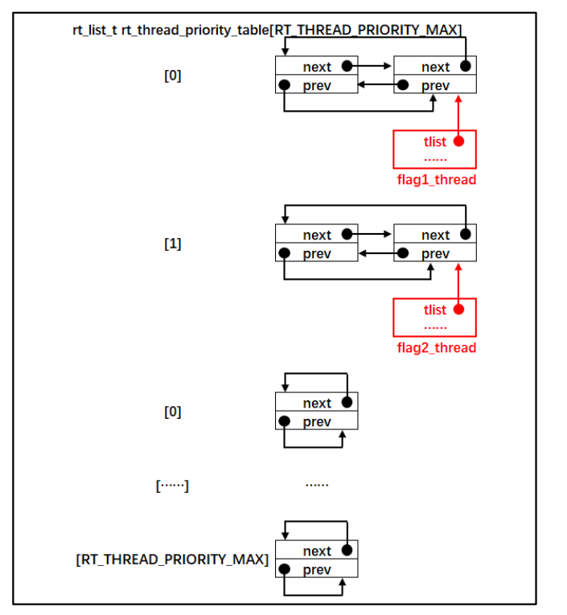

**线 程 就 绪 优 先 级 组`rt_thread_ready_priority_group`**：能够快速的找到线程在线程优先级表的插入和移除的位置，线程就绪优先级组就是一个 32 位的整形数，每一个位对应一个优先级。

**找到线程就绪优先级组中看到的第一个置1的位**，使用函数`__rt_ffs`实现，这个函数使用的是查表法返回第一个置1的位置

```c
const rt_uint8_t __lowest_bit_bitmap[] =
{
    /* 00 */ 0, 0, 1, 0, 2, 0, 1, 0, 3, 0, 1, 0, 2, 0, 1, 0,
    /* 10 */ 4, 0, 1, 0, 2, 0, 1, 0, 3, 0, 1, 0, 2, 0, 1, 0,
    /* 20 */ 5, 0, 1, 0, 2, 0, 1, 0, 3, 0, 1, 0, 2, 0, 1, 0,
    /* 30 */ 4, 0, 1, 0, 2, 0, 1, 0, 3, 0, 1, 0, 2, 0, 1, 0,
    /* 40 */ 6, 0, 1, 0, 2, 0, 1, 0, 3, 0, 1, 0, 2, 0, 1, 0,
    /* 50 */ 4, 0, 1, 0, 2, 0, 1, 0, 3, 0, 1, 0, 2, 0, 1, 0,
    /* 60 */ 5, 0, 1, 0, 2, 0, 1, 0, 3, 0, 1, 0, 2, 0, 1, 0,
    /* 70 */ 4, 0, 1, 0, 2, 0, 1, 0, 3, 0, 1, 0, 2, 0, 1, 0,
    /* 80 */ 7, 0, 1, 0, 2, 0, 1, 0, 3, 0, 1, 0, 2, 0, 1, 0,
    /* 90 */ 4, 0, 1, 0, 2, 0, 1, 0, 3, 0, 1, 0, 2, 0, 1, 0,
    /* A0 */ 5, 0, 1, 0, 2, 0, 1, 0, 3, 0, 1, 0, 2, 0, 1, 0,
    /* B0 */ 4, 0, 1, 0, 2, 0, 1, 0, 3, 0, 1, 0, 2, 0, 1, 0,
    /* C0 */ 6, 0, 1, 0, 2, 0, 1, 0, 3, 0, 1, 0, 2, 0, 1, 0,
    /* D0 */ 4, 0, 1, 0, 2, 0, 1, 0, 3, 0, 1, 0, 2, 0, 1, 0,
    /* E0 */ 5, 0, 1, 0, 2, 0, 1, 0, 3, 0, 1, 0, 2, 0, 1, 0,
    /* F0 */ 4, 0, 1, 0, 2, 0, 1, 0, 3, 0, 1, 0, 2, 0, 1, 0
};

int __rt_ffs(int value)
{
    if (value == 0) return 0;

    if (value & 0xff)
        return __lowest_bit_bitmap[value & 0xff] + 1;

    if (value & 0xff00)
        return __lowest_bit_bitmap[(value & 0xff00) >> 8] + 9;

    if (value & 0xff0000)
        return __lowest_bit_bitmap[(value & 0xff0000) >> 16] + 17;

    return __lowest_bit_bitmap[(value & 0xff000000) >> 24] + 25;
}
```

### 线程优先级表

线程优先级表就是就绪列表，线程优先级表定义`rt_thread_priority_table[RT_THREAD_PRIORITY_MAX]`

线程优先级表的数据类型为 `rt_list`，每个索引号对应线程的优先级，该索引下维护着 一条双向链表，当线程就绪时，线程就会根据优先级插入到对应索引的链表，同一个优先级的线程都会被插入到同一条链表中，当同一个链表中有多个线程的时候，需要时间片的支持。

## 实现定时器

在 RT-Thread 中，每个线程都内置一个定时器，当线程需要延时的时候，则先将线程挂起，然后内置的定时器就会启动，并且将定时器插入到一个全局的系统定时器列表`rt_timer_list`，这个全局的系统定时器列表维护着一条双向链表，每个节点代表了正在延时的线程的定时器，节点按照延时时间大小做升序排列。当每次时基中断（SysTick 中断）来临时，就扫描系统定时器列表的第一个定时器，看看延时时间是否到，如果到则让该定时器对应的线程就绪，如果延时时间不到，则退出扫描，因为定时器节点是按照延时时间升序排列的，第一个定时器延时时间不到期的话，那后面的定时器延时时间自然不到期。

### 定时器启动函数

`rt_time_start`核心实现算法是将定时器按照延时时间做升序排列插入到系统定时器列表 `rt_timer_list` 中

```c
/**
 * This function will start the timer
 *
 * @param timer the timer to be started
 *
 * @return the operation status, RT_EOK on OK, -RT_ERROR on error
 */
rt_err_t rt_timer_start(rt_timer_t timer)
{
    unsigned int row_lvl;
    rt_list_t *timer_list;
    register rt_base_t level;
    rt_list_t *row_head[RT_TIMER_SKIP_LIST_LEVEL];
    unsigned int tst_nr;
    static unsigned int random_nr;

    /* timer check */
    RT_ASSERT(timer != RT_NULL);
    RT_ASSERT(rt_object_get_type(&timer->parent) == RT_Object_Class_Timer);

    /* stop timer firstly */
    /* 关闭全局中断*/
    level = rt_hw_interrupt_disable();
    /* remove timer from list */
    /* 将定时器从系统定时器列表移除*/
    _rt_timer_remove(timer);
    /* change status of timer */
    /* 改变定时器的状态为非active*/
    timer->parent.flag &= ~RT_TIMER_FLAG_ACTIVATED;

    RT_OBJECT_HOOK_CALL(rt_object_take_hook, (&(timer->parent)));

    /*
     * get timeout tick,
     * the max timeout tick shall not great than RT_TICK_MAX/2
     */
    RT_ASSERT(timer->init_tick < RT_TICK_MAX / 2);
    timer->timeout_tick = rt_tick_get() + timer->init_tick;

#ifdef RT_USING_TIMER_SOFT
    if (timer->parent.flag & RT_TIMER_FLAG_SOFT_TIMER)
    {
        /* insert timer to soft timer list */
        timer_list = rt_soft_timer_list;
    }
    else
#endif
    {
        /* insert timer to system timer list */
        timer_list = rt_timer_list;
    }

    row_head[0]  = &timer_list[0];
    /* RT_TIMER_SKIP_LIST_LEVEL 等于1，这个循环只会被执行一次*/
    for (row_lvl = 0; row_lvl < RT_TIMER_SKIP_LIST_LEVEL; row_lvl++)
    {
        /* 当系统定时器列表rt_time_list为空时，该循环不会执行*/
        for (; row_head[row_lvl] != timer_list[row_lvl].prev;
             row_head[row_lvl]  = row_head[row_lvl]->next)
        {
            struct rt_timer *t;
            rt_list_t *p = row_head[row_lvl]->next;

            /* fix up the entry pointer */
            /* 根据节点获取父结构的指针*/
            t = rt_list_entry(p, struct rt_timer, row[row_lvl]);

            /* If we have two timers that timeout at the same time, it's
             * preferred that the timer inserted early get called early.
             * So insert the new timer to the end the the some-timeout timer
             * list.
             */
            if ((t->timeout_tick - timer->timeout_tick) == 0)
            {
                continue;
            }
            else if ((t->timeout_tick - timer->timeout_tick) < RT_TICK_MAX / 2)
            {
                break;
            }
        }
        if (row_lvl != RT_TIMER_SKIP_LIST_LEVEL - 1)
            row_head[row_lvl + 1] = row_head[row_lvl] + 1;
    }

    /* Interestingly, this super simple timer insert counter works very very
     * well on distributing the list height uniformly. By means of "very very
     * well", I mean it beats the randomness of timer->timeout_tick very easily
     * (actually, the timeout_tick is not random and easy to be attacked). */
    random_nr++;
    tst_nr = random_nr;

    rt_list_insert_after(row_head[RT_TIMER_SKIP_LIST_LEVEL - 1],
                         &(timer->row[RT_TIMER_SKIP_LIST_LEVEL - 1]));
    for (row_lvl = 2; row_lvl <= RT_TIMER_SKIP_LIST_LEVEL; row_lvl++)
    {
        if (!(tst_nr & RT_TIMER_SKIP_LIST_MASK))
            rt_list_insert_after(row_head[RT_TIMER_SKIP_LIST_LEVEL - row_lvl],
                                 &(timer->row[RT_TIMER_SKIP_LIST_LEVEL - row_lvl]));
        else
            break;
        /* Shift over the bits we have tested. Works well with 1 bit and 2
         * bits. */
        tst_nr >>= (RT_TIMER_SKIP_LIST_MASK + 1) >> 1;
    }

    timer->parent.flag |= RT_TIMER_FLAG_ACTIVATED;

    /* enable interrupt */
    rt_hw_interrupt_enable(level);

#ifdef RT_USING_TIMER_SOFT
    if (timer->parent.flag & RT_TIMER_FLAG_SOFT_TIMER)
    {
        /* check whether timer thread is ready */
        if ((soft_timer_status == RT_SOFT_TIMER_IDLE) &&
           ((timer_thread.stat & RT_THREAD_STAT_MASK) == RT_THREAD_SUSPEND))
        {
            /* resume timer thread to check soft timer */
            rt_thread_resume(&timer_thread);
            rt_schedule();
        }
    }
#endif

    return RT_EOK;
}
```

当系统定时器列表 `rt_timer_list` 为空时，该循环体不执行。 `rt_timer_list` 为空是什么 样，具体见 图 11-2，用代码表示就是 `row_head[row_lvl] =  timer_list[row_lvl].prev`（此时 row_lvl 等于 0）。现在我们假设有三个定时器需要插入到系统定时器列表 `rt_timer_list`，定时器 1 的 timeout_tick 等于 4，定时器 2 的 timeout_tick 等于2，定时器 3 的 timeout_tick 等于 3，插入的顺序为定时器 1 先插入，然后是定时器 2，再然后是定时器 3。接下来我们看看这三个定时器是如何插入到系统定时器列表的。

#### 插入定时器1

当启动定时器1之前，系统定时器列表为空，`for (; row_head[row_lvl] != timer_list[row_lvl].prev;row_head[row_lvl]  = row_head[row_lvl]->next)`该循环不会执行，紧接着执行`rt_list_insert_after(row_head[RT_TIMER_SKIP_LIST_LEVEL - 1],&(timer->row[RT_TIMER_SKIP_LIST_LEVEL - 1]));`，将定时器1作为第一个节点插入到系统定时器列表中。

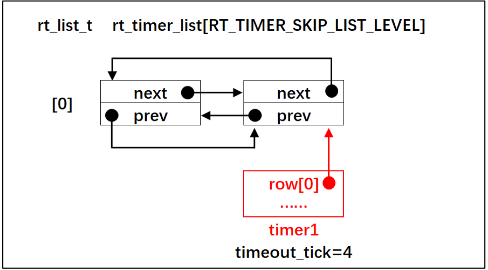

#### 插入定时器2

- 此时要插入定时器 2，定时器启动函数 rt_timer_start 会重新被调用，此时系统定时器列表里面有定时器 1，所以不为空，该 for 循环体会被执行。

- `rt_list_t *p = row_head[row_lvl]->next;`获取定时器列表节点地址，此时 p 的值等于定时器 1 里面`row[0]`的地址。

- `t = rt_list_entry(p, struct rt_timer, row[row_lvl]);`根据节点地址 p 获取父结构的指针，即根据 row[0]的地址获取到 row[0]所在定时器的地址，即定时器 1 的地址。

- `if ((t->timeout_tick - timer->timeout_tick) == 0)`比较两个定时器的 `timeout_tick` 值，如果相等则继续与下一个

  节点的定时器比较。定时器 1 的 `timeout_tick` 等于 4，定时器 2 的 `timeout_tick` 等于 2，4 减2 等于 2，小于 `RT_TICK_MAX / 2`，则跳出（break）当前的 for 循环，当前 for 循环里面的`row_head[row_lvl] = row_head[row_lvl]->next` 语句不会被执行，即 `row_head[row_lvl=0]`存的还是系统定时器列表 rt_timer_list 的根节点。然后执行代码`rt_list_insert_after(row_head[RT_TIMER_SKIP_LIST_LEVEL - 1],&(timer->row[RT_TIMER_SKIP_LIST_LEVEL - 1]));`，将定时器 2 插入到系统定时器列表根节点的后面，即定时器 1 节点的前面，实现了按照 timeout_tick 的大小做升序排列。

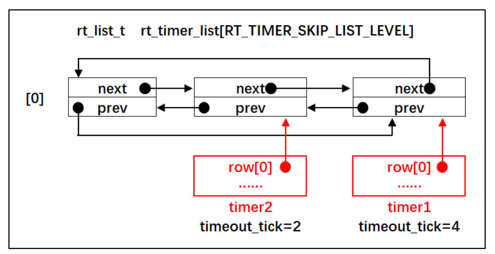

#### 插入定时器3

- 此时要插入定时器 3，定时器启动函数 rt_timer_start 会重新被调用，此时系统定时器列表里面有定时器 1 和定时器 2，所以不为空，该 for 循环体会被执行。

- `rt_list_t *p = row_head[row_lvl]->next;`获取定时器列表节点地址，此时 p 的值等于定时器 2 里面row[0]的地址。

- `t = rt_list_entry(p, struct rt_timer, row[row_lvl]);`根据节点获取父结构的指针，这里指定时器2的地址。

- `if ((t->timeout_tick - timer->timeout_tick) == 0)`比较两个定时器的 timeout_tick 值，如果相等则继续与下一个节点的定时器比较。定时器 2 的 timeout_tick 等于 2，定时器 3 的 timeout_tick 等于 3，2 减3 等于-1，-1 的补码为 `0xfffffffe`，大于`RT_TICK_MAX / 2`，表示定时器 3 应该插入到定时器 2 之后，但是定时器 2 之后还有节点，需要继续比较，则继续执行 for 循环：执行`row_head[row_lvl] = row_head[row_lvl]->next` 语句，得到 `row_head[row_lvl=0]`等于定时器 2里面 row[0]的地址。

- `rt_list_t *p = row_head[row_lvl]->next;`获取定时器列表节点地址，此时 p 的值等于定时器 1里面row[0]的地址。

- `t = rt_list_entry(p, struct rt_timer, row[row_lvl]);`根据节点获取父结构的指针，这里指定时器1的地址。

- `if ((t->timeout_tick - timer->timeout_tick) == 0)`比较两个定时器的 timeout_tick 值，如果相等则继续与下一个

  节点的定时器比较。定时器 1 的 timeout_tick 等于 4，定时器 3 的 timeout_tick 等于 3，4 减3 等于 1，1 小于 RT_TICK_MAX / 2，则跳出当前的 for 循环，表示定时器 3 应该插入到定时器 1 之前，要插入的位置找到。然后执行代码`rt_list_insert_after(row_head[RT_TIMER_SKIP_LIST_LEVEL - 1],&(timer->row[RT_TIMER_SKIP_LIST_LEVEL - 1]));`，将定时器 3 插入到定时器2 后面，实现了按照 timeout_tick 的大小做升序排列，

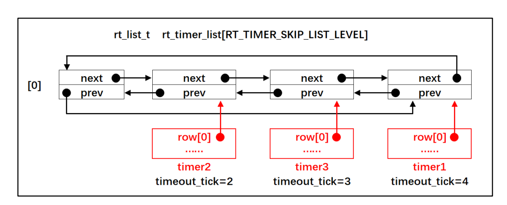


## Debug技巧

### 栈回溯和rt_hw_hard_fault_exception打印寄存器值

### 栈回溯

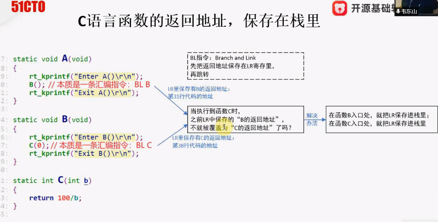

- BL B（汇编指令，跳转到函数B）：这个时候会执行两个动作

- 记录addr1（返回的地址）到LR寄存器
- 执行函数B，马上保存LR（addr1），保存在栈

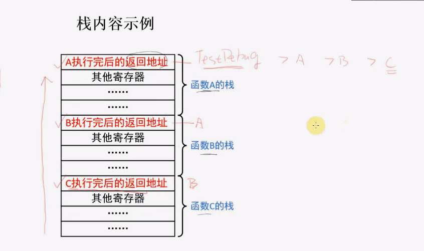

# Linux学习笔记

## 基本命令

### cd切换目录

cd切换目录，是“change directory”的首字母缩写。**Linux所有的目录和文件名大小写敏感**,“.”代表当前目录，“..”代表上一级目录。

cd后面可跟绝对路径，也可以跟相对路径。

| 命令  | 含义                                                         |
| ----- | :----------------------------------------------------------- |
| cd    | 切换到当前用户的主目录(/home/用户目录)， 用户登陆时，默认的目录就是用户的主目录。 |
| cd ~  | 切换到当前用户的主目录(/home/用户目录)                       |
| cd .  | 切换到当前目录                                               |
| cd .. | 切换到上级目录                                               |
| cd -  | 可进入上次所在的目录                                         |
| cd /  | 切换到系统根目录/                                            |

###  ls查看文件

ls 显示指定工作目录下内容，是“list”的缩写。

```
ls
```

打印出的结果如下图。

| 参数 | 含义                                                   |
| ---- | :----------------------------------------------------- |
| -a   | 显示指定目录下所有子目录与文件，包括隐藏文件           |
| -l   | 以列表方式显示文件的详细信息                           |
| -h   | 配合 -l 以人性化的方式显示文件大小，即文件大小可以用mb |


# ESP32学习笔记

学习链接：https://github.com/DuRuofu/ESP32-Guide

在Linux下使用esp_idf可以使用这个命令`get_idf_v5`

使用`cd`切换需要编译的文件

```
GGB@ubuntu20:~/esp$ cd hello_world
GGB@ubuntu20:~/esp/hello_world$ 
```

使用`idf.py build  `命令编译代码，显示下面的内容则编译成功

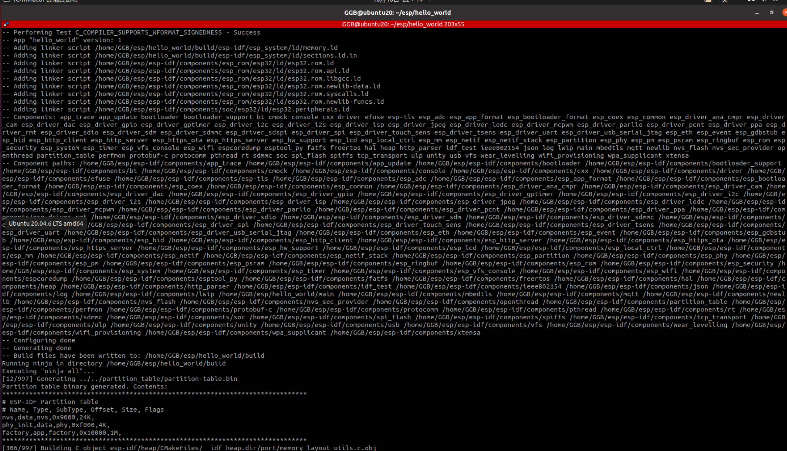

## 常用idf.py命令介绍

| 功能             | 命令                                                    | 备注                                                |
| ---------------- | ------------------------------------------------------- | --------------------------------------------------- |
| 创建新工程       | `idf.py create-project <project name>`                  | `<project name>` 为项目名称                         |
| 创建新组件       | `idf.py -C components create-component {componentName}` | `{componentName}` 为组件名称                        |
| 选择目标芯片     | `idf.py set-target <target>`                            | `<target>` 为芯片型号，不输入参数会列出所有可用型号 |
| 启动图形配置工具 | `idf.py menuconfig`                                     | 配置项目的菜单选项                                  |
| 构建工程         | `idf.py build`                                          | 编译生成固件                                        |
| 清除构建输出     | `idf.py clean`                                          | 清除中间文件                                        |
| 删除所有构建内容 | `idf.py fullclean`                                      | 清除所有生成的文件                                  |
| 烧录工程         | `idf.py -p /dev/ttyUSB0 flash`                          | `/dev/ttyUSB0` 为目标串口，根据实际情况修改         |
| 打开串口监视器   | `idf.py -p /dev/ttyUSB0 monitor`                        | `/dev/ttyUSB0` 为目标串口，根据实际情况修改         |
| 构建、烧录并监视 | `idf.py -p /dev/ttyUSB0 flash monitor`                  | `/dev/ttyUSB0` 为目标串口，根据实际情况修改         |
| 打开文档         | `idf.py docs`                                           |                                                     |

## TCP协议

 **TCP（Transmission Control Protocol，传输控制协议）**是一种面向连接的、可靠的、基于字节流的通信协议，是互联网协议套件中的核心协议之一。它运行在传输层，主要用于提供端到端的可靠通信 。

**核心特性：**

- **面向连接**：在传输数据之前，TCP需要在通信的双方之间建立一个连接，这个过程通常通过“三次握手”完成。

- **可靠传输**：TCP通过确认机制、序列号、超时重传、校验和、流量控制、拥塞控制等技术手段来保证数据传输的可靠性。

- **字节流服务**：TCP将应用程序传输的数据看作一个无结构的字节流，而不考虑这些字节属于什么样的结构（如消息、记录等）。

- **全双工通信**：TCP允许通信双方同时发送和接收数据，这意味着数据在两个方向上可以同时传输。

  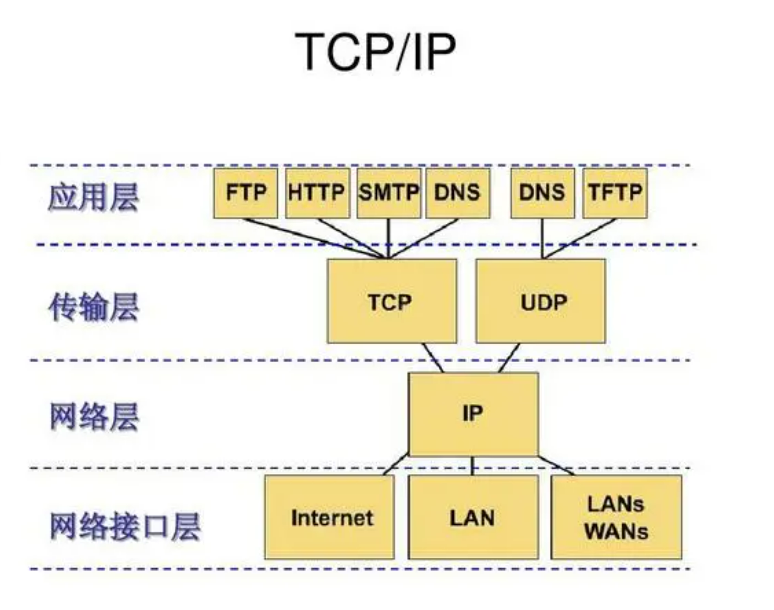


### TCP连接的“三次握手”

```
TCP连接建立（三次握手）：
客户端 → 服务器: SYN (seq=x)
服务器 → 客户端: SYN+ACK (seq=y, ack=x+1)
客户端 → 服务器: ACK (ack=y+1)
连接建立完成
```


三次握手是TCP协议用于建立连接的过程，目的是确保客户端和服务器之间可以双向通信。三次握手的具体步骤如下：

- **第一次握手**（SYN）：

  客户端发送一个带有SYN（Synchronize Sequence Numbers）标志位的数据包给服务器，表示请求建立连接。此时，客户端进入SYN-SENT状态。

- **第二次握手**（SYN-ACK）：

  服务器收到SYN包后，回复一个带有SYN和ACK（Acknowledgment）标志位的数据包，表示同意建立连接，并对客户端的SYN包进行确认。此时，服务器进入SYN-RECEIVED状态。

- **第三次握手**（ACK）：

  客户端收到服务器的SYN-ACK包后，再发送一个ACK包给服务器，表示确认连接已经建立。此时，客户端和服务器都进入ESTABLISHED状态，完成三次握手。

## UDP协议

###  UDP基本特性

 **UDP（User Datagram Protocol，用户数据报协议）**是互联网协议套件中的一种传输层协议，与广泛使用的TCP相比，它是一种**无连接**、**不可靠**的协议。UDP 被用于对传输速度要求较高、但对可靠性要求较低的场景。  

**核心特性：**

- **无连接**：UDP不需要在发送数据之前建立连接，也不维护连接的状态。数据可以在没有任何事先协商的情况下直接从一台主机发送到另一台主机。发送数据时，发送方只需要知道接收方的IP地址和端口号，而无需等待接收方的准备响应。
- **不可靠传输**：UDP没有像TCP那样的确认、重传、流量控制和拥塞控制机制。数据包可能丢失、重复、乱序到达，发送方不会知道数据是否成功到达接收方。这使UDP非常轻量和快速，但也意味着需要应用层自己处理可靠性问题（如重传机制、顺序控制等）。
- **面向数据报：**UDP以数据报（datagram）为单位传输数据。每个数据报是一个独立的单元，包含完整的源和目标信息。每个UDP数据报独立处理，且数据报的大小受到网络最大传输单元（MTU）的限制，超过一定大小的数据需要进行分片。
- **支持广播/组播**：UDP支持广播（Broadcast）和多播（Multicast），能够一对多通信，这使得它可以将数据同时发送到多个主机，特别适用于局域网内的数据传输。
- **快速低延迟**：由于UDP不需要建立连接，也不需要等待确认，因此它的传输速度通常比TCP快。特别是在需要实时传输的场景（如语音、视频、游戏）中，UDP是首选协议。

## Soket网络编程

​	如果你想和远方的朋友通电话，但是，没有办法直接把自己的声音放在电线上变成电流信号，你需要使用电话机拿起听筒拨号，而这个电话就是Socket，它让你简单方便地完了电流通话。从我们编程的角度来看，我们直接使用TCP传输信息，需要考虑的东西太多了，而Scoket替我们封装实现了TCP，我们只需使用Socket的APl，即可间接完成TCP通信。

### Socket基本特性

​	Socket，中文名是套接字，英文本意是插座的意思。在这里是网络通信的“接口”，也就是程序和网络之间的中介。它为开发者提供了一套通用的函数或API，允许程序通过网络发送和接收数据。具体地说，Socket抽象了网络底层的细节，比如数据包的传输、协议的选择、错误处理等，开发者只需要使用Socket提供的函数来建立连接和传输数据，而不需要关心网络底层的实现。因此，Socket 相当于是在应用程序和网络协议之间的一个抽象层。  

| 特点       | 具体说明                                               |
| ---------- | ------------------------------------------------------ |
| 双向通信   | 支持全双工通信，可同时发送和接收数据                   |
| 协议灵活性 | 可使用多种协议（如 TCP、UDP），适配不同应用场景需求    |
| 网络透明性 | 能跨网络通信，不受设备地理位置限制                     |
| 可扩展性   | 支持处理多个连接，适合构建高性能网络应用               |
| 数据流控制 | TCP 协议提供流量控制与可靠性保障，确保数据传输的完整性 |

### 网络通信的三要素

- IP地址（寻找主机）

  IP地址是互联网协议（IP）在网络上识别设备的地址。它是一个逻辑地址，用于在网络中标识每个设备，确保数据能够正确发送和接收。主要用来寻找对应服务器的主机。

- 端口号（定位程序）

  端口号用于在主机内定位具体进程，标示进程的逻辑地址，不同进程对应不同端口号。相当于当前服务器（或当前电脑）上对应的 Web 应用程序。端口范围与规则：有效端口区间：0 ~ 65535。0 ~ 1024 由系统占用（或称为“保留端口”），开发场景建议使用 1024 以上的端口。

- 传输协议（交互方式与通信规则）

  传输协议定义了网络交互的“规则与方式”，常见协议包括：TCP（传输控制协议）和UDP（用户数据报协议）

### 基于TCP的Socket编程

#### 连接流程


1. **创建 Socket**：

   使用 `socket()` 函数创建一个 Socket，指定协议族（如 IPv4）和类型（如 TCP）。

2. **绑定地址**：

   使用 `bind()` 函数将 Socket 绑定到一个特定的 IP 地址和端口上。

3. **监听连接**（仅适用于服务器）：

   使用 `listen()` 函数监听传入的连接请求。

4. **接受连接**（仅适用于服务器）：

   使用 `accept()` 函数接受连接，返回一个新的 Socket 用于与客户端通信。

5. **连接到服务器**（仅适用于客户端）：

   使用 `connect()` 函数连接到服务器的 Socket。

6. **发送和接收数据**：

   使用 `send()` 和 `recv()`（或 `write()` 和 `read()`）函数进行数据传输。

7. **关闭 Socket**：

   使用 `close()` 函数关闭 Socket，释放资源

#### 实际代码应用

```c
// 创建TCP服务器socket（端口8080）
g_conn_sock = socket(AF_INET, SOCK_STREAM, IPPROTO_TCP);
struct sockaddr_in addr = {
    .sin_family = AF_INET,
    .sin_addr.s_addr = IPADDR_ANY,  // 监听所有网络接口
    .sin_port = htons(8080),        // 绑定到端口8080
};
bind(g_conn_sock, (struct sockaddr *)&addr, sizeof(addr));

// conn_task函数实现
static void conn_task(void *pvParameters) {
    int sock = (int)pvParameters;
    listen(sock, 5);  // 开始监听TCP连接，最多5个排队连接
    
    for (;;) {
        int c = accept(sock, NULL, NULL);  // 接受客户端连接
        if (c != -1) {
            // 为每个新连接创建处理任务
            xTaskCreate(conn_process_handler, "conn_process", 4096,
                       (void *)c, 4, NULL);
        }
    }
}
```

### 基于UDP的Socket编程

在UDP通信中，服务器/客户端的概念比较模糊，因为UDP是无连接的。通常我们认为：

- 绑定到固定端口的一方更像"服务器"
- 使用随机端口的一方更像"客户端"


####  UDP客户端流程

1. **socket()**：创建一个UDP套接字（Socket）。这是启动UDP通信的第一步，客户端通过调用`socket()`函数生成一个用于通信的套接字。
2. **sendto()**：向服务器发送数据。客户端使用`sendto()`函数来将数据报发送到指定的服务器IP地址和端口。这是一个无连接的操作，不需要事先建立连接。
3. **等待响应**：客户端调用`recvfrom()`函数，进入阻塞状态，等待从服务器返回的数据。`recvfrom()`会接收来自服务器的数据报，函数会在接收到数据后解除阻塞。
4. **recvfrom()**：接收到服务器返回的数据后，继续处理该数据。
5. **close()**：通信完成后，关闭客户端套接字，释放系统资源。

####   UDP服务器流程

1. **socket()**：与客户端一样，服务器首先创建一个UDP套接字，通过调用`socket()`函数。
2. **bind()**：将套接字与指定的IP地址和端口绑定。服务器必须绑定到一个特定的端口上，这样才能接收来自客户端的数据。`bind()`是服务器端特有的操作，客户端通常不需要显式调用`bind()`。
3. **recvfrom()**：服务器使用`recvfrom()`接收客户端发送的数据报，并进入阻塞状态，直到接收到数据为止。
4. **处理请求**：收到数据后，服务器可以处理这个请求。例如，解析数据、执行相关操作。
5. **sendto()**：处理完成后，服务器通过`sendto()`向客户端发送响应数据。
6. **继续等待**：服务器可以继续调用`recvfrom()`来接收下一个数据请求。

#### 实际代码应用

```
def socket_to_serial(self):
    with socket.socket(socket.AF_INET, socket.SOCK_DGRAM) as sock:
        # 1. 创建UDP socket并绑定到随机端口
        sock.bind(('0.0.0.0', 0))
        port = sock.getsockname()[1]  # 获取分配的端口号
        sock.settimeout(5)
        
        # 2. 通过TCP连接告诉ESP32这个UDP端口
        connect_esp32_car(port, self.tcpaddr, self.device_type)
        
        # 3. 开始UDP数据接收循环
        while self.running:
            try:
                # 接收ESP32发来的UDP数据
                message, self.last_addr = sock.recvfrom(1024)
                # 写入虚拟串口
                self.seri.write(message)
            except socket.timeout:
                # 超时重连
                connect_esp32_car(port, self.tcpaddr, self.device_type)
```

## 话题通信机制

### 打开ROS空间

1. 如果没有合适的工作空间，先创建一个：
   - `mkdir -p ~/catkin_ws/src`
   - `cd ~/catkin_ws/src`
   - `catkin_init_workspace`
   - `cd ..`
   - `catkin_make`（或使用 catkin tools 的 `catkin build`）。
2. 在 VS Code 中打开工作空间根目录：文件 > 打开文件夹 > 选择 `~/catkin_ws`。
3. 验证扩展是否激活：检查状态栏是否有“ROS”指示，或按 Ctrl+Shift+P 打开命令面板搜索 ROS 命令。
4. 通过命令面板重试：搜索“ROS: Create Catkin Package”。

### Topic理论模型

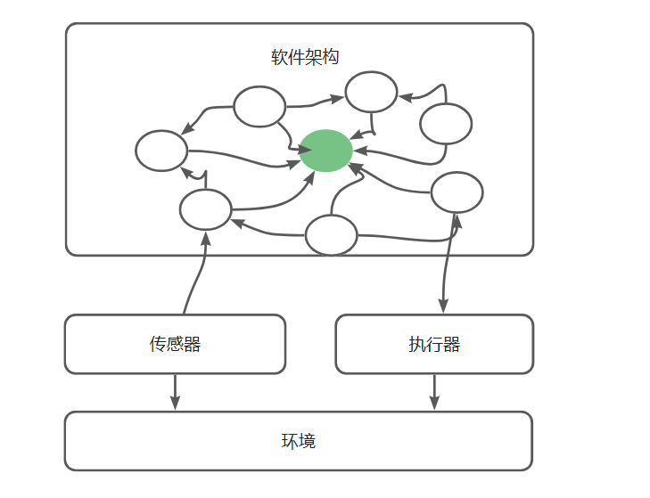

- ros整个框架下，我们开发大量的节点，节点间需要有数据的交互，数据该如何交互，这个是ROS要解决的问题，也是核心问题。

- ROS的通信方式是ROS最为核心的概念，ROS系统的精髓就在于它提供的通信架构。ROS的通信方式有以下四种：

  Topic 话题，Service 服务，Parameter Service 参数服务器，Actionlib 动作库

### Topic通信流程	

ROS中的通信方式中，Topic是最常用的一种。对于实时性、周期性的消息，使用topic来传输是最佳的选择。topic是一种**点对点**，**异步**，**单向**的通信方式。在Topic通讯机制中，Node间进行通讯，其中发送消息的一方，ROS将其定义为 **Publisher(发布者)** ，将接收消息的一方定义为 **Subscriber(订阅者)** 。

​	Topic要经历下面几步的初始化过程：首先，Publisher节点和Subscriber节点都要到节点管理器进行注册，ROS Master 负责保管 Publisher和 Subscriber注册的信息，然后Publisher会发布topic，Subscriber在ROS Master的指挥下会订阅该topic，从而建立起sub-pub之间的通信。

### rostopic命令行操作

|             命令              |                           作用                            |
| :---------------------------: | :-------------------------------------------------------: |
|        `rostopic list`        |                    列出当前所有的topic                    |
|  `rostopic info topic_name`   |                  显示某个topic的属性信息                  |
|  `rostopic echo topic_name`   | 显示某个topic的内容，用于调试publisher数据，模拟数据接收  |
| `rostopic pub topic_name ...` | 向某个topic发布内容，用于调试subscriber数据，模拟数据发送 |
|   `rostopic bw topic_name`    |                    查看某个topic的带宽                    |
|   `rostopic hz topic_name`    |                    查看某个topic的频率                    |
|  `rostopic find topic_type`   |                    查找某个类型的topic                    |
|  `rostopic type topic_name`   |                 查看某个topic的类型(msg)                  |

## 话题通信python实现

### publisher方

```python
#! /usr/bin/env python3

import rospy
from std_msgs.msg import String

if __name__ == "__main__":
    #1.初始化 ROS 节点:命名(唯一)
    rospy.init_node("talker_py_node")
    #2.实例化 发布者 对象
    #Publisher 函数第一个参数是话题名称，第二个参数 数据类型，现在就是我们定义的msg 最后一个是缓冲区的大小，超出此阀值时，先进的先销毁(时间早的先销毁)
    #queue_size: None（不建议）  #这将设置为阻塞式同步收发模式！
    #queue_size: 0（不建议）#这将设置为无限缓冲区模式，很危险！
    #queue_size: 10 or more  #一般情况下，设为10 。queue_size太大了会导致数据延迟不同步。
    pub = rospy.Publisher("talker",String,queue_size=10)
    #3.创建 msg 对象
    msg = String()  
    
    count = 0  #计数器 
    rate = rospy.Rate(10)# 设置更新频率
    while not rospy.is_shutdown():
        #拼接字符串
        msg.data = "hello " + str(count)
        #4.发布数据
        pub.publish(msg)
        rate.sleep()
        rospy.loginfo("发布数据:%s",msg.data)
        count += 1
```

| 返回值       | 方法                                                         | 作用                                                         |
| ------------ | ------------------------------------------------------------ | ------------------------------------------------------------ |
| `None`       | `rospy.init_node(name, argv=None, anonymous=False, disable_signals=False)` | **初始化节点**• `name`：节点名称• `anonymous`：是否匿名（自动添加随机后缀）• `disable_signals`：禁用信号处理 |
| `bool`       | `rospy.is_shutdown()`                                        | **检查节点是否关闭**• True：节点应终止• False：节点正常运行  |
| `Publisher`  | `rospy.Publisher(topic, data_class, queue_size=None, latch=False)` | **创建发布者**• `topic`：发布话题• `data_class`：消息类型• `queue_size`：消息队列大小• `latch`：是否锁存最后消息 |
| `Subscriber` | `rospy.Subscriber(topic, data_class, callback, queue_size=None)` | **创建订阅者**• `callback`：消息回调函数                     |
| `Rate`       | `rospy.Rate(hz)`                                             | **创建频率控制器**• `hz`：循环频率（Hz）                     |
| `None`       | `rospy.sleep(duration)`                                      | **精确休眠**• `duration`：休眠时间（秒或 Duration 对象）     |

完成代码的编写之后，在vscode开卡一个终端，输入

```bash
#启动 ROS Master
roscore
```

然后再打开一个终端输入

```bash
#加载 ROS 工作空间的环境变量，让系统知道在哪里找到您编译的功能包（topic_demo_pkg），每次打开新终端都需要执行这个命令（或者添加到 ~/.bashrc 中自动执行）
source ~/catkin_ws/devel/setup.bash
# rosrun：ROS 的运行命令
# topic_demo_pkg：功能包名称
# talker.py：要运行的节点脚本
rosrun topic_demo_pkg talker.py
```

### subscriber方

```python
import rospy
from std_msgs.msg import String

#3.处理订阅的消息(回调函数)
def listener_callback(msg):
    rospy.loginfo("I heard:%s",msg.data)

if __name__ == "__main__":
    #1.初始化 ROS 节点:命名(唯一)
    rospy.init_node("listener_py_node")
    #2.实例化 订阅者 对象
    sub = rospy.Subscriber("talker",String,listener_callback,queue_size=10)
    #4.设置循环调用回调函数
    rospy.spin()
```

相较于发布者，订阅者需要一个特殊的**回调函数**。

​	回调函数作为参数被传入到了另一个函数中（在本例中传递的是函数指针），在未来某个时刻（当有新的message到达），就会立即执行。Subscriber接收到消息，实际上是先把消息放到一个**队列**中去，如图所示。队列的长度在Subscriber构建的时候设置好了。当有spin函数执行，就会去处理消息队列中队首的消息。

## 服务通信机制

### Service理论模型

​	有些时候使用单向的topic通信满足不了通信要求，比如当一些节点只是临时而非周期性的需要某些数据，如果用topic通信方式时就会消耗大量不必要的系统资源，造成系统的低效率高功耗。这种情况下，就需要有另外一种请求-查询式的通信模型。这节我们来介绍ROS通信中的另一种通信方式——service(服务)。	

​	Service通信是一种**多对一**，**同步**，**双向**的通信方式。它不仅可以发送消息，同时还会有反馈。在Service通讯机制中，Node间进行通讯，发送请求的一方，ROS将其定义为是**Clinet（请求方）**，而反馈应答的一方定义为**Server（应答方或服务方)**。这时Client就会发送一个**request**，要等待server处理，反馈回一个**reply**，这样通过类似**“请求-应答”**的机制完成整个服务通信。

这种通信方式的示意图如下：
	Node B是server（应答方），提供了一个服务的接口，叫做`/Service`，我们一般都会用string类型来指定service的名称，类似于topic。Node A是client方（请求方），向Node B发起了请求，经过处理后得到了反馈。

- `client端`负责发送请求(Request)给`server端`。
- `server端`负责接收`client端`发送的请求数据。
- `server端`收到数据后，根据请求数据和当前的业务需求，产生数据，将数据(Response)返回给`client端`。

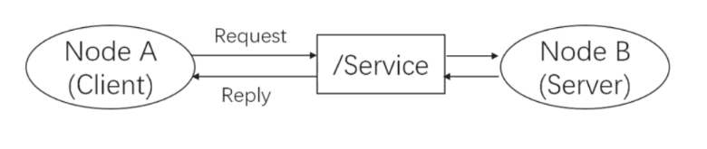

​	Service是**同步**通信方式，所谓同步就是说，此时Node A发布请求后会在原地等待reply，直到Node B处理完了请求并且完成了reply，Node A才会继续执行。Node A等待过程中，是处于**阻塞状态**。这样的通信模型没有频繁的消息传递，没有冲突与高系统资源的占用，只有接受请求才执行服务，简单而且高效。

|   名称   |              Topic               |                       Service                       |
| :------: | :------------------------------: | :-------------------------------------------------: |
| 通信方式 |             异步通信             |                      同步通信                       |
| 实现原理 |              TCP/IP              |                       TCP/IP                        |
| 通信模型 |        Publish-Subscribe         |                    Request-Reply                    |
| 映射关系 |              多对多              |                       多对一                        |
|   特点   | 接受者收到数据会回调（Callback） | 远程过程调用（RPC）服务器端的服务（相对与本地调用） |
| 应用场景 |       连续、高频的数据发布       |              偶尔使用的功能/具体的任务              |
|   举例   |     激光雷达、里程计发布数据     |         开关传感器、拍照、机械臂的逆解计算          |

Service机制相比于Topic的核心不同之处在于：

1. 消息的传输是双向的，有反馈的，而不是单一的流向。
2. 消息往往不会以固定频率传输，不连续，而是在需要时才会向服务器发起请求。

### Service命令行工具

| 命令                                    | 作用                                                         |
| --------------------------------------- | ------------------------------------------------------------ |
| `rosservice list`                       | 列出所有可用的服务**（显示服务的全局地址，如`/detect`）。    |
| `rosservice info <服务地址>`            | 显示服务的**详细信息**（包括服务类型、提供者节点名称、服务URI等）。 |
| `rosservice type <服务地址>`            | 返回服务的**数据类型**（即`.srv`文件定义的类型，如`service_demo_pkg/detect_char`）。 |
| `rosservice call <服务地址> <请求数据>` | 作为**客户端**调用服务，传递符合`.srv`文件请求部分格式的参数（如`detect_flag: true`），并接收服务端响应。 |
| `rosservice args <服务地址>`            | 显示服务**请求部分的参数格式**（即`.srv`文件中请求字段的名称和类型，如`detect_flag`）。 |

### Srv

#### 格式定义	

类似msg文件，srv文件是用来描述服务service数据类型的，service通信的数据格式定义在*.srv中。它声明了一个服务，包括请求(request)和响应（reply）两部分。其格式声明如下：

```
bool detect_flag
---
string char_type
```

以我们自定义的`detect_char.srv`文件为例：它是用来查询当前摄像头识别中的字符结果的。srv文件格式是固定的，第一行是请求的数据格式，中间用三个短横**---**隔开，第三行是应答的数据格式。在本例中，请求为是否开始检测的标志位，应答为字符的识别结果。对于srv，他可以嵌套msg在其中，但它不能嵌套srv。


# 数据结构

如何使用两种方式来讨论数据结构，这两种方式称为**抽象数据类型(ADT)**

- 数学
- 逻辑模型

## 链表

相同类型的对象的集合

- 可以在相应的位置加入相应的元素
- 可以删除某一个元素
- 计算列表中的元素数量


链表可以抽象成两个部分：一部分用来存放用户数据，一部分用来存放下一个内存的地址。

链表增加元素和删除元素相对于数组更加高效

- 在某一个位置增加元素，需要遍历这个链表，找到这个元素，使这个元素的的“下一个”指向需要增加的元素。但时间复杂度依然是O(n)。

### 链表的实现

下面这种是C风格的声明节点的指针方式

```c
struct Note
{
    int data;		//存放数据
    struct Note *Link;//存放下一个节点的地址
};
```


1. 头节点的创建

   ```c
   Node *A;
   A = NULL;
   Node *temp = (Node *)malloc(sizeof(Node)); //分配内存
   temp->data = 2;
   temp->Link = NULL;
   A = temp;
   ```

   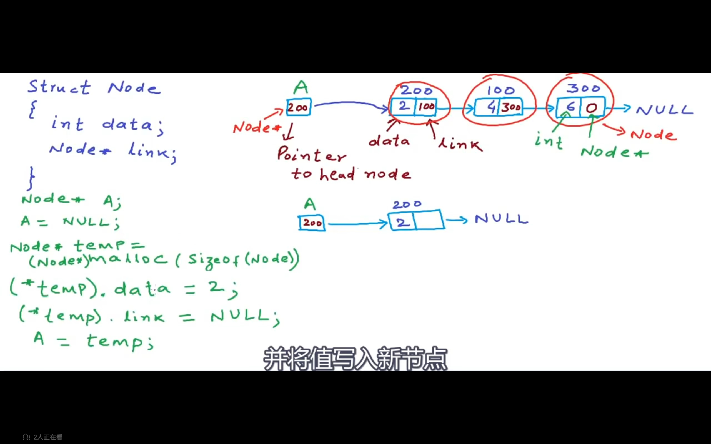

2. 尾节点的添加

   **遍历链表的通用逻辑**

   ```c
   Note *temp = A;
   while(temp->Link != NULL)
   {
       temp=temp->Link;
   }
   ```

   这里要创建一个临时节点来操作，直接使用原节点会对链表造成破坏。

   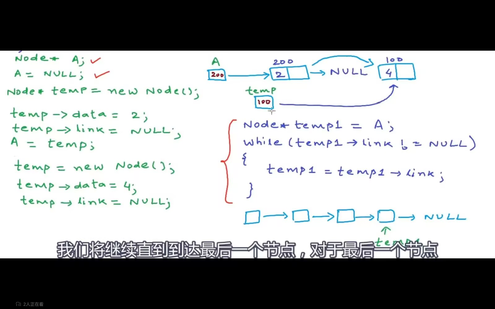

### 头节点的添加

```c
struct Note
{
    int data;		//存放数据
    struct Note *next;//存放下一个节点的地址
};

 struct Note* head = NULL;

void Insert(int x)
{
    struct Note* temp = (struct Note*)malloc(sizeof(struct Note)); //新建一个内存用来存放临时节点
    temp->data = x;  //存放用户数据
    temp->next = head;//链接链表
    head = temp;
}

void Insert(int x)
{
    struct Note* temp = (struct Note*)malloc(sizeof(struct Note)); //新建一个内存用来存放临时节点
    temp->data = x;  //存放用户数据
    temp->next =NULL;
    if(head!=NULL) temp->next = head;
    head = temp;
}

void Print(void)
{
    struct Note* temp = head; // 创建临时变量存放头指针
    while(temp->next!=NULL)
    {
        printf("",temp->data);
        temp=temp->next;
    }
}

int main(void)
{
    //实现链表插入函数
    Insert(int x);
    //实现链表打印函数
    Print();
}

```

这两个代码都是在链表头部插入新节点的函数，但它们有一个细微但重要的区别。

第一个版本：

```c
void Insert(int x) 
{
    struct Note* temp = (struct Note*)malloc(sizeof(struct Note)); //新建一个内存用来存放临时节点
    temp->data = x;  //存放用户数据
    temp->next = head;//链接链表
    head = temp;
}
```

第二个版本：

```c
void Insert(int x)
{
    struct Note* temp = (struct Note*)malloc(sizeof(struct Note)); //新建一个内存用来存放临时节点
    temp->data = x;  //存放用户数据
    temp->next = NULL;
    if(head!=NULL) temp->next = head;
    head = temp;
}
```

区别在于：

第一个版本直接将新节点的next指针设为head，无论head是否为NULL。

第二个版本先将新节点的next指针设为NULL，然后只有当head不为NULL(即链表不为空)时，才将新节点的next指针设为head。

实际效果：

- 当链表不为空时，两个版本的行为完全相同。
- 当链表为空时(head为NULL)：
  - 第一个版本：新节点的next指针会被设为NULL(因为head是NULL)
  - 第二个版本：新节点的next指针被显式地设为NULL，然后跳过if条件

所以最终结果是一样的，但第二个版本写法更加清晰和安全，因为它明确处理了链表为空的情况，使代码意图更加明确。

### 任意位置插入一个节点

应用程序内存的一部分用于存储所有需要被执行的命令，另一部分存储全局变量，贯穿整个程序或者说应用程序的生命周期。存储器的一部分称为**栈**，用于存储所有有关函数的调用信息，存储所有局部变量。**堆**是不固定的，我们可以请求内存，程序运行从**堆**中读取数据，这就是**malloc**所做的事。

**RAM (Random-Access Memory)**：

- **是什么：**“随机存取存储器”。它的特点是**读写速度非常快**，可以随机访问任何一个存储单元，但它是**易失性**存储器。这意味着一旦单片机断电，RAM 中的所有内容都会立即丢失。
- **作用：** RAM 是单片机**运行程序时**用来存放**临时数据和变量**的地方。CPU 在执行程序时，需要频繁地读写数据，这些数据就存放在 RAM 中。
- **通常存放：**
  - **程序运行时产生的变量：** 包括全局变量、静态变量、局部变量（在堆栈上）。
  - **堆栈 (Stack)：** 函数调用时的返回地址、函数参数、局部变量等都存放在这里。
  - **堆 (Heap)：** 程序运行时动态申请的内存空间。
  - **临时缓冲区：** 比如接收或发送数据时的缓冲区、处理数据时的中间结果等。
  - **（部分或全部）程序代码：** 在某些高性能单片机或特定应用中，为了提高执行速度，会将 Flash 中的程序代码复制到 RAM 中执行。
- **类比：** 就像电脑的内存条，是程序运行时工作的地方，用来存放当前正在使用的数据和程序的一部分。

要在n位置插入一个节点，就需要到达n-1的这个位置

```c
void Insert(int x,int n) //x为用户存放的数据 n为存放的位置 
{
    struct Note* temp1 = (struct Note*)malloc(sizeof(struct Note)); //新建一个内存用来存放临时节点
    temp1->data = x;
    temp1->next = NULL;
    if(n==1)
    {
        temp1->next = head;
        head = temp1;
        return;
    }
    struct Note* temp2 = (struct Note*)malloc(sizeof(struct Note)); //新建一个内存用来存放临时节点
    temp2 = head;
    for(uint8_t i = 0;i < n - 2;i++)//因为这里是从1（n==1）开始的，所以这里要少于n-2
    {
        temp2 = = temp2->next;; //循环找到这个节点
    }
    temp1->next = temp2->next;
    temp2->next = temp1;    
}
```

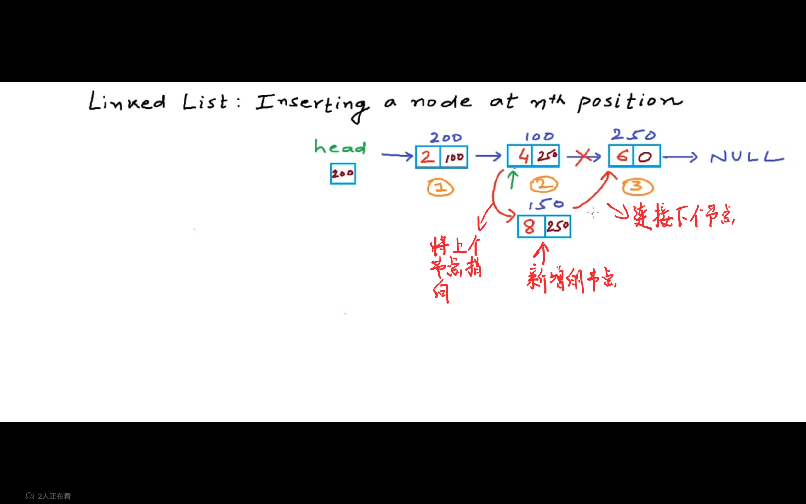

程序最开始会在栈中开辟部分内存来存放函数的执行和局部变量，当调用`Insert`函数的时候，此函数会使用`malloc`函数在堆中开辟一块内存，执行到` head = temp1;`的时候，会将`head`指向`temp1`

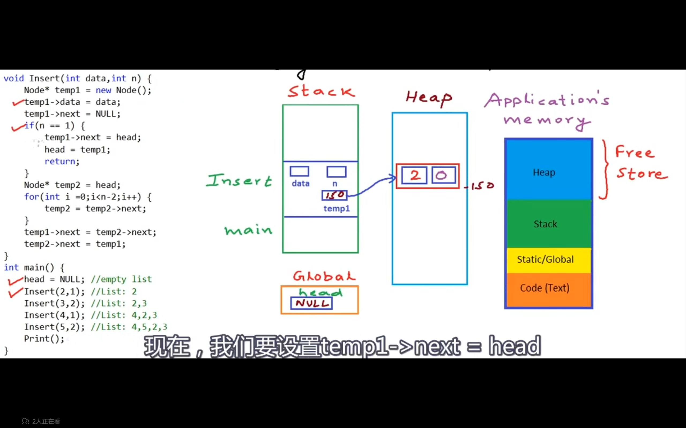

### 任意位置删除一个节点

1. 找到这个节点，把这个节点的链接关系修改
2. 释放这个节点的内存
3. 头节点需要特别处理

```c
void Delete(int n)
{
    struct Node * temp1 = head;
    if(n==1)
    {
        head = temp1->next;
        free(temp1);
        return;
    }
    for(int i = 0;i < n - 2;i++)//n-2的目的是为了找到当前节点的前一个节点
    {
        temp1 = temp1->next;
    }
     struct Node * temp2 = temp1->next; //temp2就是当前节点
    temp1->next = temp2->next;//
    free(temp2);
}
```

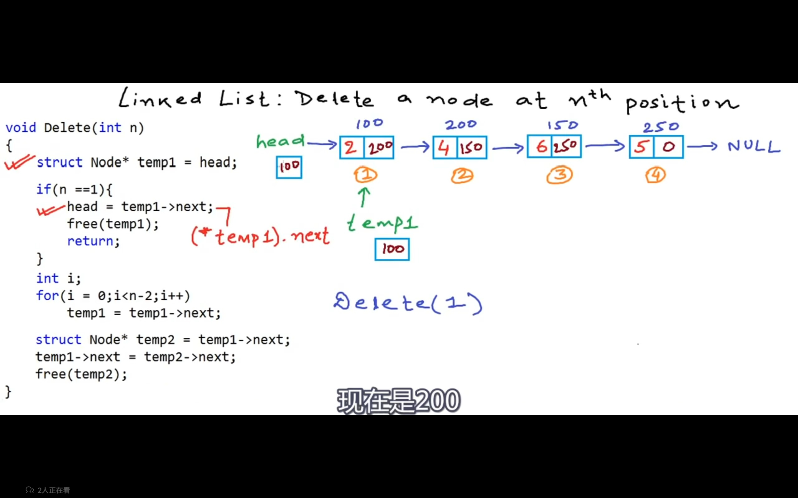

- 第一种情况：处理头节点

  如果要删除的节点为头节点，把临时节点（头节点）的下一个链接指向头节点（这种情况同样适用于**next为NULL的情况**），然后在把这个临时节点指向的内存块释放。

- 第二种情况：处理其它的节点

  找到需要删除的节点，将这个节点的**前一个**指向这个节点的**后一个**，修复链接关系，释放这个节点的内存。

  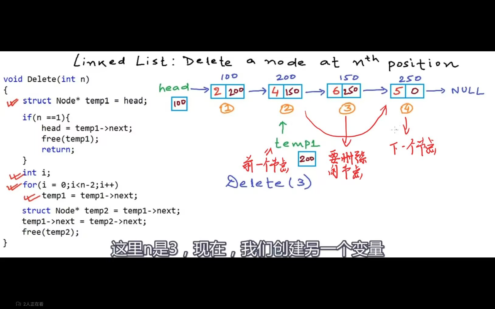

### 反转一个链表

------

#### **迭代方式反转**

图中红色的部分是**数据**，棕色的部分是**地址**

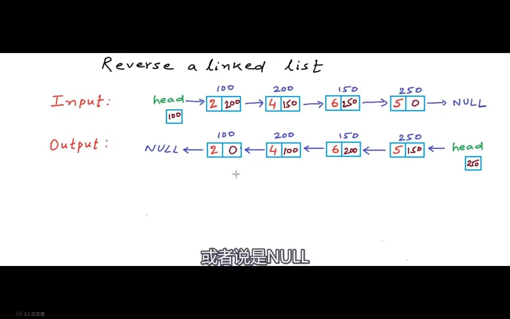

反转一个链表，希望这个节点指向前一个节点而不是后一个节点，对于头节点它的前一个节点应该指向**NULL**

```c
void Reverse(void)
{
    struct Node * current, *prev, *next; // 这三个变量分别代表 当前节点 前一个节点 下一个节点
    current = head;//刚开始将当前节点设置为head
    prev = NULL;//前一个节点设置为NULL
    
    while(current != NULL)
    {
        next = current->next; //保存下一个节点，防止链接断开
        current->next = prev; //修改当前节点的指向
        prev = current;//保存当前节点的地址
       current = next;//移动当前节点到下一个节点
    }
    head = prev;//重新设置头节点
}
```

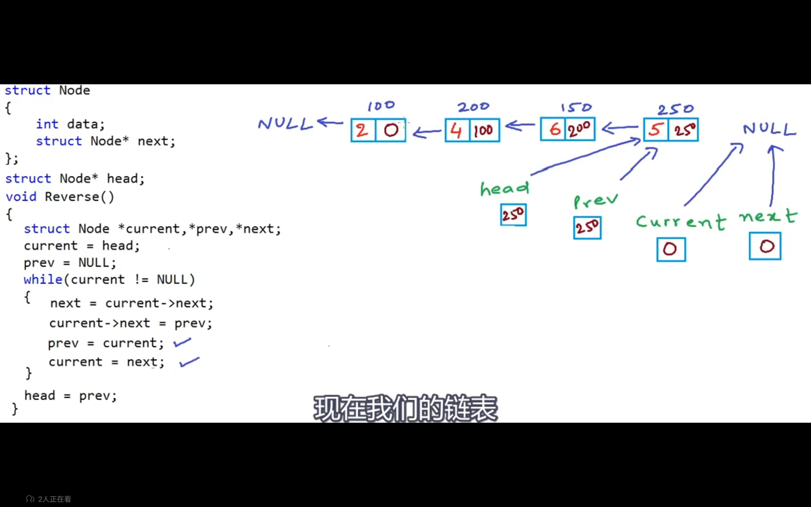

 `（2，0）->(4，100)->(6，200)->(5，250)` 这个例子表示一个链表，每个括号 `(数据, 下一个节点的地址)` 代表一个节点。 另外，你提供的地址 `100，200，150，250` 应该是这四个节点在内存中的实际地址。

所以，我们这个链表的实际结构是这样的：

- 头节点 `head` 指向地址为 100 的节点。
- 地址 100 的节点：数据是 2，它的 `next` 指针指向地址 200 的节点。
- 地址 200 的节点：数据是 4，它的 `next` 指针指向地址 150 的节点。（注意这里根据你提供的地址列表，地址 150 才是数据为 6 的节点的地址，而不是 200。你的例子 `(6,200)` 可能是写错了，应该是 `(6,150)` 或者地址 150 是数据 6 的节点的地址，并且它指向地址 250 的节点。让我们按照地址列表和链表顺序来理解）。

根据你提供的链表顺序 `(2,0) -> (4,100)->(6,200)->(5,250)` 和地址列表 `100，200，150，250`，一个合理的解释是：

- 链表头 `head` 指向数据为 2 的节点。
- 数据为 2 的节点（假设其地址为 100）：`data = 2`, `next` 指针指向数据为 4 的节点（地址 200）。
- 数据为 4 的节点（地址 200）：`data = 4`, `next` 指针指向数据为 6 的节点（地址 150）。
- 数据为 6 的节点（地址 150）：`data = 6`, `next` 指针指向数据为 5 的节点（地址 250）。
- 数据为 5 的节点（地址 250）：`data = 5`, `next` 指针指向 NULL（表示链表结束）。

初始链表状态（数据和它们所在的地址）： `head` -> (数据 2, 地址 100) -> (数据 4, 地址 200) -> (数据 6, 地址 150) -> (数据 5, 地址 250) -> NULL

现在我们来一步步执行代码 `Reverse()`：

函数中有三个指针变量：

- `current`: 当前正在处理的节点。
- `prev`: `current` 前一个节点，反转后它将成为 `current` 的下一个节点。
- `next`: `current` 后一个节点，用来在修改 `current->next` 之前保存下一个节点的地址。

**初始化：** `current = head;`  // `current` 指向地址 100 的节点 (数据 2) `prev = NULL;`     // `prev` 初始化为 NULL

**进入 while 循环 (`while(current != NULL)`):**

**第一次循环：** `current` 指向地址 100 的节点 (数据 2)。`current != NULL` 条件为真。

1. `next = current->next;`  // `next` 保存 `current` (地址 100) 的下一个节点的地址，即地址 200。现在 `next` 指向地址 200 的节点 (数据 4)。
2. `current->next = prev;` // 将 `current` (地址 100 的节点) 的 `next` 指针指向 `prev` (NULL)。现在，地址 100 的节点的 `next` 指向 NULL。数据 2 的节点成为了新的尾部。
3. `prev = current;`      // 将 `prev` 更新为当前的 `current`，即地址 100。现在 `prev` 指向地址 100 的节点 (数据 2)。
4. `current = next;`      // 将 `current` 更新为之前保存的 `next`，即地址 200。现在 `current` 指向地址 200 的节点 (数据 4)。

- **循环结束时状态：**
  - 地址 100 的节点 (数据 2) 的 next -> NULL
  - `prev` 指向地址 100 的节点 (数据 2)
  - `current` 指向地址 200 的节点 (数据 4)

**第二次循环：** `current` 指向地址 200 的节点 (数据 4)。`current != NULL` 条件为真。

1. `next = current->next;`  // `next` 保存 `current` (地址 200) 的下一个节点的地址，即地址 150。现在 `next` 指向地址 150 的节点 (数据 6)。
2. `current->next = prev;` // 将 `current` (地址 200 的节点) 的 `next` 指针指向 `prev` (地址 100)。现在，地址 200 的节点的 `next` 指向地址 100 的节点 (数据 2)。链表段 (4) -> (2) 形成。
3. `prev = current;`      // 将 `prev` 更新为当前的 `current`，即地址 200。现在 `prev` 指向地址 200 的节点 (数据 4)。
4. `current = next;`      // 将 `current` 更新为之前保存的 `next`，即地址 150。现在 `current` 指向地址 150 的节点 (数据 6)。

- **循环结束时状态：**
  - 地址 100 的节点 (数据 2) 的 next -> NULL
  - 地址 200 的节点 (数据 4) 的 next -> 地址 100 的节点 (数据 2)
  - `prev` 指向地址 200 的节点 (数据 4)
  - `current` 指向地址 150 的节点 (数据 6)

**第三次循环：** `current` 指向地址 150 的节点 (数据 6)。`current != NULL` 条件为真。

1. `next = current->next;`  // `next` 保存 `current` (地址 150) 的下一个节点的地址，即地址 250。现在 `next` 指向地址 250 的节点 (数据 5)。
2. `current->next = prev;` // 将 `current` (地址 150 的节点) 的 `next` 指针指向 `prev` (地址 200)。现在，地址 150 的节点的 `next` 指向地址 200 的节点 (数据 4)。链表段 (6) -> (4) 形成。
3. `prev = current;`      // 将 `prev` 更新为当前的 `current`，即地址 150。现在 `prev` 指向地址 150 的节点 (数据 6)。
4. `current = next;`      // 将 `current` 更新为之前保存的 `next`，即地址 250。现在 `current` 指向地址 250 的节点 (数据 5)。

- **循环结束时状态：**
  - 地址 100 的节点 (数据 2) 的 next -> NULL
  - 地址 200 的节点 (数据 4) 的 next -> 地址 100 的节点 (数据 2)
  - 地址 150 的节点 (数据 6) 的 next -> 地址 200 的节点 (数据 4)
  - `prev` 指向地址 150 的节点 (数据 6)
  - `current` 指向地址 250 的节点 (数据 5)

**第四次循环：** `current` 指向地址 250 的节点 (数据 5)。`current != NULL` 条件为真。

1. `next = current->next;`  // `next` 保存 `current` (地址 250) 的下一个节点的地址，即 NULL。现在 `next` 是 NULL。
2. `current->next = prev;` // 将 `current` (地址 250 的节点) 的 `next` 指针指向 `prev` (地址 150)。现在，地址 250 的节点的 `next` 指向地址 150 的节点 (数据 6)。链表段 (5) -> (6) 形成。
3. `prev = current;`      // 将 `prev` 更新为当前的 `current`，即地址 250。现在 `prev` 指向地址 250 的节点 (数据 5)。
4. `current = next;`      // 将 `current` 更新为之前保存的 `next`，即 NULL。现在 `current` 是 NULL。

- **循环结束时状态：**
  - 地址 100 的节点 (数据 2) 的 next -> NULL
  - 地址 200 的节点 (数据 4) 的 next -> 地址 100 的节点 (数据 2)
  - 地址 150 的节点 (数据 6) 的 next -> 地址 200 的节点 (数据 4)
  - 地址 250 的节点 (数据 5) 的 next -> 地址 150 的节点 (数据 6)
  - `prev` 指向地址 250 的节点 (数据 5)
  - `current` 是 NULL

**退出 while 循环：** `current` 已经是 NULL，循环结束。 `head = prev;` // 将 `head` 指向 `prev`，即地址 250。

**最终状态：** `head` 指向地址 250 的节点 (数据 5)。 链表的连接方向完全反转： `head` -> (数据 5, 地址 250) -> (数据 6, 地址 150) -> (数据 4, 地址 200) -> (数据 2, 地址 100) -> NULL

这个过程就是通过不断地改变当前节点的 `next` 指针，使其指向它的前一个节点，并利用 `prev` 和 `next` 指针来“记住”前一个和后一个节点的位置，从而安全地完成链表的反转。最后，将头指针 `head` 指向原链表的最后一个节点（也就是反转后链表的第一个节点，由 `prev` 指向）。

------

#### **递归的方式**

```c
struct Node *haed;
void Reverse(struct Node * P)
{
    if(p->next == NULL)
    {
        head = p;
        return;
    }
    Reverse(P->next);
    struct Node *q = p ->next;
    q->next = p;
    p->next = NULL;
}
```

假设有如下图所示的链表

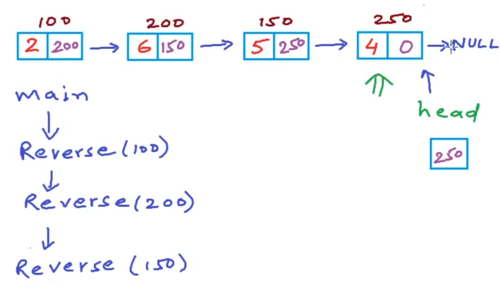

一开始调用 `Reverse(head)`函数，这个函数首先会进行一个`if(.....)`判断，然后会继续调用`Reverse(P->next)`来找到下一个节点，直到找到最后一个节点，到这里就会有人好奇，为什么`Reverse(P->next)`下面的三条代码还没有被执行，在上面我们提到过，每次调用一次函数，函数的地址都会在栈中保存，以便代码可以回到原来的位置去执行下面的代码，递归的方式也是这样，当我们找到最后一个节点，把这个节点设置为`head`，代码就会返回上一层`Reverse(150)`，执行这层剩下的代码。

-  `struct Node *q = p ->next;`保存当前节点的下一个节点，此时**q**的地址为250，**p**的地址为150。
-  `q->next = p;`将**q**指向前一个节点。
-  ` p->next = NULL;`将**p**的下一个节点指向**NULL**，清除原来的指向关系。

### 双向链表

在双向链表中，每个节点将具有两个链接：一个链接到下一个节点，一个链接到上一个节点。

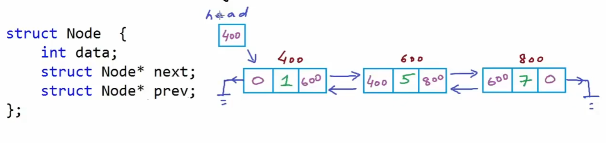

**优点**

1. 可以仅使用一个节点就可以向前或向后去遍历整个链表。

### 双向链表的插入

```c
struct Node
{
    int data;
    struct Node* next;
    struct Node* prev;
}
//在堆中创建一个节点
struct Node* GetNowNode(int x)
{
    struct Node* NowNode = (struct Node* NowNode)malloc(sizeof(struct Node));
    NowNode->data = x;
    NowNode->next = NULL;
    NowNode->prev = NULL;
    return NowNode;
}
```

**这里为什么要在堆中创建一个节点？**

调用函数时，栈会分一部分空间给这个函数，这部分称为栈帧，局部变量会存放在栈帧里，当函数执行完之后，这部分内存就会被释放，因此在函数里面创建一个临时的节点，会在这个函数执行完之后被释放，所以需要使用`malloc`显示的开辟一块内存来存放节点，而这块内存会在**堆**中开辟。

```c
void InsertAtHead(int x)
{
    struct Node* newNode = GetNowNode(x);
    if(head == NULL)
    {
        head = newNode;
        return;
    }
    head->prev = newNode;
    newNode->next = head;
    head = newNode;
}
```

这个函数里创建的`newNode`最后也会被清除，而这个函数`GetNowNode(x)`是在堆中创建的节点并返回这个节点的地址。

## 队列

**数据结构**

队列是一种数据结构，先进先出（FIFO），在队列里面，插入必须从队尾进行，删除要从队列的另一端进行。

1. 插入操作，也被称为入队操作(**Enqueue**)
2. 删除操作，也被称为出队操作(**Dequeue**)
3. 返回队列的头部元素
4. 检查这个数列是否为空

**逻辑视图**

一个队列可以表示为两头挖空的一个容器

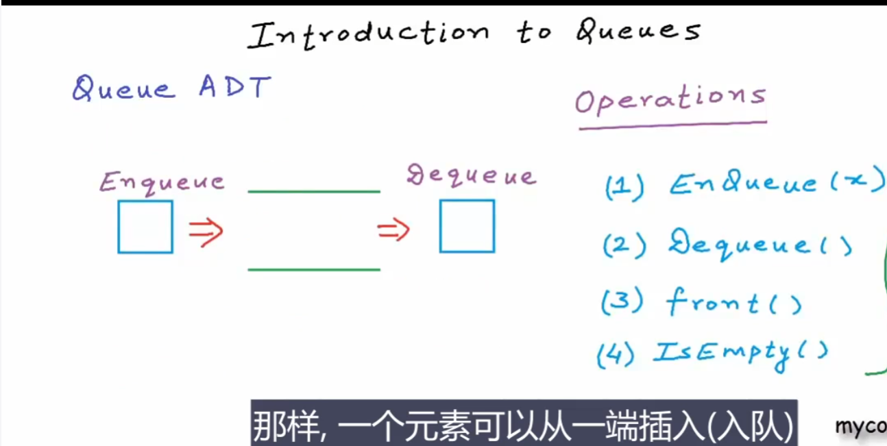

**使用场景**

为了服务请求，我们会有一些共享的资源，为了响应这些请求，使用排队的方式是比较合理的，也就是先来的人先得到响应。

### 使用数组实现队列

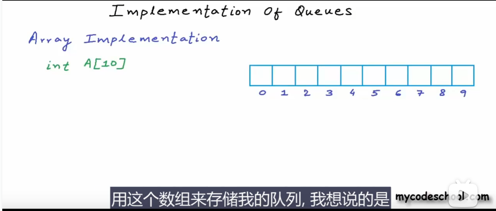

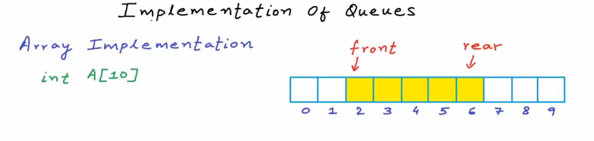

增加一个元素可以让`rear`向后移动一格，减少一个元素可以让`front`向后移动一格。当`front`等于`rear`的时候，队列中只有一个元素，如果是在环形数组中，也有可能是队列已经满了。

```c
int front = -1;//表示还没有进行操作
int rear = -1;
int arr[10];
int size_max = sizeof(arr)/sizeof(arr[0]);

//检查队列是否为空
int Isempty(void)
{
    if(front == -1 && rear == -1)
    {
        return 1;
    }
    else
    {
        return 0;
    }
}

//在队列插入一个元素
void Enqueue(x)
{
    if(rear > size_max - 1)
    {
        //已经增加到数组的最大个数
        return;
    }
    else if(front == -1 && rear == -1) //第一次向队列写入数据
    {
        front = rear = 0;
        arr[rear] = x;
    }
    else 
    {
        rear = rear + 1;
        arr[rear] = x;
    }
}
//在队列中删除一个元素
void Dequeue(x)
{
    if(Isempty()) //队列为空的情况
    {
        return;
    }
    else if(front == rear) //队列中只有一个元素
    {
        rear = front = -1；
    }
    else
    {
        front = front + 1；
    }
}
```

随着我们不断的`Dequeue(x)`，左边就会空出一些单元，而这些单元就会被浪费掉。

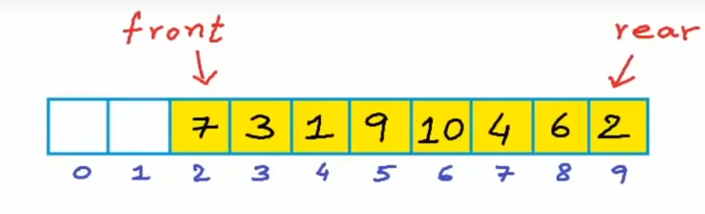

这个时候就可以引入环形数组的概念

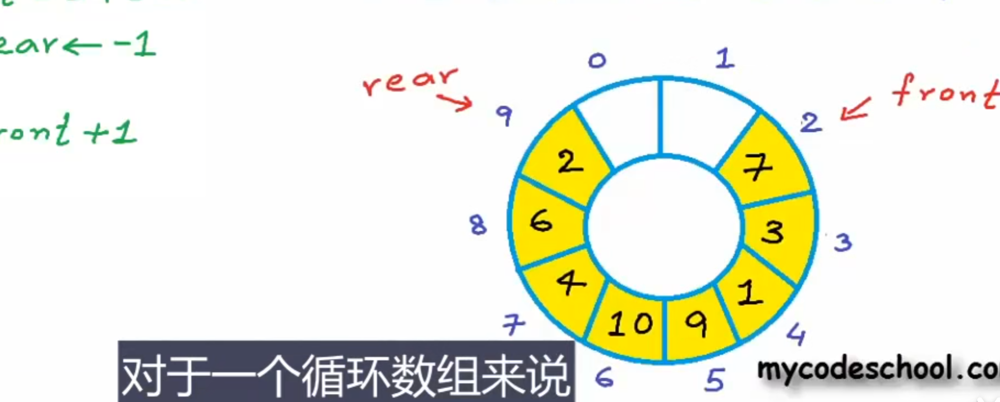

假设数组当前的位置是`i`，那它的下一个位置就是`(i+1)%N`，它的上一个位置就是`(i-1+N)%N`。

- 如果`i`不等于`N-1`，这条运算的结果还是正常的`i`。

- 如果`i`等于 `N-1`，这个运算就会是0，就会回到最初的位置。

### 使用链表实现队列

我们可以从链表的一头进行**Enqueue(入队)**，而链表另一头进行**Dequeue(出队)**，这里需要注意的是，队列的入队和出队操作的时间复杂度都应该是**O(1)**，但在链表中，如果你选择头节点进行入队，那么另一端进行出队的操作它的时间复杂度就是**O(n)**，所以我们应该使用一个变量来追踪链表的尾部。

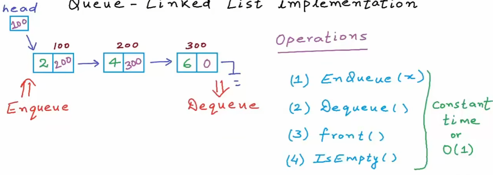

```c
struct Note
{
    int data;		//存放数据
    struct Note *next;//存放下一个节点的地址
};
 struct Note * front = NULL;
struct Note * rear = NULL;
//在队列插入一个元素
void Enqueue(x)
{
    struct Note * temp = (struct Note *)malloc(sizeof(struct Note));
    temp->data = x;
    tmep->next = NULL;
    if(front == NULL && rear == NULL)
    {
        front = rear = temp;
        return;
    }
    rear -> next = temp;
    rear = temp;
}
```

当队列是空的时候，函数会执行`if`语句，把`front`和`rear`设为新节点的地址，再次添加新节点的时候，会把新节点与上一个节点链接起来，然后再把这个新节点设置为`rear`

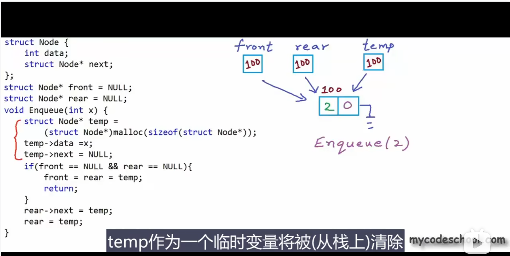

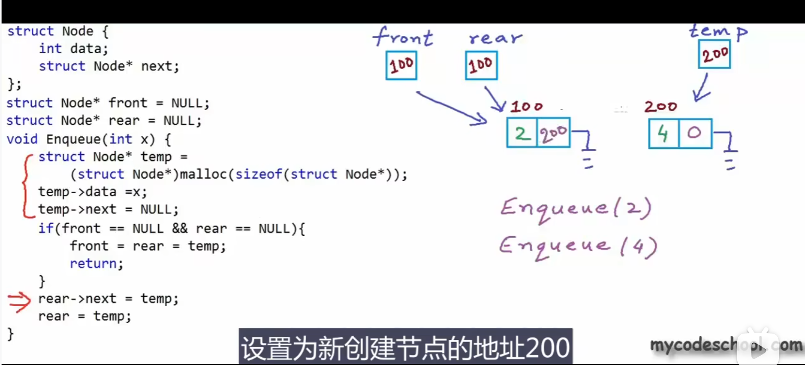

```c
struct Note
{
    int data;		//存放数据
    struct Note *next;//存放下一个节点的地址
};

struct Note * front = NULL;
struct Note * rear = NULL;

//在队列中删除一个元素
void Dequeue(x)
{
     struct Note * temp = front;
    
    if(front == rear)
    {
        front = rear = NULL;
    }
    else
    {
        front = temp->next;
    }
    free(temp);
}
```

## 栈

**栈**是一种链表或者集合，插入和删除元素只能从一端进行，最后进入的元素会最先出来。

- `push`向栈中插入一个元素
- `pop`从栈上移除一个元素
- `top`返回栈顶的一个元素
- `IsEmpiy`检查栈是否为空
- 这些所有操作的时间复杂度都是常数

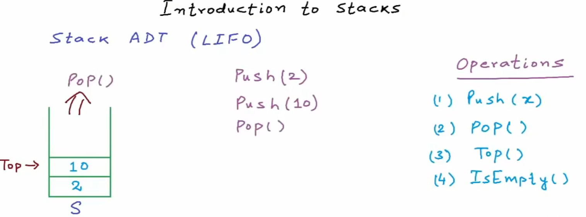

### 使用数组实现栈

创建一个数组来存放我栈中的数据，使用一个变量来存放我栈顶的索引，这个索引就是**top**，对于一个空栈来说，这个**top**就等于-1

- 对于入栈，只需要把这个索引往前移，然后再填入相应的值就可以，但要注意这个索引不能超过数组的长度。
  - 时间复杂度为**O(1)**，这是入栈最好的一种情况
  - 但是当数组要溢出的时候，我们需要创建一个更大的数组来存放原来的数组数据，然后再进行入栈操作，这时的时间复杂度为**O(n)**，这是最坏的一种情况。
  - 平均的入栈操作是**O(1)**。
  - 当要进行n次入栈操作时，时间复杂度会是**O(n)**。
- 对于出栈，只需要把这个索引往后移，这里留下的值会有下一个入栈的值进行覆盖，但要注意不能对空栈进行出栈的操作。
- 对于检查是否为空栈，只要检查这个索引是否为-1即可。
- 对于返回栈顶的元素，只要返回add[top]即可。

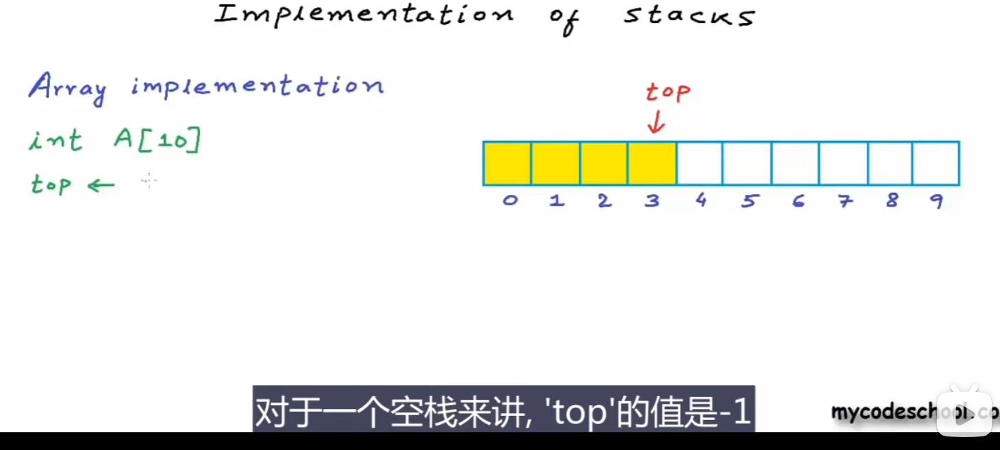

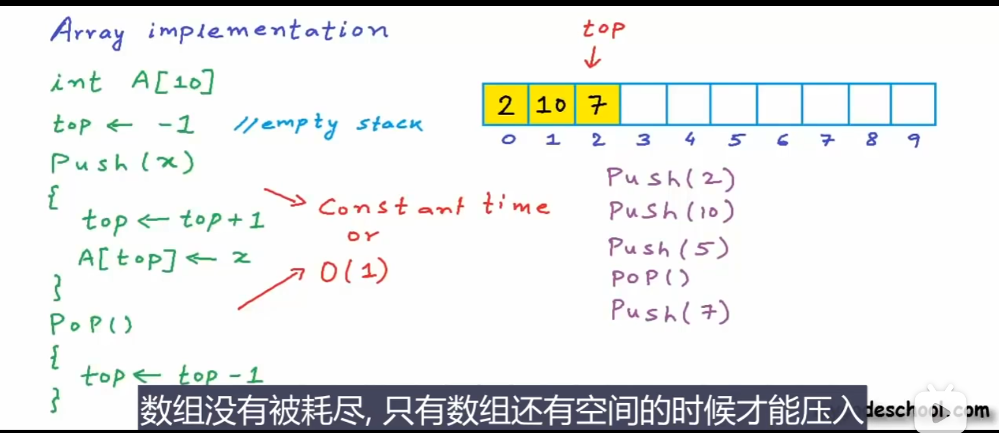

```c
#define MAX_SIZE 101

int addr[MAX_SIZE];
int index = -1;

void push(int x)
{
    if(index > MAX_SIZE -1)
    {
        printf("Error\r\n");
        return;
    }
    addr[++index] = x;
    return;
}

void pop(void)
{
    if(index == -1)
    {
        printf("Error\r\n");
        return;
    }
    index -= 1;
    return;
}

int top(void)
{
    if(index != -1)
    {
        return addr[index];
    }
    else
    {
        printf("Error\r\n\r\n");
    }
}

int IsEmpiy(void)
{
    return index;
}
```

### 使用链表实现栈

栈是一种后进先出的数据结构，它的插入和删除总是从栈的一端来进行，这种方式也可以使用链表来实现，如果我是从链表的尾部来进行插入和删除的话，那它的时间复杂度就是**O(n)**，而我们说，栈的插入和删除应该是常数的。所以我们应该从链表的头部进行插入和删除。

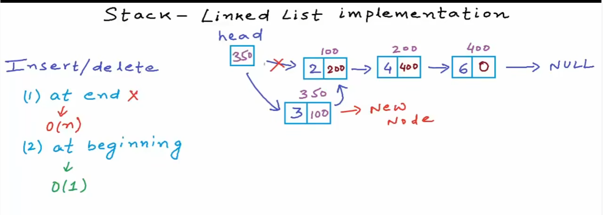

```c
struct Note
{
    int data;		//存放数据
    struct Note *next;//存放下一个节点的地址
};

struct Note* top = NULL;

void push(int x)
{
    struct Note * temp = (struct Note *)malloc(sizeof(struct Note ));
    temp->data = x;
    temp->next = top;
    top = temp;
    return;
}

void pop(void)
{
    if(top == NULL)
        return;
    struct Note * temp = NULL;
    temp = top;
    top = top->next;
    free(top);
}

struct Note* top_func(void)
{
    if(top == NULL)
        return;
    else
    {
        return top;
    }
}
```

### 反转一个字符串或者反转一个链表

这里会使用以前实现的栈来作为最基本的库来进行调用。

**反转一个字符串**

```c
#define MAX_SIZE 101

int addr[MAX_SIZE];
int index = -1;

void push(int x)
{
    if(index > MAX_SIZE -1)
    {
        printf("Error\r\n");
        return;
    }
    addr[++index] = x;
    return;
}

void pop(void)
{
    if(index == -1)
    {
        printf("Error\r\n");
        return;
    }
    index -= 1;
    return;
}

int top(void)
{
    if(index != -1)
    {
        return addr[index];
    }
    else
    {
        printf("Error\r\n\r\n");
    }
}

int IsEmpiy(void)
{
    return index;
}


void Reverse(char *str,int len)
{
    for(uint8_t i = 0 ;i < len;i++)
    {
        push(str[i]); //进行压栈操作
    }
    for(uint8_t i = 0;i < len;i++)
    {
        str[i] = top();//获取栈顶的数据
        pop();//
    }
}
```


**反转一个链表**

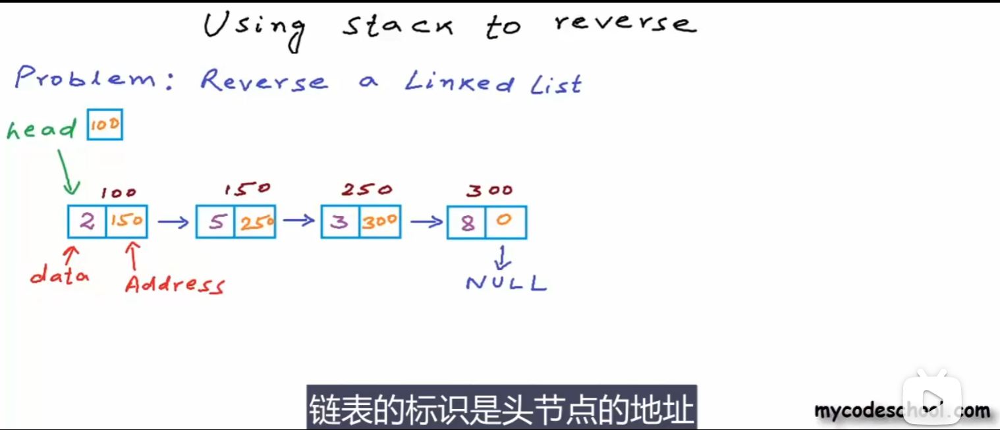

```c
struct Note
{
    int data;		//存放数据
    struct Note *next;//存放下一个节点的地址
};

struct Note* top = NULL;

void push(int x)
{
    struct Note * temp = (struct Note *)malloc(sizeof(struct Note ));
    temp->data = x;
    temp->next = top;
    top = temp;
    return;
}

void pop(void)
{
    if(top == NULL)
        return;
    struct Note * temp = NULL;
    top = top->next;
    temp = top;
    free(temp);
}

struct Note* top_func(void)
{
    if(top == NULL)
        return;
    else
    {
        return top;
    }
}

void Reverse(struct Note *str)
{
	
    while(str!=NULL)
    {
    	push(str);
    	str=str->next;
    }
    struct Note * temp = top_func();
    str = temp;
    pop();
    while(temp != NULL)
    {
    	temp->next = top_func();
    	pop();
    	temp = temp->next;
    }
    temp->next = NULL;
    
}

```

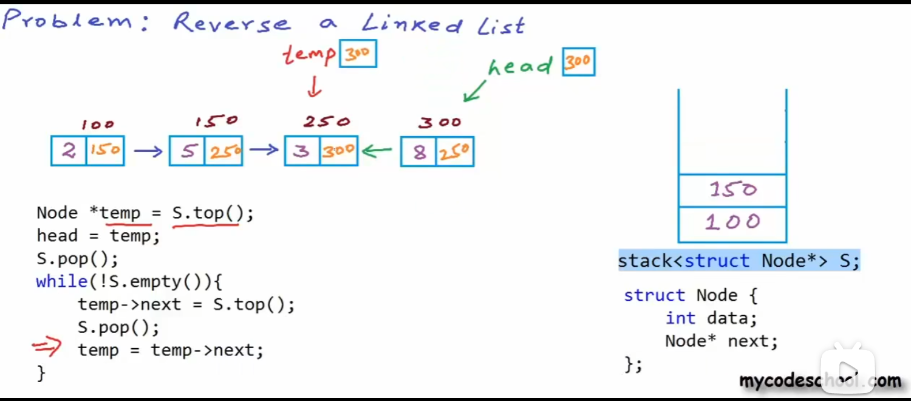

### 检查括号的匹配性

检查括号的匹配性，这个括号包括**{}**，**[]**，**()**，每一个括号都应该有其对应的括号去进行匹配。检查括号的匹配性可以通过检查括号的数量去检查，但这种方法对于检查这些情况时并不适用**{[}(})]}**，除了检查括号的数量，还需要跟据括号的性质去进行匹配，每一个左括号都应该有一个与之对应的右括号，还有一个属性，可以出现右括号的条件是，（该右括号对应的那个左括号）之后出现的所有括号都已经进行匹配。

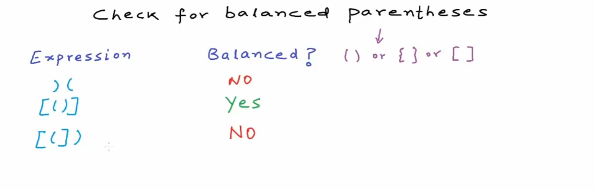

任何时候的右括号都应对应着离它最近的左括号。

但我们碰到一个开放的括号的时候，我们可以把它压入栈中，碰到一个关闭的括号的时候，可以把它与栈顶的括号进行检查。

```c
struct Note
{
    char data;		//存放数据
    struct Note *next;//存放下一个节点的地址
};

struct Note* top = NULL;

void push(chat x)
{
    struct Note * temp = (struct Note *)malloc(sizeof(struct Note ));
    temp->data = x;
    temp->next = top;
    top = temp;
    return;
}

void pop(void)
{
    if(top == NULL)
        return;
    struct Note * temp = NULL;
     temp = top;
    top = top->next;
    free(temp);
}

struct Note* top_func(void)
{
    if(top == NULL)
        return NULL;
    else
    {
        return top;
    }
}

int CheckBalancedParenthesis(char *str)
{
    int len = strlen(str);
    
    if(len % 2 != 0)
    {
    	return -1;
    }
    
    for(int i = 0;i < len;i++)
    {
    	if(str[i] == '[' || str[i] == '{' || str[i] == '(')
    	{
    		push(str[i]);
    	}
    	else
    	{
    		if(str[i] == ']' || str[i] == '}' || str[i] == ')')
    		{
    			struct Note* temp = top_func();
    			if((temp->data == '[' && str[i] == ']') || (temp->data == '(' && str[i] == ')') || (temp->data == '{' && str[i] == '}') )
    			{
    				pop();
    			}
    			else
    			{
    				return -1;
    			}
    		}
    	}
    }
    
    return (top_func()?-1:0)
}
```

# 硬件学习之路

## AD使用笔记

添加原理图库和添加PCB图库

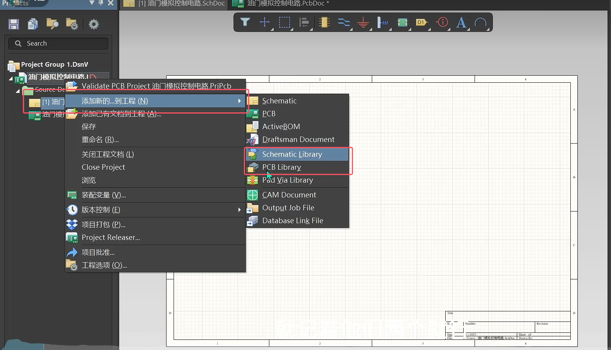

方法二

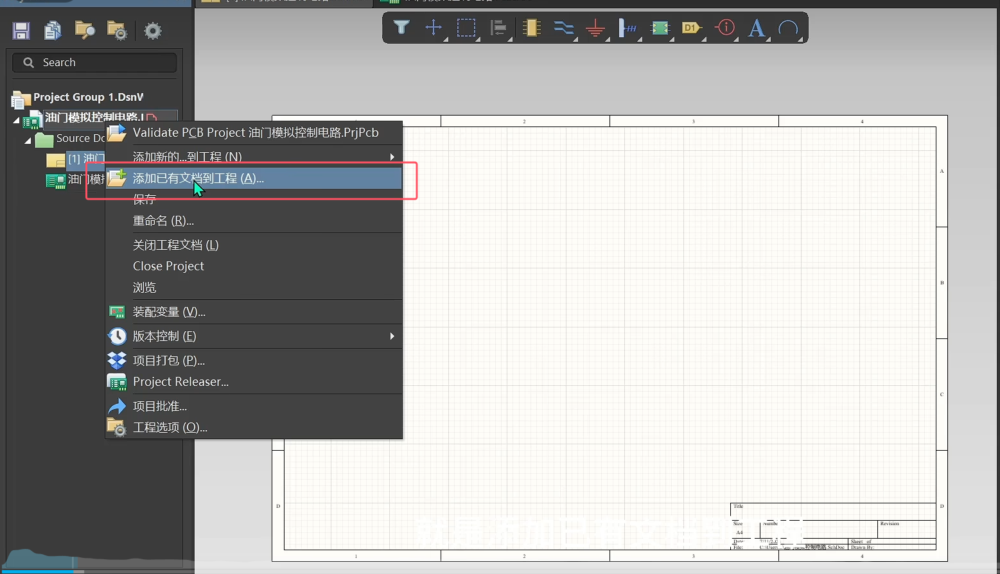 

**取反符号：**键盘上的' \ '键。

板子按选择的对象定义：DSD。

### PCB

**unknow pin错误：1.没有封装 2.封装管脚缺失 3.管脚好不匹配**

**绿色报错：**1.T+M 复位错误	2.T+D 设计规则检测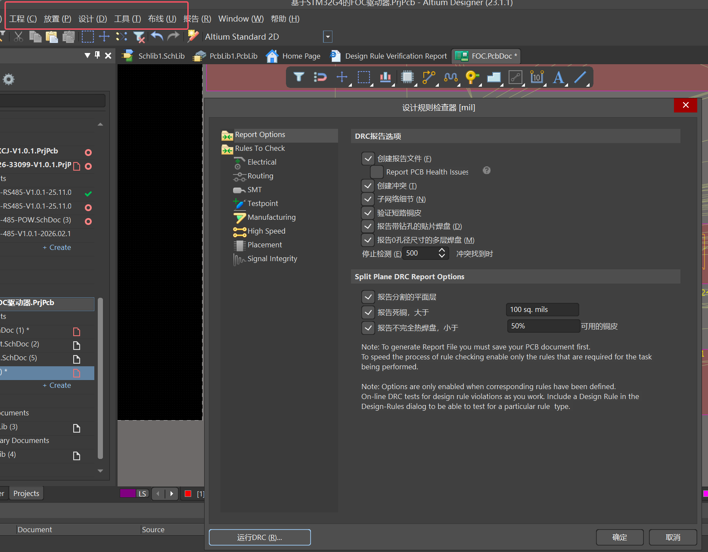


**评估板框大小：**1.T+O+L 将器件在矩形区域内摆放

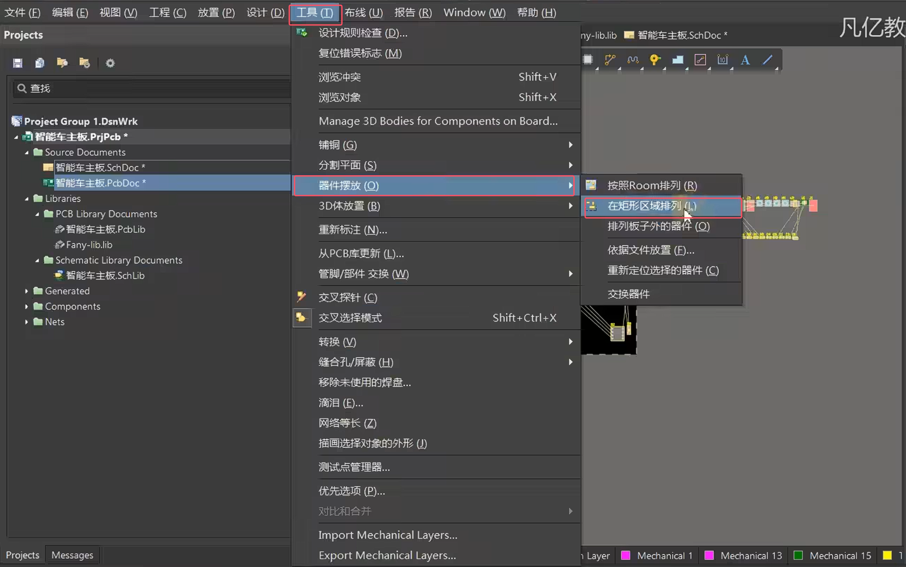


**设置PCB原点：**E+O+S

**设置板框形状：**D+S+D 

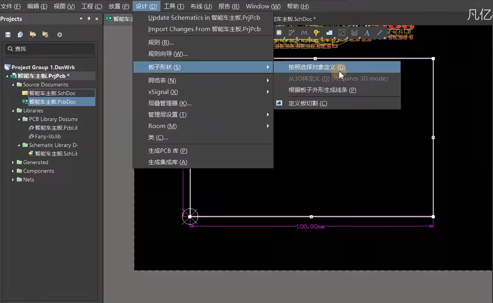


**层叠管理器：**D+K

**Signal：**正片层的**默认状态是无铜的基材**，只有你主动绘制的**走线、焊盘、铺铜、过孔**等区域才有铜箔，铜箔是 “按需绘制” 的，所有**信号层**都是正片逻辑。

AD 里的正片层标签均为`Signal`相关，比如`Top Layer`（顶层）、`Bottom Layer`（底层）、`Mid Layer1/2`（中间信号层），都是正片。

**Plane**：负片层的**默认状态是整层全覆盖铜**，你不需要的区域（非目标网络、安全间距区）通过**挖空（刻蚀）** 实现无铜，仅保留**目标电源 / 地网络的整层铜箔**，AD 里的`Internal Plane1/2/3`（内电层）都是负片，也是电源 / 地层的专属层别。

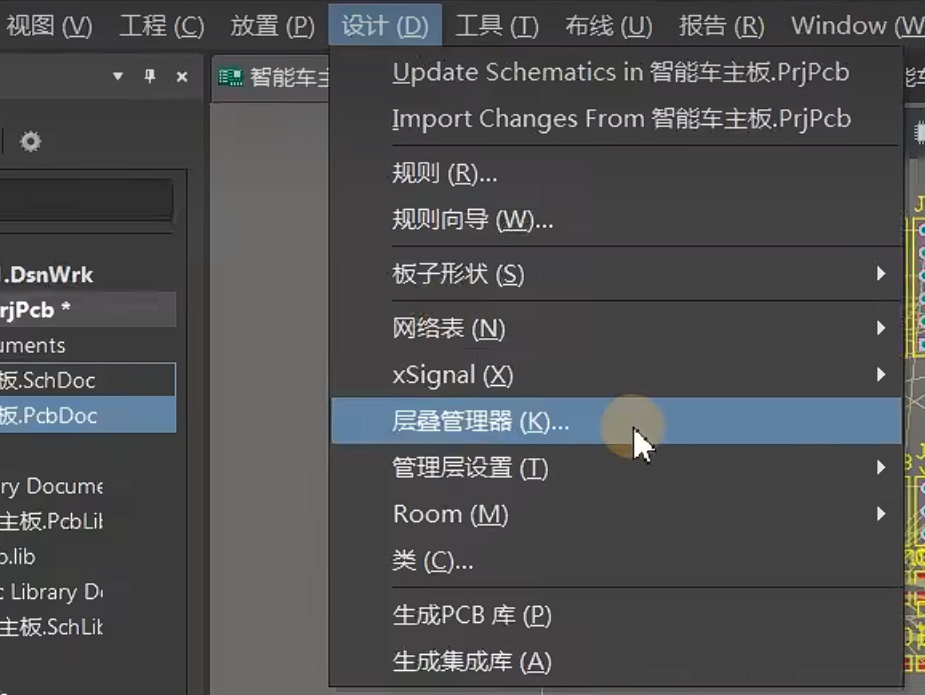

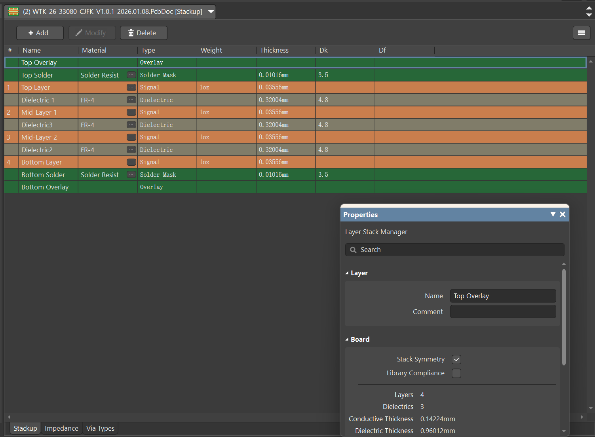


**规则：**1.电气规则	2.线宽、信号规则 

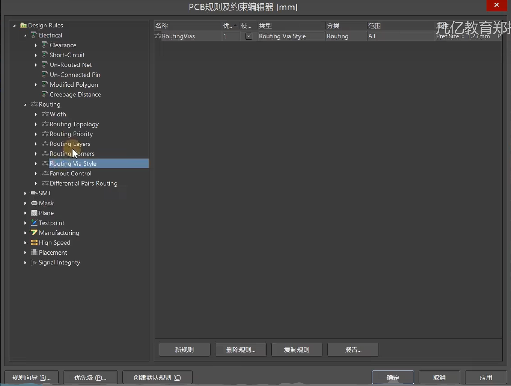

**间距规则**：


## 常用电路

### DC24V转DC12V

**STC2403**

- 8V-40V Vin、3.5A、高效率同步降压型 DCDC 转换器，具有可编程频率。
- 采用 ESOP-8 封装。

输出的电压由R5,R6的选择共同决定。

#### 典型应用

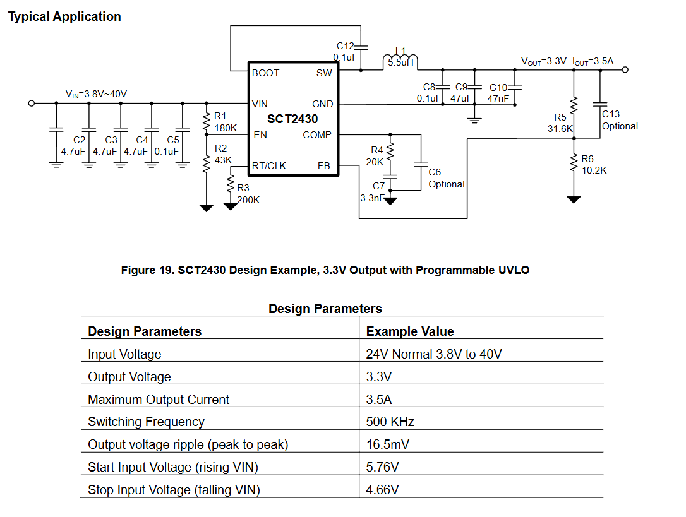

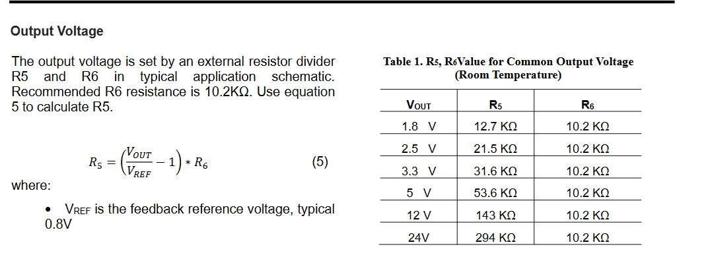


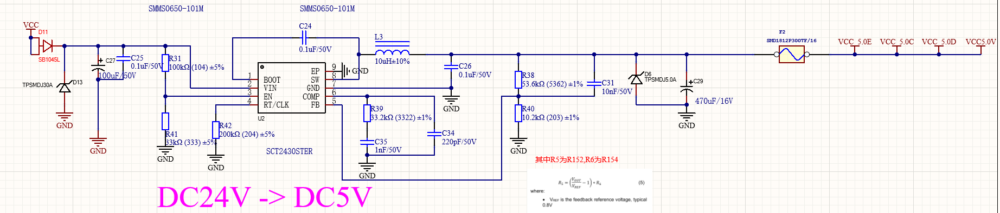

**SB1045L**：肖特基二极管，起到防反接的作用，最大反向耐压值为45V。

**TPSMDJ30A，TPSMDJ5.0A**：TVS管，静电和浪涌保护，30A代表反向截止电压为30V。

### DC12V转DC3V3

**TPS563201DDCR**

- 输入电压范围：4.5 V 至 17 V
- 输出电压范围：0.76 V 至 7 V

#### 典型应用

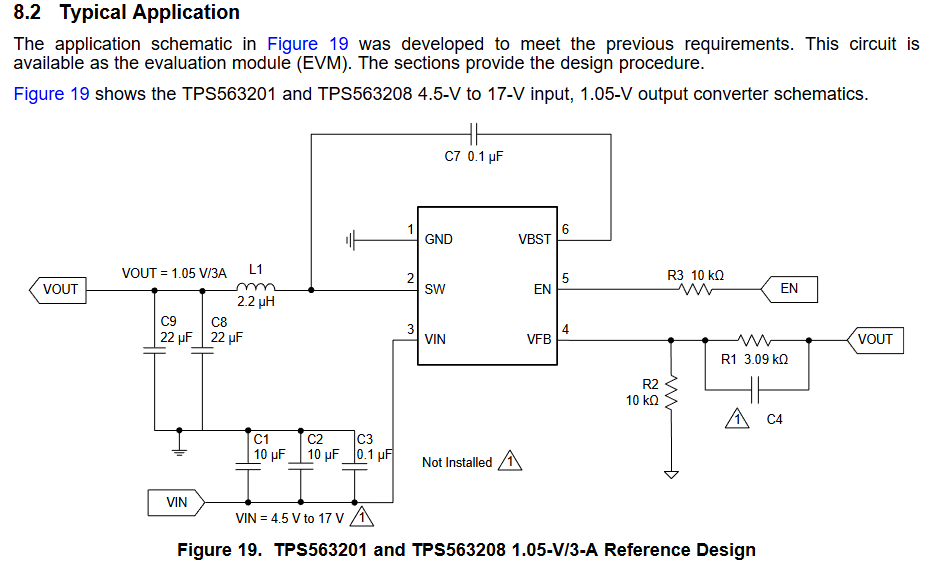


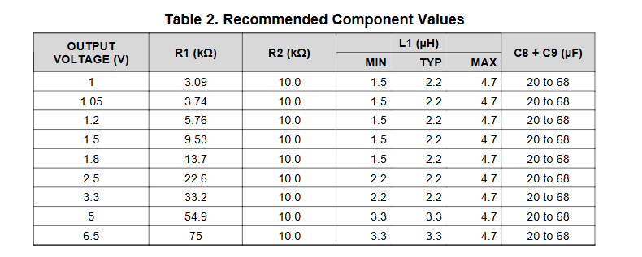

### 防雷电路

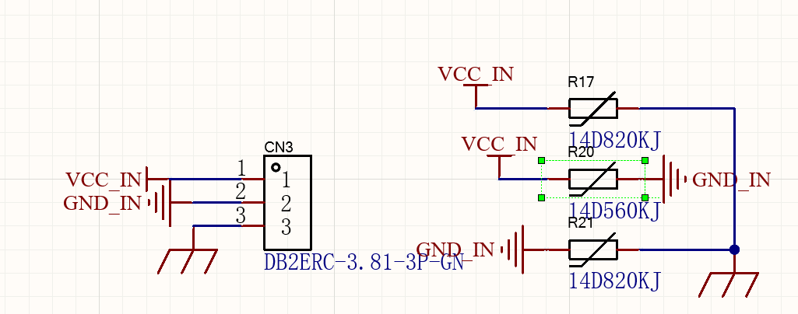

**14D560K 能在雷击浪涌到达后几纳秒内启动保护，将电压钳位至<=110V**

#### 一级防雷

#### 二级防雷

### 以太网电路

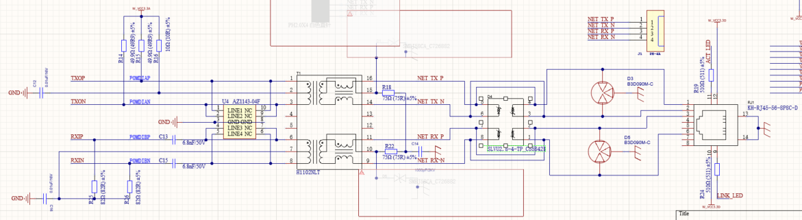

**H1102NLT**：网络变压器，隔离电压1.5kV，防止：地环路干扰（Ground Loop）、雷击浪涌通过网线损坏主控芯片、不同设备间的电位差导致电流倒灌

### RC电桥

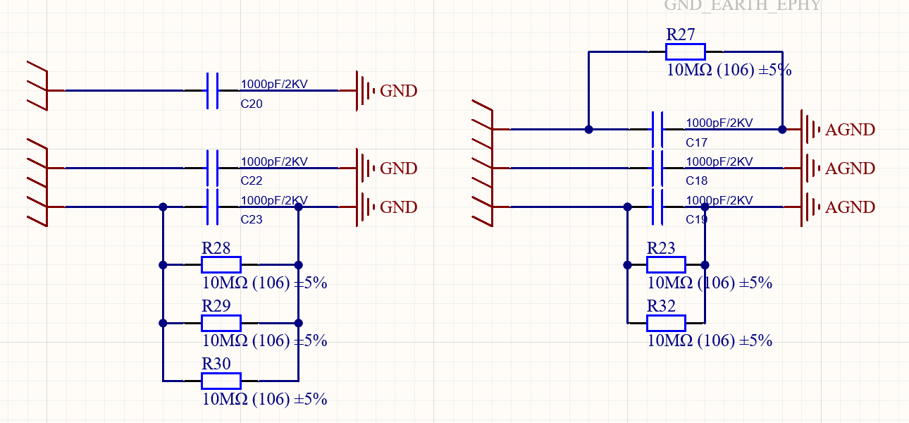

使用电容和电阻将GND和大地隔离开来

**电容的作用**：**1000pF = 1nF**，属于小容量陶瓷电容，它对 **低频信号（如直流、工频）呈高阻抗**，几乎不导通，对 **射频（RF）、高速瞬态噪声（如 EMI、雷击感应）呈低阻抗**，可以将这些干扰电流泄放到地。

**电阻的作用**：单独使用电容无法导通直流，可能导致 **系统地（GND）浮空**，这个阻值足够大，不会显著影响正常工作电流，但又能提供一个 **缓慢的直流泄放通道**，使系统地保持稳定。

## 外设电路

### AT24C02

**AT24C02**：EEPROM，断电不丢失。

### CAN通信电路

CA-IS2062A 是一款隔离式控制器局域网（CAN）收发器，内部集成DC-DC 转换器。

CAN 总线具有两个状态：显性状态和隐性状态。显性状态下（“0”位，用于确定信息发送的优先级），CANH-CANL 之间的差分电压介于1.5V 至 3V（高于1V），该状态对应于TXD/RXD 的逻辑“0”；隐性状态下（“1”位，总线空闲状 态），总线通过内部电路拉至 VISOIN/2，CANH-CANL 之间的差分电压介于–80mV 至+80mV，或接近 0V（低于 0.4V，取 决于总线负载），该状态对应于TXD/RXD的逻辑“1”，如下图所示。

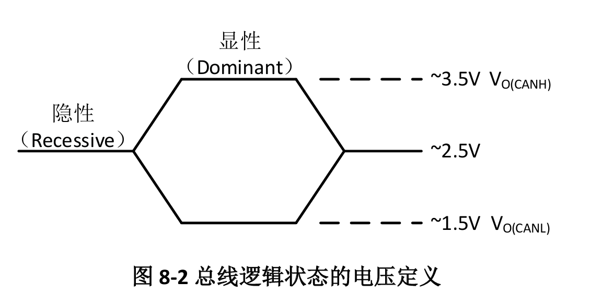

## 电源设计

### 电源分类

按照电压转换类型分类：按电压转换类型分类，电源可以分为AC/DC、DC/DC和DC/AC三类。

**DC/DC的线性电源与开关电源**

最早接触的稳压电源都是三端稳压器，也是一种线性电源。因为只有三个管脚，所以三端稳压电源也是最简单的一种稳压电源。

三端稳压器是线性电源的一种。线性电源的基本原理就是：电阻分压，只不过有一个动态调整的电阻。不管是线性电源还是开关电源都是输出电压负反馈，只不过线性电源通过一个三极管处于一个放大区，等效于一个可以变化阻值的电阻，对输出负载进行分压。通过输出电压分压后反馈，来控制三极管实现输出的稳压。

#### 开关电源按是否隔离进行分类

1．电源隔离与非隔离的概念

电源的隔离与非隔离，主要是针对开关电源而言。业内比较通用的定义是：隔离电源是指电源的输入回路和输出回路之间没有直接的电器连接，输入和输出之间是绝缘的高阻态，没有电流回路；非隔离电源是指输入回路和输出回路之间有直接的电流回路，例如，输入和输出之间是共地的。

**开关电源的调制方式**：通常来说，开关电源（DC/DC）有PWM、PFM和PSM三种最常见的调制方式。

1. PWM（Pulse Width Modulation，脉冲宽度调制）：频率不变，不断调整脉冲宽度。PWM方式是一种固定开关周期、通过调整T on 来改变占空比的调制方式。
2. PFM（Pulse Frequency Modulation，脉冲频率调制）：脉冲宽度不变，调整频率。PFM方式在正常工作时，驱动信号的脉冲宽度保持恒定，但脉冲出现的频率发生改变，即所谓的定宽调频。
3. PSM（Pulse Skip Modulation，脉冲跨周期调制）：频率和脉冲宽度都不变，脉冲时有时无。PSM方式可称为定频定宽，其驱动信号的频率与宽度都保持恒定。

## 同步与非同步电源

通俗一点地说，在电路中，上管和下管都使用场效应管MOSFET的就是同步的。只有一个上管的开关而没有下管，或者是由一个二极管替代下管位置的，就是非同步的。因为在非同步电源中，下管是一个二极管，不需要控制，也就不存在控制器同步的问题。

同步Buck变换器基本电路

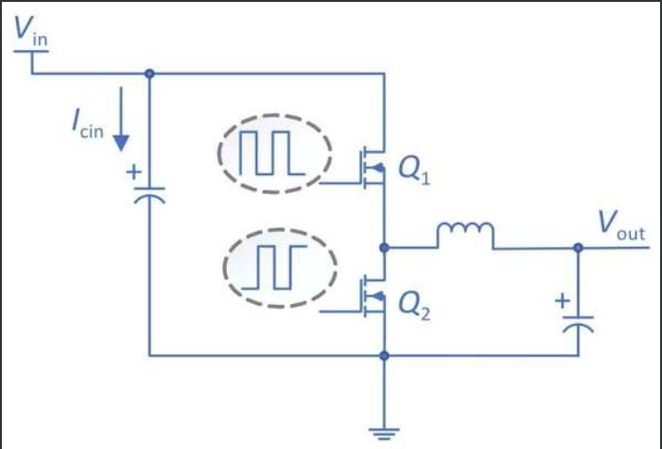

非同步Buck变换器基本电路

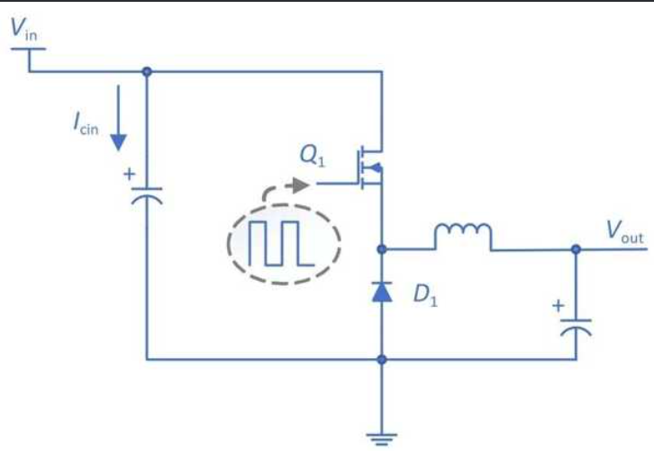


## 设计上的十万个为什么

### 0Ω电阻的隔离作用

- **功率地（Power GND）**：大电流回路（电源、电机、驱动、开关电源），**噪声大、脏、干扰强**。
- **模拟地（Analog GND）**：小信号回路（传感器、运放、ADC），**极怕干扰，一丁点噪声就飘**。
- **数字地（Digital GND）**：开关翻转多，**高频尖峰噪声多**。

1. 实现**单点接地**，切断地环路

不同地只通过这一个 0Ω 连在一起，

→ 没有闭合环路

→ 没有环流

→ 没有环路带来的干扰。

2. **直流相通，高频隔离**

- **直流 / 低频**：0Ω ≈ 导线，保证两地**电位相等**，不会有压差烧芯片。
- **高频**：0Ω 本身有一点点寄生电感，对高频噪声相当于**小阻抗**，能**挡一部分高频干扰**，不让功率地 / 数字地的脏噪声串到模拟地。

3. 调试无敌方便

- 干扰大 → 拆掉 0Ω，换成磁珠、小电感、RC 电路；
- 查问题 → 临时断开 0Ω，定位是哪块地的噪声；
- 定型 → 焊回 0Ω，成本几乎为零。

4. 统一系统参考电位

所有地最终必须**共地**，否则会有电势差，击穿芯片、信号错乱。

0Ω 就是**最便宜、最可靠的等电位连接点**。

## 电源电路的基本元器件

### 电阻

在电源中，电阻主要应用在分压反馈电阻、配置开关频率、Power Good（PG）上拉、限流点设置、环路补偿、RC缓冲电路、MOSFET驱动限流等方面。

- 环路补偿

  - 在输入电压、输出负载发生突变的情况下，如果开关电源的输出不进行调整，则输出电压会发生变化。当输出电压变化太大而超出规定的幅值范围的时候，如输出电压突然变大会导致用电器件损毁，或者如果输出电压突然变小会导致用电器件工作异常。因此，需要设计反馈环路的补偿电路，从而使得整个系统的传递函数有足够的增益裕量和相位裕量，让开关电源无论在何种模式下都能稳定工作。在环路补偿网络设计时，一般会用到电阻和电容的组合，实现若干个极点和零点，从而改变反馈环路的波特图特性。一般我们通过补偿网络的频率特性，调整整个控制环路的波特图。这时，我们就需要通过调整补偿网络中电阻和电容的值来实现期望的频率特性。

- MOSFET驱动电路

  - 开关电源的开关一般选择MOSFET，类型一般选择N-MOSFET。

    MOSFET在完全导通的状态下，体现出是一个稳定导通电阻的特性，称作R DS（on） 。高压侧驱动器的设计用于驱动MOSFET，这种MOSFET一般都是能够通大电流，并且R DS（on） 值都比较低。当配置为浮动驱动器时，VCC电源提供7.5V（或10V）的偏置电压。在V GS =7.5V（或10V）时，平均驱动电流等于栅极电荷除以开关电源的开关周期T（或者等于栅极电荷乘以开关频率f）。瞬时驱动电流由BST和SW引脚之间的自举电容器提供。驱动能力由其内阻表示，BST到UGATE的内阻为1.5Ω，UGATE到SW的内阻为0.9Ω。

    低压侧驱动器设计用于驱动大电流、低R DS（on） 的N-MOSFET。驱动能力由其内阻决定，VCC到LGATE的内阻为1.5Ω，LGATE到GND的内阻为0.9Ω。VCC电源提供7.5V（或10V）的偏置电压。瞬时驱动电流由连接在VCC和GND之间的输入电容器提供。平均驱动电流等于栅极电荷乘以开关频率。该栅极驱动电流及上管MOSFET的栅极驱动电流乘以7.5V（或10V），即产生需要从器件封装中耗散的驱动功率。

    这里提到的1.5Ω和0.9Ω都是器件内部的电阻。由于MOSFET打开的过程中需要对MOSFET的寄生电容充电，所以这个瞬间电流比较大，有时会导致VCC或BST电压跌落，导致内部逻辑错乱，驱动逻辑错误导致丢失驱动脉冲，从而导致输出异常。所以有时会串联电阻（R UGATE 和R LGATE ），用于控制瞬间电流。但是这个电阻会因为RC充放电延时，影响MOSFET控制时序。我们电阻选型阻值也不能太大。

#### 功能与应用

**1.分压**

例如芯片参考电压、电源使能电压和FB电阻、NTC热敏电阻串联分压电阻。必须是极小电流（uA、nA）的应用，否则会电压不准确。

- DDR3的VTT,Vreg需要是电源引脚的一半

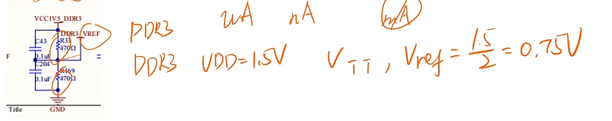

- 电源芯片的FB引脚

  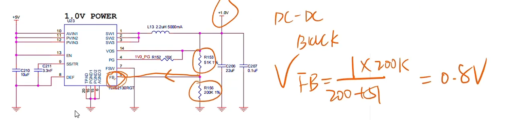

**2.串阻信号衰弱**

例如串在复位信号上的330欧电阻有抑制噪声干扰功能。某些滤波器。有抑制信号的作用

- JTAG接口是一个对外的接口，经常会耦合进一些对外的干扰，通过一个串阻，这个串阻首先不会影响正常的通信功能，但可以将外部的噪声抑制掉一部分

  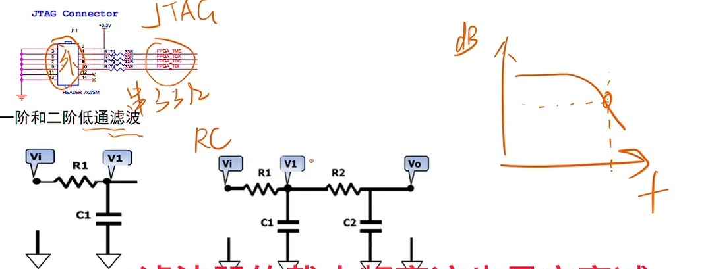

**3.端接匹配/阻抗匹配**

例如差分LVDS的100欧电阻、RS485的端接电阻、DDR地址命令线末端的VTT电阻、有源晶振输出的22/33欧电阻

- 阻抗不匹配的话会产生一个反射，PCB上的走线是当作一个传输线来看，阻抗大概是50Ω，在这个单端时钟线上串上一个33Ω的电阻进行阻抗匹配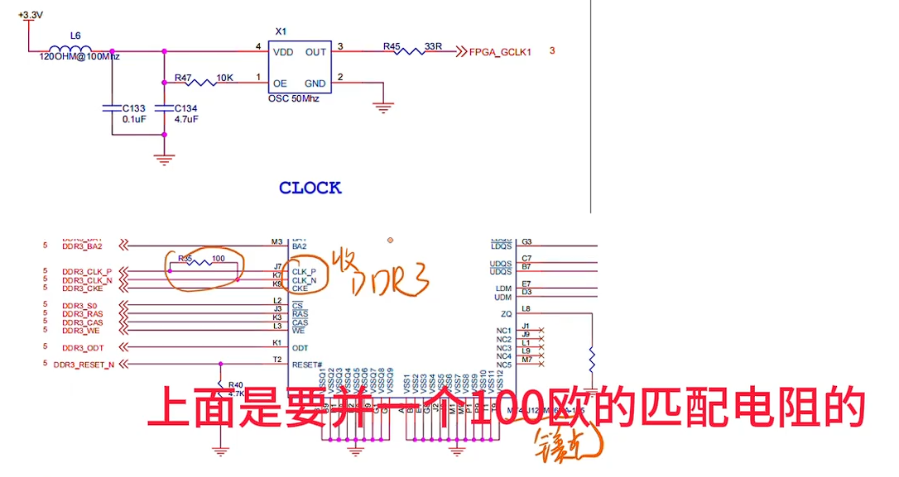

**4.上下拉功能**

- 确认地址的高低、在上电的时候保持信号的稳定

  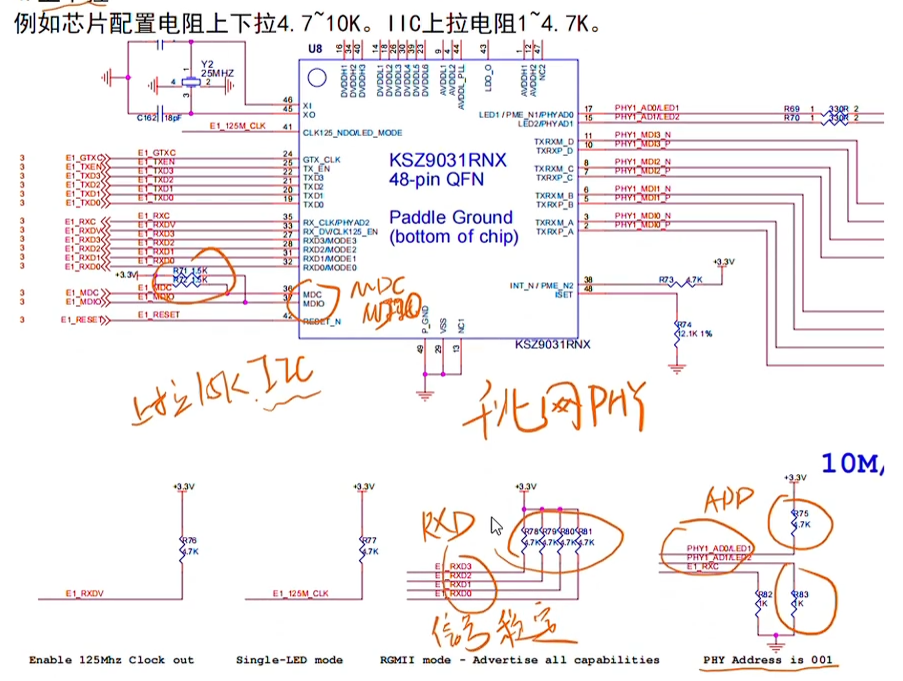

**5.电流采样**

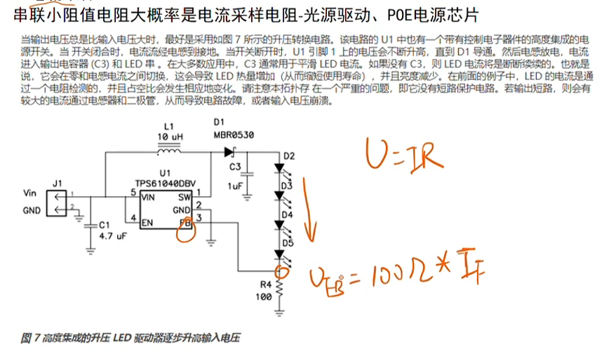

**6.限流**

**7.发热**

**8.测试点调试**

**9.泻放**

### 电容

电容器最简单的结构可以理解为，由两个相互靠近的导体在形成的面积中间夹一层绝缘介质组成。当在电容器两个极板间加上电压时，电容器就会储存电荷，所以电容器是一个充放电荷的电子元件。在电路中，电容有通交流、阻直流和通高频、阻低频的特性。

电容在开关电源电路中主要用于：输入电容；输出电容；自举电容；控制器自身的一些储能和稳压；开关控制器的配置；环路特性设计；去耦电容。

- 自举是指通过开关电源MOSFET管和电容组成的升压电路，通过电源对电容充电使其电压高于VCC。

**一、先明确自举电路的核心组成**

用户提到的 “MOSFET + 电容” 是核心，但实际完整电路还需补充两个关键元件，才能实现升压：

| 元件                         | 作用                                       |
| ---------------------------- | ------------------------------------------ |
| 自举电容 Cboot               | 核心储能元件，负责 “搬运” 电压并叠加       |
| 开关管 MOSFET                | 充当 “切换开关”，控制电容的充电 / 放电路径 |
| 自举二极管 Dboot             | 防止电容放电回 VCC，保证充电单向性         |
| VCC                          | 基础电源（如 12V），给电容初始充电         |
| 参考电位端（如 Vout / 绕组） | 提供第二个电位，与电容电压叠加             |

**简单类比**：把 Cboot 看作一个 “可移动的电压蓄水池”，VCC 先给它灌到接近满水（电压≈VCC），再通过 MOSFET 切换，让这个 “蓄水池” 的电压和另一个电位叠加，最终得到更高的总电压。

**二、分步拆解：为什么电压会高于 VCC？（关键在 “切换 + 叠加”）**

开关电源的 MOSFET 会周期性 “导通 / 关断”（频率通常几十 kHz~MHz），自举的升压过程就发生在这两个阶段的切换中：

**阶段 1：MOSFET 关断 → 电容 Cboot 被 VCC 充电（“蓄水池储水”）**

当 MOSFET 关断时，电路路径为：**VCC → 自举二极管 Dboot → 自举电容 Cboot → 参考电位端（如地 / GND 或低电位点）**

- 二极管 Dboot 的单向导电性：只允许电流从 VCC 流向 Cboot，阻止 Cboot 后续放电回 VCC（避免 “蓄水池漏水”）；

- 充电结果：Cboot 两端会被充到 **≈VCC - Vd**（Vd 是二极管正向压降，约 0.3~0.7V），近似看作 **Cboot 电压 = VCC**（工程上可忽略 Vd 的微小影响）。

此时 Cboot 的状态：一端接 VCC（电位 = VCC），另一端接参考电位（电位 = 0V/GND），两端压差稳定在≈VCC。

**阶段 2：MOSFET 导通 → 电容电压与参考电位叠加（“蓄水池移位叠加”）**

当 MOSFET 导通时，电路路径切换：**Cboot 的 “原参考端”（曾接 GND）被 MOSFET 连接到一个新的高电位点 Vx（如开关电源的输出电压 Vout，或变压器副边绕组电压）**

- 核心原理：**电容两端的电压不能突变**（电容的电场能量不能瞬间改变，就像蓄水池的水位不能瞬间升降）。

导通前 Cboot 两端压差是 “VCC - 0V = VCC”，导通后这个压差必须保持不变；

- 电位叠加计算：

导通后 Cboot 的一端电位变为 Vx（新参考点），为了维持两端压差≈VCC，另一端的电位会被迫升高到：

**最终电位 = Vx + Cboot 两端压差 ≈ Vx + VCC**

- 升压结果：如果 Vx 本身是正电位（比如开关电源的输出 Vout=12V，或绕组感应电压 = 12V），那么最终电位就会是 12V+12V=24V，明显高于原始 VCC（12V）。

- 去耦电容

  - 在高速电路中，尤其要注意元器件的去耦问题，主要是因为元器件会把一部分能量（噪声）耦合到电源、地系统之中。这些噪声会以共模或差模的形式传播到其他器件中，从而影响其他器件的正常工作。此时就需要用到去耦电容，**在靠近高速器件的电源管脚放置一些电容，可以防止高速器件的噪声向外传播。由于去耦电容滤除的是高频噪声**，所以一般选用陶瓷电容作为去耦电容。铝电解电容不适用于高频去耦，主要用于电源或电力系统的滤波。

    去耦电容的选择并不局限于陶瓷电容，但陶瓷电容因其高频特性和良好的稳定性而常被选用。在选择陶瓷电容作为去耦电容时，需要确保电容的自谐振频率高于电路中最高频的时钟频率或信号频率。通常，可以选择一个自谐振频率在10MHz到30MHz之间的电容。

    对于许多PCB电路，其内部信号的频率范围可能高达200MHz到400MHz。在这种情况下，当把PCB电路结构视为一个电容时，选择适当的去耦电容可以有效地增强对电磁干扰（EMI）的抑制能力。这些去耦电容应放置在关键电路节点附近，以便有效地滤除高频噪声，确保电路的稳定性和可靠性。

**核心逻辑总结**

自举不是让电容 “直接充到高于 VCC”，而是先让电容充到≈VCC，再通过 MOSFET 切换，把电容的一端 “接到更高的参考电位上”，利用电容电压不能突变的特性，让电容另一端的电位被 “抬升” 为 “参考电位 + VCC”，最终实现高于 VCC 的输出。

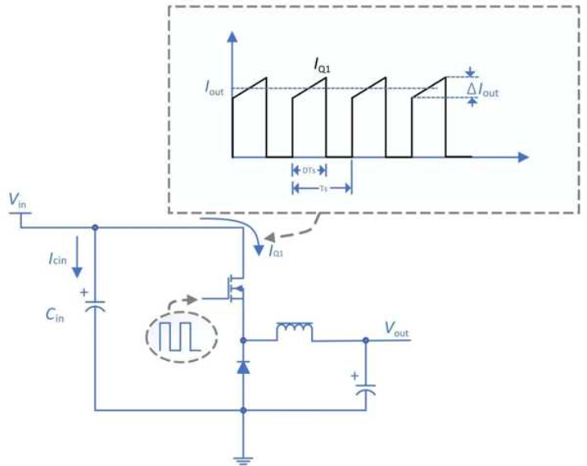

#### 电容的高频RLC模型

在电源和数字电路的滤波/去耦设计中，**100nF（0.1μF）电容被专门用于高频滤波，核心原因在于实际电容的寄生参数决定了其频率响应特性，而100nF MLCC在物理结构上恰好能在MHz频段保持极低阻抗。** 下面从原理到工程实践逐层拆解：

---
核心原理：实际电容的阻抗-频率特性

理想电容的阻抗随频率升高单调下降（$Z_C = \frac{1}{j\omega C}$），但**真实电容存在寄生参数**，等效电路为：
```
      ┌── ESR ──┐
  ───┤         ├───
      └── ESL ──┘
          │
          C
```
总阻抗公式：  
$$Z(f) = \sqrt{ESR^2 + \left(2\pi f \cdot ESL - \frac{1}{2\pi f \cdot C}\right)^2}$$

- **低频段**：容抗主导，阻抗随频率↑而↓
- **自谐振频率（SRF）**：当 $2\pi f \cdot ESL = \frac{1}{2\pi f \cdot C}$ 时，阻抗最低（仅由ESR决定）
- **高频段（>SRF）**：感抗主导，电容表现为**电感**，阻抗随频率↑而↑，完全失去滤波能力

---
 为什么大容量电容滤不了高频？

| 电容值    | 典型封装      | ESL范围        | SRF范围         | 有效滤波频段       |
| --------- | ------------- | -------------- | --------------- | ------------------ |
| 10μF/22μF | 0805/1206     | 1.0~2.5 nH     | 300 kHz ~ 1 MHz | 低频纹波、负载瞬态 |
| 1μF       | 0603          | 0.6~1.2 nH     | 2~5 MHz         | 中低频             |
| **100nF** | **0402/0603** | **0.3~0.8 nH** | **15~50 MHz**   | **中高频开关噪声** |
| 10nF      | 0201          | 0.2~0.4 nH     | 50~150 MHz      | 超高频/数字边沿    |

- **大容量MLCC**：介质层数多、极板面积大 → 内部电流回路长 → **ESL大** → SRF低。在DC-DC开关频率（通常500kHz~2MHz）的谐波或数字电路快速边沿（>10MHz）面前，早已进入感性区，阻抗反而升高。
- **100nF MLCC**：容值小、结构紧凑，配合小封装（0402/0201）可做到ESL极低，SRF落在10~50MHz，**正好覆盖开关电源高次谐波、IC内部逻辑开关、时钟辐射等高频噪声**。

---
为什么采用“大容量 + 100nF”并联？

这不是简单叠加容值，而是**频带拼接（Broadband Decoupling）**：
- `10μF/22μF`：提供低频储能，抑制<1MHz的纹波与慢速负载跳变
- `100nF`：在1~50MHz维持低阻抗，吸收快速di/dt电流，防止高频噪声耦合到电源平面
- 两者并联后，整体阻抗曲线呈“宽底U型”，覆盖从kHz到百MHz的完整频谱

> 💡 并联多个100nF还可进一步降低等效ESL（$L_{eq} \approx L_1 // L_2$）和ESR，提升高频分流能力。但超过3~4个后边际收益递减，且可能引发并联谐振峰，需结合仿真或实测调整。

**高频模型与电容去耦**

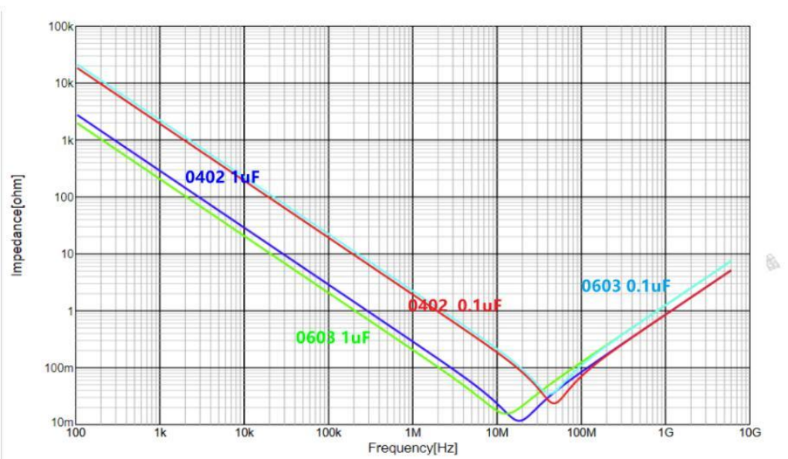

如上图横轴 - 频率与纵轴 - 阻抗的关系可见（封装容值均用相同颜色标出），一般容量越小、封装越小的电容（C 和 ESL 都较低），其谐振频率点（可以理解成能有效去耦的工作频率）就越高

故在芯片引脚旁边，我们放的一般是 100nF，0201~0603 封装的 MLCC，因为芯片引脚附近的噪声一般是高频 RE 辐射噪声（由晶振等器件、走线辐射 RE 和电源平面空间耦合形成），噪声频率高几十 MHz 级别，故需要去耦频率高的小封装 MLCC 电容

在电源输入口和开关电源附近，由于噪声一般是从供电线传导的 CE 噪声和开关电源工作噪声（几百 KHz，一般不会超过 2.2MHz），噪声频率低，故可以使用大封装大容量的铝电解和 MLCC 进行去耦（也有储能作用）

#### PDN阻抗与并联电容

在 SI/PI 信号完整性与电源完整性中，有一个概念叫 PDN，PDN 全称为 power delivery network，翻译为中文为电源分配网络。电源分配网络（PDN）就是将电源功率从电源输送给负载的实体路径，电流通过 PDN 从电源端流向负载端，再通过 PDN，从负载端流回电源端。**PDN 的阻抗是由电源、用电设备、传输线的电阻 + 电感 + 电容（含寄生参数）决定的**

如果定量计算，假设 PDN 电源分配网络的阻抗为 Z（对应不同频率，Z 值不同），用电设备的电流突变量为△I（恒定的电流不受 PDN 高频阻抗影响），则用电设备上的电压突变为△U，△U=△I*Z

故若△U 过大，则用电设备两端电压会有突变，可能会影响正常工作，而△I 往往是由芯片功能决定的，例如驱动负载变化、多路 IO 输出的电平翻转，无法改变，故想要降低△U 电压突变，只能降低 PDN 电源分配网络的高频阻抗 Z

要降低 PDN 的高频阻抗，就要关注电源和芯片周边的电容并联。单个电容的频率 - 阻抗曲线见 7.1.3，都是随频率先变低再变高的，若要保证 PDN 在全频段（一般是几百 KHz~ 几十 MHz）范围内均有较低阻抗，就需要多种类型 - 封装 - 容值的电容并联

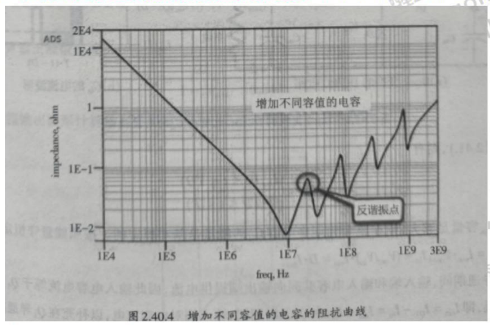

若使用不同类型 - 封装 - 容值的电容进行并联，则充分利用不同电容的优势（**一般大容量电容的封装大，寄生电阻、寄生电感都比较大**，在低频段阻抗小，高频段阻抗大；小容值的电容尤其是 MLCC，封装小，寄生电阻、寄生电感都比较小，在低频段阻抗大，高频段阻抗小）并联后可保证全频段均有较低的 PDN 阻抗，保证用电设备两端电压不会突变严重。

####  电容的功能

**1.交流耦合（隔直通交）**

利用直流信号不能通过电容，而交变信号可以通过电容的特性

例如示波器就有直流耦合DC和交流耦合AC模式，交流耦合模式可以隔离直流分量（测电源纹波时，可以忽视V级别的直流电压，关注mV级别的纹波；如果开直流耦合模式，由于有直流电压分量，则量程要开的很大，就没法看到mV级纹波细节）。下图就是RT6253电源芯片的纹波示意图，12V输入5V输出，可见纹波幅值选的20mV一格，就是用的交流耦合在5v输出上测量的

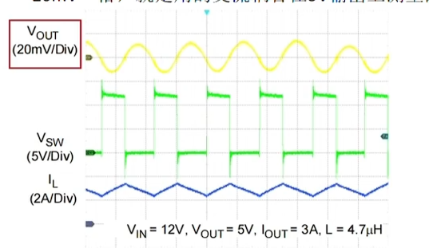

三极管放大电路交流耦合，防止直流信号影响三极管的静态直流工作点，使三极管进入饱和或截止，影响正常放大
例如下图中的C1是输入交流耦合电容，C2是输出交流合电容，使本级的直流信号不会影响后级直流工作点

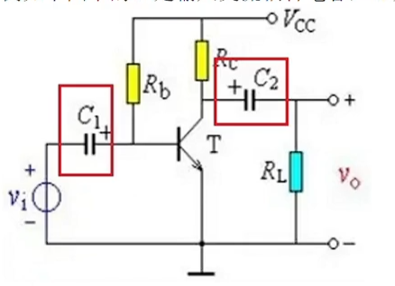

**2.去耦decouple/旁路bypass**

利用电容等效阻抗\(X_C = \frac{1}{2\pi f C}\) 特性，频率越高，等效阻抗越低，例如低通滤波器，C1,C2给高频信号提供一个旁路通道

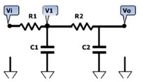

靠近芯片电源引脚的电容，常用100nF的MLCC，可以给供电路径在PCB上耦合的高频噪声一个泄放路径。例如下图中的C62 0.1uF

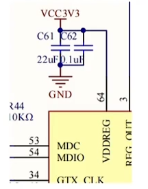

**3.滤波**

开关电源和LDO电源的输入/输出一般都会放多个不同容值并联的电容用于滤波，一般电容容值越大、电容的寄生电感和寄生电阻ESR越小则输出电压纹波越小，即电源质量越好。所以一般滤波电容都是多种容值、封装并联的。
例如下图中的22uF和0.1uF并联作为开关电源的输入/输出滤波电容

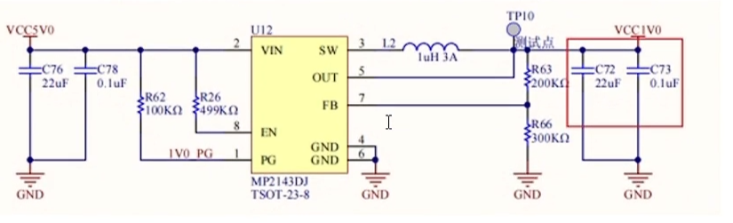


**4.储能**

电容内能量W=0.5*C*U*U电容越大，电压越高，容值越大，能量越大。

**5.自举&电荷泵**

利用的是电容两端电压不能突变的原理，在开关电源、电机驱动芯片等应用中，为获取一个高于Vin的电压驱动NMOS管栅极，经常需要应用自举电容。还有倍压/负压电荷泵，也是应用的电容两端电压不能突变的原理
下图：开关电源RT6253，Cboot0.1uF就是自举电容，提供上管NMOS驱动电源

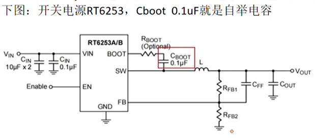

下图：负压电荷泵LM2776芯片，输入2.7~5.5V正压，输出相反电压。1uF电容就是电荷泵电容：内部原理是4个开关管控制开关实现负压输出

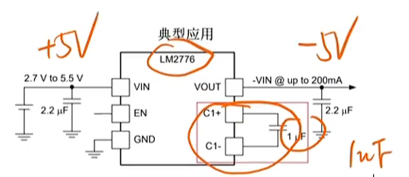

下图：RS232芯片，图中C1是倍压电压泵电容，C2是负压电荷泵电容RS232总线规定逻辑“1”的电平为-5V~-15V，逻辑"0”的电平为+5V~+15V，此芯片可以在使用3V供电的情况下，产生士5V幅值以上的输出信号，就是因为内部自带电荷泵

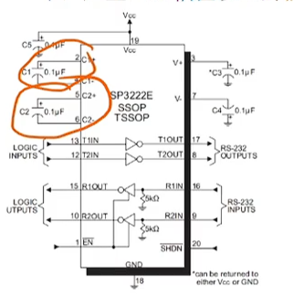

**6.震荡**

利用的电容可以改变信号相位的原理（电流超前电压90°；但是实际电容有寄生电感，故达不到90°）RLC震荡电路、RC震荡电路等，了解即可，目前电路设计一般使用无源晶体/有源晶振等器件做时钟源，不会要求设计震荡电路。
例如无源晶体，2个负载电容18pF的作用就是移相，CL1+CL2+晶振共移相180°

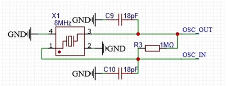

**7.计时**

利用RC电容充电时间常数原理，做时间计时应用。例如RC做复位，电源缓启动，上电时序控制RC充电原理：使用电压Ui电源，通过电阻R对电容C充电，则电容C两端电压Uc与时间关系为：时间常数τ=R*C

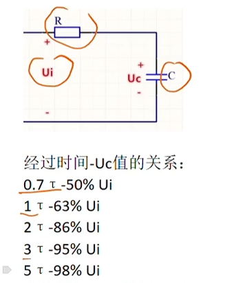


****

### 电感

现代高频开关电源电路中常用的磁性元件有很多，如输出级的直流滤波电感、谐振电感、输入级的共模滤波电感、差模滤波电感、高频开关变压器、驱动变压器和电流互感器等。这些磁性元器件与电路元器件结合在一起协调工作，构成开关电源的电路。为了简化分析，应用安培环路定律和电磁感应定律，将磁性元器件的电磁关系简化为电路关系，主要包括自感和互感。而变压器则是利用这些电磁关系来实现电压变换的电路元件。

电感是自感和互感的总称。

感值大小是电感最基本的属性电感的单位是Henry，符号是L。L=1Henry的定义是:电流以每秒钟1安培的节奏变化(1A/s)，如果在电感上产生的感应电动势的电压是1V，这种电感就是1Henry。在无线电和通信设备中，常见的电感单位是nH(纳亨)，应对MHz级别的电流变化;在电源和供电设备中，常见的电感单位是uH(uH，微亨)，应对KHz级别的电流变化(开关电源的工作频率一般为300KHz~2.2MHz) 1uH=10~(-6)H。

**功率电感-直流电阻DCR**

X电感内部可以理解成是导体(根据工艺，不一定是导线)围绕磁芯一圈圈绕起来的，所以导体必然存在直流电阻 DCR，而直流电阻就会产生热效应，是电感损耗的主要因素(电感损耗可以分为铜损和磁芯损耗，功率电感的话，由于频率相对较低，基本只计算铜损，即电
感DCR引起的热效应P=P2DCR)
DCR一般单位为m，一般同样尺寸的电感，感值越大，说明内部导体越细、绕的圈数越多，则 DCR也会越大(做功率电感选型要平衡好电感的各个参数。

**功率电感-饱和电流SAT**

电感中能储存的能量是有限的，如果电感中的电流达到一定程度，则等效感值会对应下降，一般将感值下降20%时对应的电流叫做电感的饱和电流Isat，意为在此电流工况下电感已接近磁饱和。饱和电流1sat单位一般为A。
对于正常工作的开关电源，输出的负载电流为lout，但是其实在电感中，电流是一直上升-下降循环变化的，故有电感电流变化率ΔI，一般Imax=lout+0.5*ΔL，做电感选型时，要注意电感的饱和电流SAT值大于Imax，且留一定余量。

**功率电感-温升电流RMS**

电感内部是由导体绕制而成的，导体会有直流电阻DCR，直流电阻DRC在通过电流时会产生热效应;故一般将电感中通过一定电流引起电感温升20°C时的电流称为温升电流Irms，温升电流Irms的单位为A。

开关电源工作时是产生热效应的电流和BUCK-BOOST拓扑同参考9.1.2的图，可见感值越大，温升电流 RMS越小
电流是变化的，故不能直接将输出负载电流Iout认为较为复杂，BUCK电路可以直接估算luma)≈lout,BOOST杂，不能直接估
电感选型时电感的RMS参数要大于实际电路工作的lrms且尽量留一倍以上余量，因为电感的RMS参数是根据25°C环境温度标的，实际工作温度越高，留的余量要越大。

BUCK降压的RMS电流计算公式，实际计算结果Irms ≈ Iout。

****

#### 磁珠与电感

**磁珠是能耗器件，电感是储能器件**

磁珠是将电能转换为热能，电感是将电能转换为磁能，还可以将磁能转换回电能。

磁珠的阻抗一般标注的是100MHz时的高频阻抗。另外需要注意直流电流容量，和直流电阻。同封装磁珠，一般交流阻抗越大
电流容量越小，直流阻抗越大（类似电感参数变化）

磁珠和电感都对电流有抑制作用，都可以用于滤波。

但是由于电感有谐振风险（LC），且电感滤波的能量会反射回源端或者以EMI形式发射，故除非某些专用电路，一般电源滤波建议使用磁珠，尤其是用于消除EMI。电**感滤波一般用于电源和中低频，磁珠滤波一般用于高频**

**磁珠使用方法：**
1.选型：注意直流通流参数，一般封装越大、高频阻抗越低的磁珠，直流通流越大
2.由于磁珠具有抑制电流突变的特性，故若串磁珠供电，则负载有大电流变化时，磁珠会引
起电压跌落：故磁珠前后都要加电容，用于减弱电压变化量

**磁珠的应用**

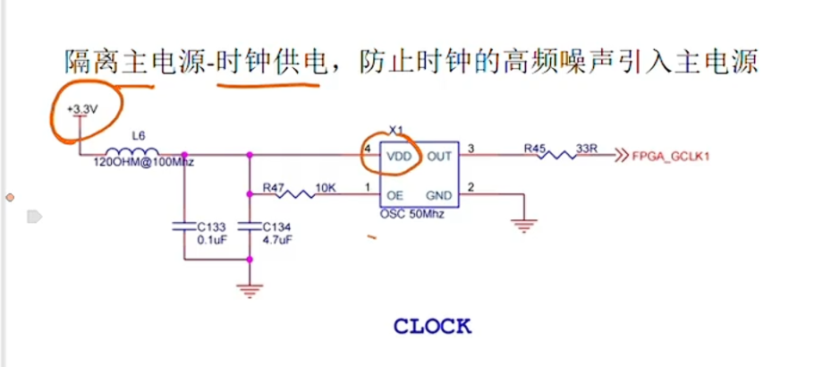

- 隔离主电源-IO供电：防止外界干扰/EMC合进主电源

  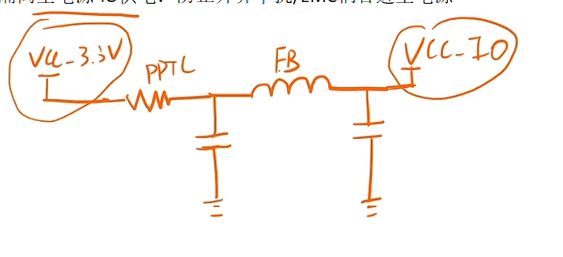
  
  ****

### MOSFET在电路中的应用

如图所示，MOSFET 有两种，分别是N-MOSFET（N 沟道MOSFET）和P-MOSFET（P沟道MOSFET）

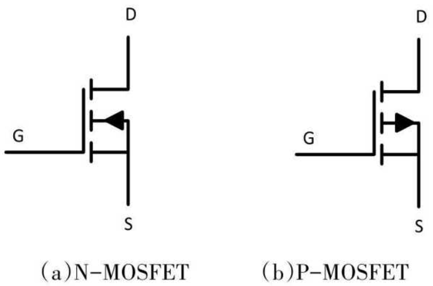

在图中，G是GATE的缩写，中文称作栅极；S是Source的缩写，中文称作源极；D是Drain的缩写，中文称作漏极。G极是控制端，它的电压高低，决定了电流流经D极到达S极的电流大小。

**三极管与场效应管的的区别**

1. 输入阻抗不同
   - 三极管是电流控制器件，通过控制基极电流达到控制输出电流的目的。因此，基极总有一定的电流，故三极管的输入电阻较低；场效应管是电压控制器件，其输出电流决定于栅源极之间的电压，栅极基本上不取电流，因此，它的输入电阻很高，可高达10 9 ～10 14 Ω。高输入电阻是场效应管的突出优点。
2. 完全导通（饱和状态）的等效电阻值不同
   - 三极管导通时等效电阻值大，场效应管导通时的等效电阻值较小，只有几十毫欧姆，甚至几毫欧姆。因此，在大功率电路中，一般都用场效应管做开关，它的效率是比较高的。

**结电容**

因为是半导体，所以就有PN结；有PN结，就有结电容。从宏观上看，结电容可以等效到MOSFET三个电极之间的电容，如图2.27所示。

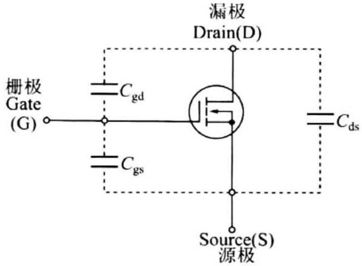

尽管结电容的电容量非常小，但对电路稳定性的影响却是不容忽视的，如果处理不当往往会引起高频自激振荡。更为不利的是，栅控器件的驱动本来只需要一个控制电压而不需要控制功率，但是工作频率比较高的时候，结电容的存在会消耗很大的驱动功率，频率越高，消耗的功率越大。

**考虑到MOSFET极间等效电容的存在，在设计开关电源的时候，我们通常需要加粗Gate极的PCB走线。确保在开关的过程中，即使驱动MOSFET的瞬间电流比较大，也有足够的通流能力。**

**为什么选择MOSFET而非JFET作为开关电源的开关管？**

1. MOSFET在直流和低频的情况下，输入阻抗也很高。但是在高频应用中，MOSFET的阻抗会因为输入电容的影响而急剧下降。
   - 电容的核心电气特性是「阻碍直流、导通交流」，且对不同频率的交流阻抗不同，其阻抗（容抗 Xc）遵循容抗 Xc 与频率 f 成反比，与电容值 C 成反比：MOSFET 输入阻抗 = 栅极绝缘电阻（极高）∥ 输入电容（寄生）→ 直流 / 低频：输入电容容抗极大（近似开路），阻抗由绝缘电阻主导→ 阻抗高；→ 高频：输入电容容抗随频率增大而急剧减小（近似短路），阻抗由容抗主导→ 阻抗急剧下降。

### 变压器在电源电路中的应用

变压器（Transformer）是利用电磁感应的原理来改变交流电压的装置，主要构件是初级线圈、次级线圈和铁芯（磁芯）。主要功能有：电压变换、电流变换、阻抗变换、隔离、稳压（磁饱和变压器）等

### 二极管

1.整流二极管

整流，即将交流电整流为直流电，可以**使用单管做半波整流，也可以使用四管做桥式全波整流**，常用型号例如1N4007此时主要关注的参数为二极管的（反向）耐压、通流能力、封装等

2.肖特基二极管 - 续流、单向导电、电源防反接

在开关电源中，经常利用二极管的单向导电性做续流或单向导电功能。此时由于开关电源输出侧一般电压不高，但电流较大，故特别需要关注二极管压降（否则二极管上功率损耗会很大，且容易发热损坏，热损耗功率P=I*V），另外开关频率也较高，故此时常用压降低、恢复时间快的肖特基二极管。另外在单板电源入口处，需要做电源防反接时（防止单板电源的+和GND接反烧坏单板），也经常使用肖特基二极管（压降低）

肖特基二极管，反相耐压Vr60V，通流能力Io 5A，**前向压降V只有0.5V左右**（普通二极管压降约0.7~1V 左右）

3.发光二极管

发光二极管在选型时主要需要关注前向压降V、前向电流I、发光波长（即颜色）、封装

下图中是国星光电0603二极管的参数，最大前向电流If = 25mA，工作时前向压降Vf = 2V

故若使用此发光二极管做电源指示灯，需要搭配合适的限流电阻。按照工作时前向电流I=5mA（发光土极管指示用几个mA己经足够了），前向电压V-=2V计算，若接3.3V电源供电，限流电阻取R=（3.3-2）/5mA=260（可以近似取常用阻值330R），若接12V电源供电，限流电阻取R=（12-2）/5mA=2K。下图中单片机控制LED使用了阴极控制灌电流（高灭低亮），防止控制多个LED时因MCU因Souce拉电流驱动能力不足影响亮度。

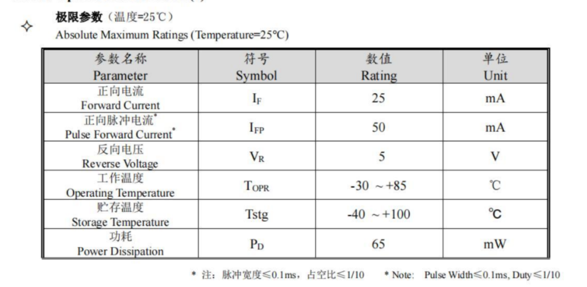

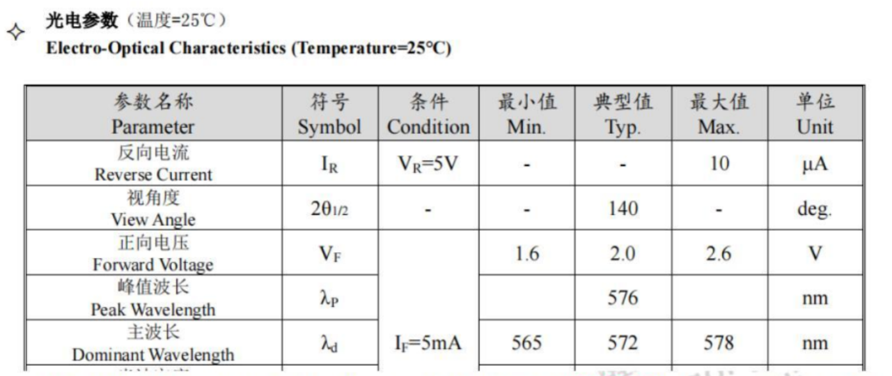

4.稳压二极管

稳压极管（文叫齐纳极管，英文名称Zenerdiode）是一种硅材料制成的面接触型晶体二极管，简称稳压管。利用PN结反向击穿状态，其电流可在很大范围内变化而电压基本不变的现象。实际应用电路中可以做参考电源，或者做信号限幅保护用。

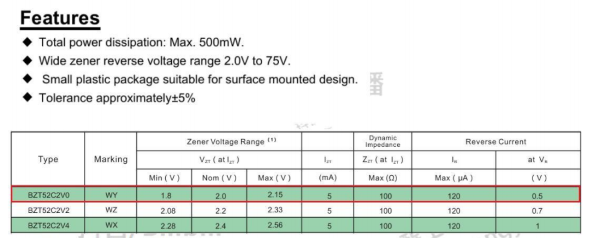

从上图中可以得到，稳定电压Vzt为2V，稳定电流Izt为5mA，最大功耗Pmax 500mW。

R9为限流电阻，输入12V电压，电流Id经过ZD1稳压二极管，提供一个5.1V的参考电压。上需注意的是R9选型，**R9最大值不超过(12-5.1)/lzr=1.38KΩ，否则反向电流太小稳压效果不好;R9最小值也不能小于(12-5.1)/98mA=70.4Ω**，否则稳压二极管会过功率烧毁(P=500mW，故最大电流laMAx=500mW/5.1V=98mA)。图中考虑到稳压二极管热功率留一定余量，取R9=200Ω(R9至少要用1/2W电阻)。此电路的缺点是Vref_5V1能提供的电流较小，只有几十mA级别，2无法做功率类应用。

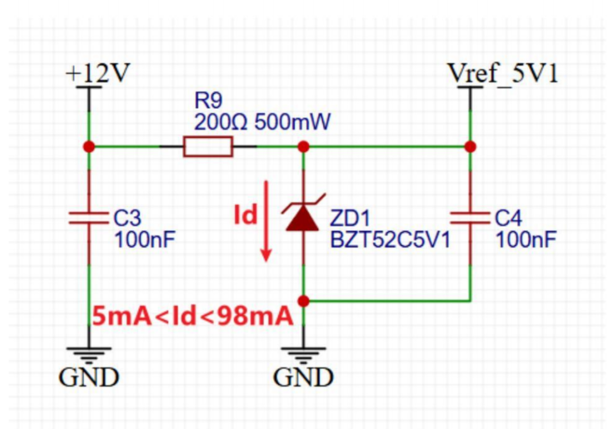

5.TVS瞬态抑制二极管

TVS瞬态抑制二极管，是常见的接口EMC保护器件。TVS是采用半导体工艺制成的具有单个PN结或多个PN结集成的器件。

TVS反向并联在电路中，当电路正常工作时，处于高阻状态截止可以理解为开路。当电路异常超过击穿电压VBR时，TVS迅速由高阻状态变为低电阻状态，泄放由异常过电压导致的瞬时过电流到地，同时把异常过电压钳制在后级电路可承受的安全水平之内，从而保护后级电路免遭异常过电压的损坏。当异常过电压消失后，TVS阻值又恢复为高阻态。

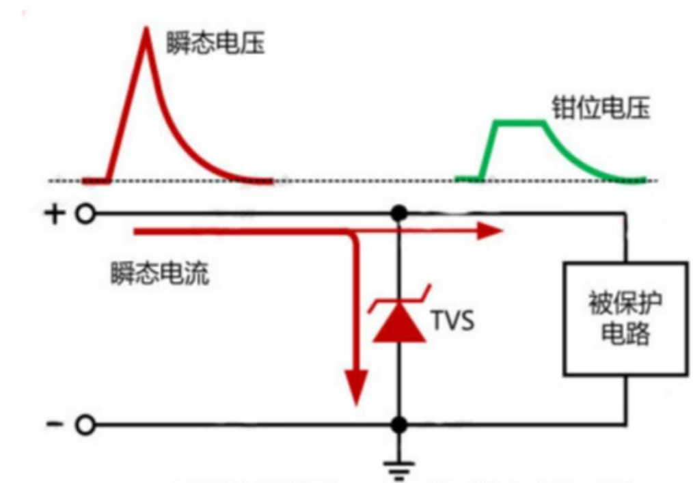

TVS在选型和使用中主要注意的参数有Vbr反向击穿电压，钳位电压Vcl，Ip电流Ppp功率，封装，Co结电容等。Vbr反向击穿电压:一般要选择TVS所在电路电压的1.1~1.2倍，防止TVS常态导通，例如12V供电选择防护TVS时需要使用>12*(1.1~1.2)=13.2~14.4V，所以一般会选择Vbr电压=15v的TVS管。
lpp电流和Ppp功率:即TVS能承受的峰值电流与功率，一般与封装成正比。一般电源接口用大容量大封装TVS，Io接口用小容量小封装的TVS。
钳位电压Vcl:指TVS遇到高压脉冲输入导通时，TVS两端的电压不会超过的值。Vcl值要低于后级芯片的耐压值，例如前面说的12V供电选用Vag=15V的TVS,此TVS的Va=24.4V,则12V电源所接的芯片耐压均需要高于24.4V，否则即使有TVS防护也可能烧毁芯片

### 三极管的功能与常用电路

1.交变信号放大

2.逻辑反向

可使用三极管搭建逻辑反相电路(非门)，输入高电平则输出低电平，输入低电平则输出高电平;此时三极管工作于开关状态(即处于截止区或饱和区)

假设上图中VCC=3.3V，IN1和OUT1均为3.3V电平信号。当IN1为低电平=0V时，三极管 Q22基极电压Vbe=0V，三极管截止，则OUT1通过R22被上拉到3.3V。当IN1为高电平=3.3V,三极管Q22基极电压Vbe=0.7V,基极电流Ib=(3.3-0.7)/1K=2.6mA，三极管导通，此时集电极电流Ic=3.3/1K=3.3mA，Ic<Ib*B(β为放大倍数，一般>100)，故三极管其实是出于饱和导通状态。此时OUT1为低电平，接近0V(实际由于三极管导通VcE残压，OUT1约为0.3V)。

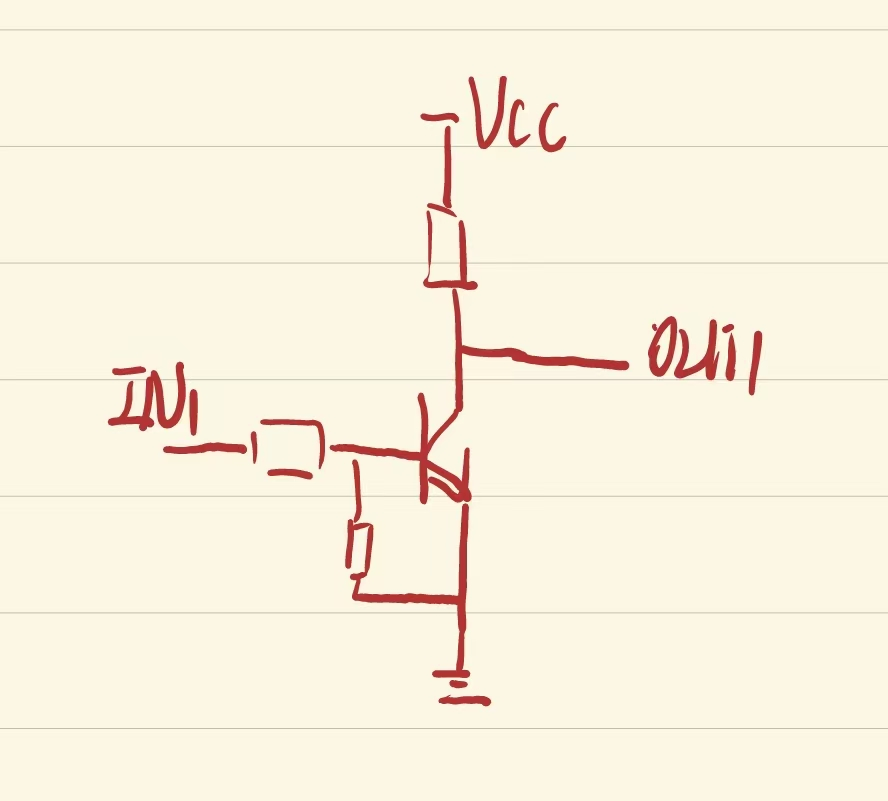

3.电平转换

可使用三极管搭建逻辑电平转换电路，例如2个单片机间的GPIO通信，一个单片机I0为3.3V，一个单片机10为5V，则可以使用本电路;此时三极管工作于开关状态(即处于截止区或饱和区)

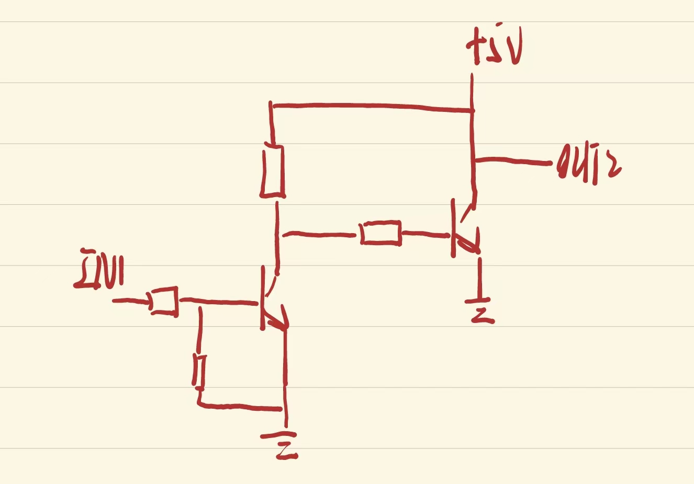

上图中左边IN1为3.3V电平信号,右边OUT2为5V电平信号;当输入IN1为高电平3.3V时，输出OUT2为高电平5V;当输入IN1为低电平0V时，输出OUT2为低电平接近0V。当IN2输入低电平时，Q24截止，则Q24的发射极为高电平，Q23导通，OUT2输出低电平;当IN2输入高电平时，Q24导通，则Q24的发射极为低电平，Q23截止，OUT2输出高电平(其实三极管的工作状态和逻辑反相功能是类似的，只是电平转换时为了保证逻辑，用了两级三极管做开关，且需要注意上拉的电压)此电路中三极管与MOS管基本可以互相替代

4.恒流控制

可以使用三极管构建简单的恒流源和带运放反馈的恒流源。
做恒流源时三极管工作在放大区。例如下图是最简单的镜像电流源。选用2个完全相同的NPN三极管，两个三极管基极电压相同，电流相同，1b1=lb2;Ub点电压为三极管导通Vbe电压即0.7V，则Q25的集电极电流Ic1=(5-0.7)/R73=4.3mA;由于两个三极管基极电流相同，故右侧三极管Q21的集电极电流Ic2=lc1=4.3mA(Ic1=(2+B)*1b1≈B*1b2=lc2)，使用直流电流计或串入负载都不会改变右侧回路的电流，形成镜像电流源。但是此类电流源有一个严重的问题，就是没有反馈，且随温度变化，三极管的Vbe参数会变化，导致恒流值也会随之变化。

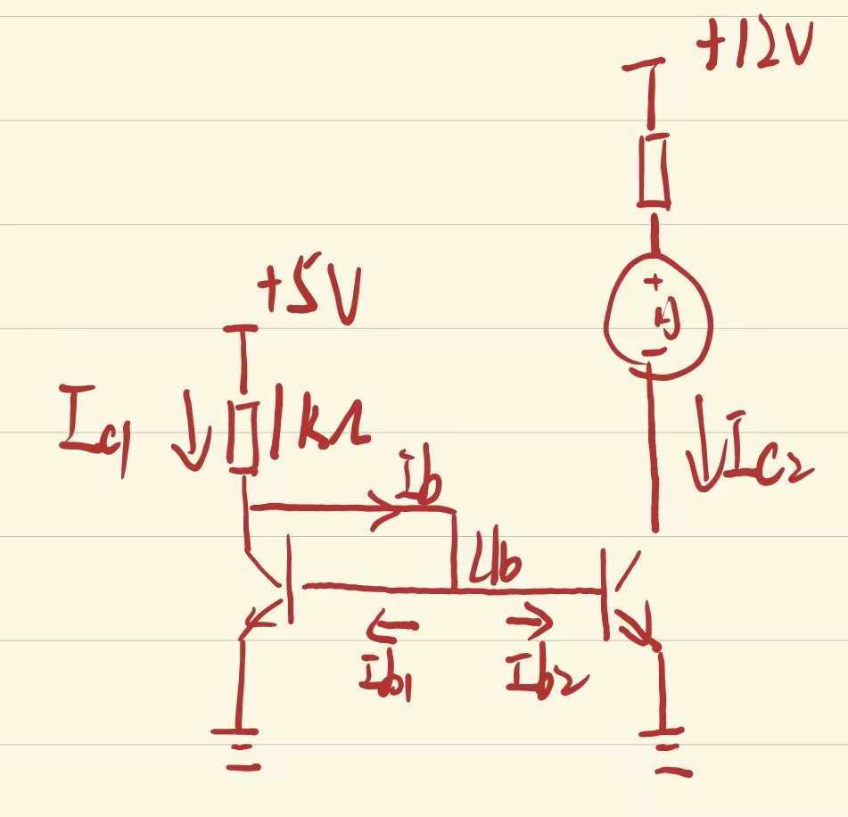

下图是带有反馈的恒流源电路，图中Q27为NPN功率三极管控制主通路开度，U19为运放用于做负反馈控制，R79为电流采样电阻，主通路电流为I。电路工作时，从Vref_TP+引脚送入参考电压，例如做2A恒流驱动，则送入0.2V做参考电压**(参考电压=采样电阻 * 设定电流)**;OP_VIN+=0.2V,OP_VIN-=采样电阻0.1Ω*电流I。

主通路电流|偏高时:I↑ → OP_VIN-↑ → OP_OUT↓ → I↓

主通路电流|偏低时:I↓ → OP_VIN-↓ → OP_OUT↑ → I↑

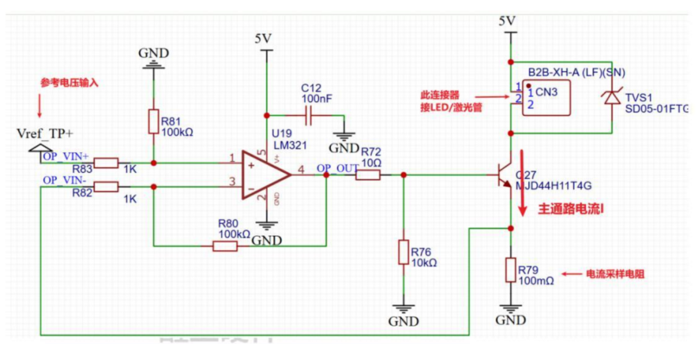

5.恒压源与线性稳压

恒压源与线性稳压电源的工作原理是相同的，都是使用负反馈电路控制三极管开度，用三极管集电极C-发射极E间承受输入电压与设定输出电压的压差。此时三极管工作在放大区。
在模拟电路设计中常用一种恒压源芯片，用于提供一个标准参考电压，最常用的例如TL431，它是一种低成本恒压源，**内部就是由基准电压+误差放大运放+三极管组成**，使用误差放大器控制三极管导通程度，控制K-A引脚间的电流，使R脚电压维持在2.5V。

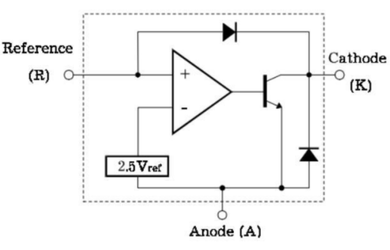

### 场效应管（MOS管）的功能

[NMOS管与PMOS管的区别与总结-CSDN博客](https://blog.csdn.net/weixin_43491077/article/details/109721185)

1.逻辑反向（开关状态）

逻辑转换即取反操作，将高电平转换为低电平，将低电平转换为高电平。

当IN为3.3V高电平时，NMOS管Q6的栅-源电压Vgs=3.3V，Q6导通，OUT相当于直接与GND连接，输出0V低电平;当IN为0V低电平时，Q6的栅-源电压Vgs=0V,Q6截止，OUT通过10K电阻被上拉到3.3V，输出3.3V高电平。需注意此电路输出的是OD即开漏输出，高电平驱动能力较弱。如果将NMOS替换为NPN三极管也可以实现相同功能(三极管的叫OC输出)。注意MOS管易受干扰，栅极一定要加上下拉电阻。

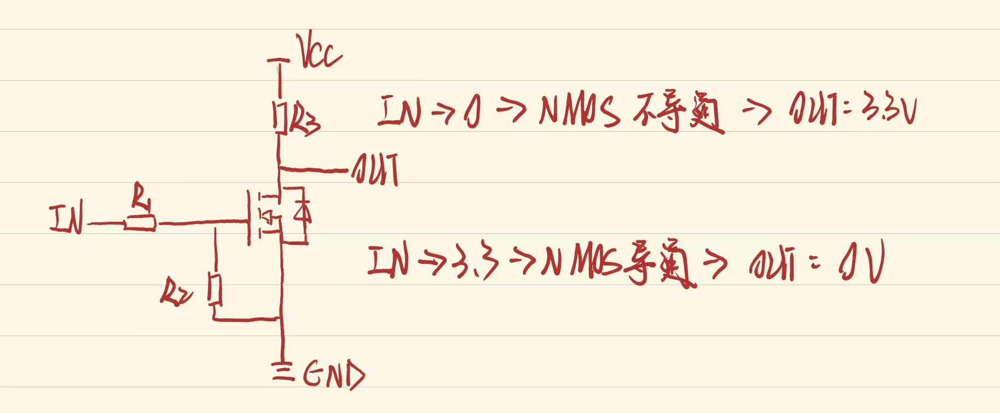

2.电平转换

电平转换即将低电平转换为高电平。

当IN1为3.3V高电平时，NMOS管Q1的栅-源电压Vgs=3.3V，Q1导通，IN2点相当于直接与GND连接，为0V，故Q2的栅-源电压Vgs=0，Q2截止，OUT2通过电阻被上拉到5V高电平；当IN1为0V低电平时，Q1的栅-源电压Vgs=0V，Q1截止，IN2点通过电阻被上拉到3.3V，故Q2的栅-源电压Vgs=3.3V，Q2导通，OUT相当于直接与GND连接，0V低电平。

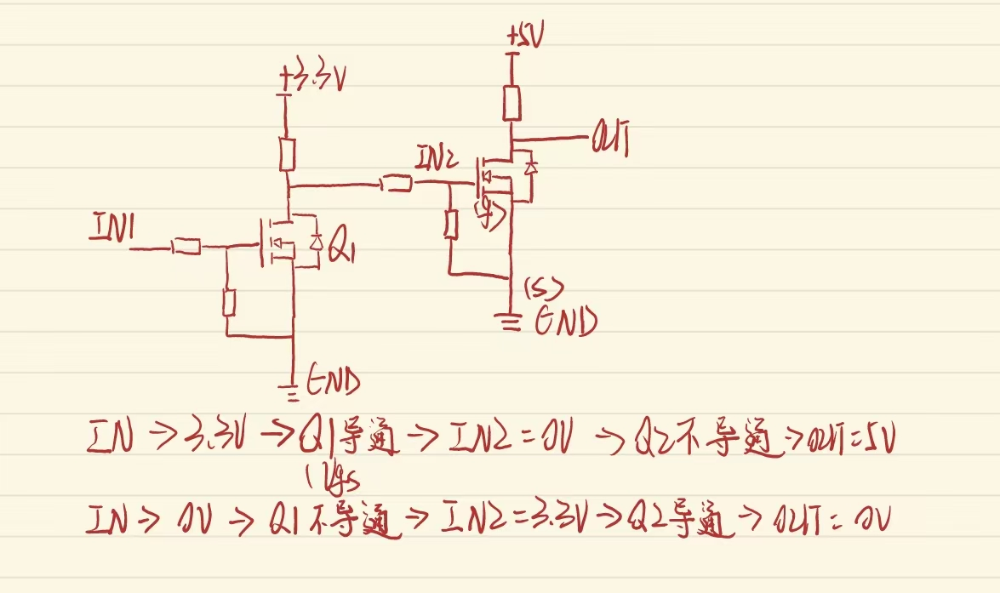

3.电源防反

电源防反，即电源防反接，功能是防止电源正负接反时损坏单板，最简单的电源防反电路使用一个二极管即可，**但是二极管导通损耗较大**。按照一般工况估算，假设一台设备输入电压Vin=12V,工作电流I=1A,防反用肖特基二极管前向压降V=0.5V,则使用肖特基二极管防反电路时损耗为Po=Vf * I=0.5V * 1A=0.5W，使用PMOS 防反电路时损耗为Po=I²Rds(ON)=1A * 1A * 0.012=0.01W;对比可见使用 MOs管防反电路功耗损耗方面优势非常大。
下图左为二极管防反电路，下图右为PMOS防反电路(电路中未加过流保护、滤波等，是简化的，用于说明防反工作原理，请勿直接使用)

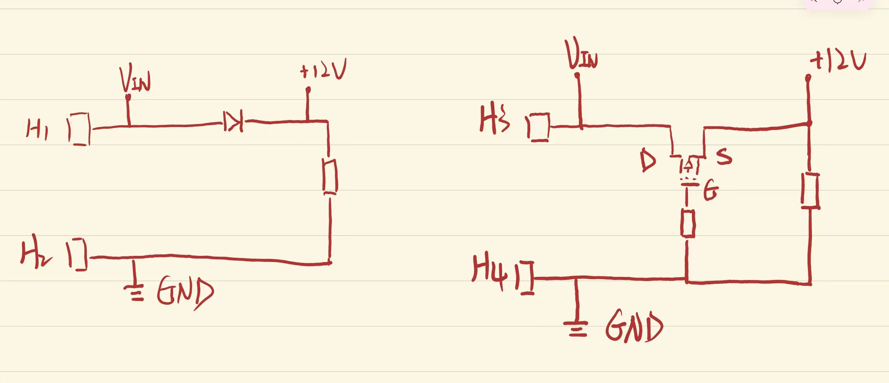

上图中二极管防反电路利用二极管的单向导电性;当H1连接+12V,H2连接0V时，二极管D2导通，RL1负载工作;当H1连接0V,H2连接+12V时，二极管D2截止，负载RL1不工作。
上图中 PMOS防反电路利用PMOS需要**负压Vgs**才能导通的特性;当H3连接+12V,H4连接0V时，PMOS的体二极管首先导通，此时PMOS的源极S电压Vs为+11.3V(体二极管导通压降了0.7V)，栅极G电压Vg为0V,Vgs=Vg-Vs=-11.3V，PMOS导通，源极S电压提高到接近+12V(此时源极S电压为12V-1*Rds(on))，RL2负载工作;当H3连接0V,H4连接+12V时，PMOS 的源极S电压Vs为12V，栅极G电压Vg为12V，Vgs=Vg-Vs=12-12=0V，PMOS截止，负载RL2不工作。

4.电源缓启动

电源缓启动指上电时电压缓慢升高，可以防止上电电流过大对电源造成冲击。PMOS可以作为开关控制电路供电，由于电路上电刚开始工作时一般有较大的上电冲击电流，故开关控制时一般使用缓启动电路，延长从关断到导通的过程时间，减小电流冲击，防止前级产生电压跌落等问题。

关断:GPIO1为低电平时，三极管U9截止，A点电压为+12V，此时主PMOS管Q5的栅极电压Vgs=OV，PMOS管截止(Vgsth阈值电压为-2V左右，即Vgs低于-2V时 PMOS才会导通)，+12VOUT无输出。
导通:GPIO1为高电平时，三极管U9导通，A点电压接近0V(实际和三极管的MMBT3904的Vce参数有关，一般是0.3V左右。可以认为是连接到了GND)，栅极寄生电容和C10电容会通过R30这个100K电阻被缓慢充电到-12V，栅极电压缓慢到达0V，即Vgs电压缓慢到达-12V，PMOS缓慢导通，实现缓启动。

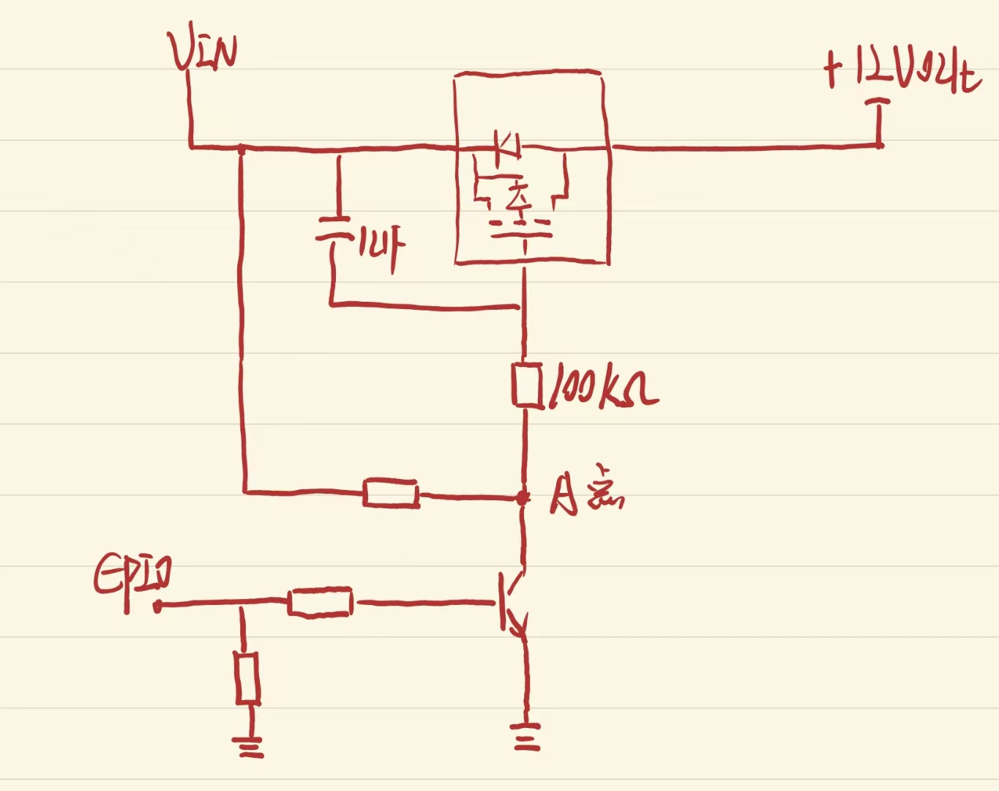

5.开关电源

图中Q1为上管，用于接通VIN+给电感L1充电;Q2为下管，用于续流(NMOs导通阻抗小，续流损耗比肖特基二极管低很多)。**电源芯片EG1163的HO、L0为NMOS管栅极控制引脚，控制NMOS管通断;从HO、LO到NMOS管栅极有15欧姆串阻，是为了防止与NMOS管寄生电容发生震荡:15欧电阻上并联的2欧电阻+1N4148二极管是为了加速关断(一般NMOS关断比打开慢)。**上管Q1和下管Q2不会同时打开，否则会短路，芯片在控制时会留出“死区”防止这种情况。

**“从 HO、LO 到 NMOS 管栅极有 15 欧姆串阻，是为了防止与 NMOS 管寄生电容发生震荡。”**

1. 问题根源：MOS 管的寄生参数会形成 “LC 谐振回路”

NMOS 管的栅极（G）和源极（S）、栅极和漏极（D）之间天生存在寄生电容：

- CGS（栅源电容）、CGD（栅漏 / 米勒电容）；
- 加上 PCB 走线的寄生电感 L、驱动芯片的输出内阻，会形成**LC 谐振回路**。

当驱动信号（HO/LO 的阶跃跳变，比如从低到高，驱动 MOS 管开通）时，阶跃信号会激励这个 LC 回路，引发**高频震荡**：

- 栅极电压会出现严重的 “过冲 + 振铃”，甚至超过 MOS 管栅极的最大耐压（通常 ±20V），直接击穿管子；
- 震荡还会导致 MOS 管误开通 / 关断，额外增加开关损耗，同时产生 EMI 干扰。

2. 15Ω 电阻的作用：增加阻尼，抑制震荡

串联的 15Ω 电阻（图中 R1、R11）是**阻尼电阻**，它在 LC 回路中引入了阻尼系数，破坏了谐振条件：

- 提高回路的阻尼比，让阶跃激励下的震荡快速衰减；
- 让栅极电压的上升沿更平稳，减少过冲和振铃，保护 MOS 管，同时降低 EMI。

**“15 欧电阻上并联的 2 欧电阻 + 1N4148 二极管是为了加速关断。”**

要理解这句话，必须区分 MOS 管的**开通**和**关断**两个过程，看驱动电流的路径差异：

1. 开通过程：只走 15Ω 主电阻，保持阻尼

当驱动芯片 HO/LO 输出高电平（驱动 MOS 管开通）时：

- 电流从驱动端流出，给栅极电容 CGS 充电，使 VGS 上升；
- 此时并联支路的 1N4148 二极管是**反向偏置**的（驱动端电压高、栅极初始电压低，二极管阴极接驱动端，无法导通）；
- 充电电流只能走 15Ω 主电阻，维持阻尼作用，避免开通时的震荡。

2. 关断过程：走 “二极管 + 2Ω 电阻” 支路，快速放电

当驱动芯片 HO/LO 输出低电平（驱动 MOS 管关断）时：

- 栅极电容 CGS 需要放电，电流从栅极流回驱动端，使 VGS 下降；
- 此时栅极电压比驱动端高，二极管**正向偏置导通**，电流会优先走 “栅极 → 二极管 → 2Ω 电阻 → 驱动端” 这条低阻路径；
- 放电总电阻从 15Ω 降到约 2Ω（加上二极管导通电阻，远小于 15Ω），放电时间常数 τ=R放电×CGS 大幅减小，栅极电压快速下降，MOS 管关断过程被加速。

3. 为什么要串联 2Ω 电阻？

- 限制放电电流尖峰，避免过大的放电电流损坏二极管或驱动芯片；
- 防止关断速度过快导致漏极电流 di/dt 过大，引发漏极电压过冲，起到缓冲作用。

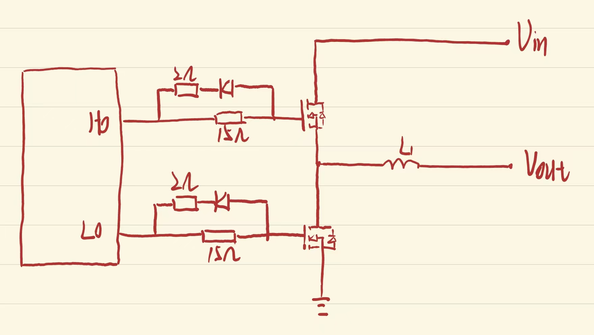

6.电机控制

7.恒流控制

例如恒流源、LED恒流控制(LED、激光管等发光器件其亮度与电流成正相关，故恒流控制比恒压控制更优)等应用中，可以使用MOS管或三极管搭建恒流控制电流，原理一般是进行电流采样，将电流信号转化为电压信号，然后送入运放，进行负反馈误差放大，使用运放的输出引脚控制 MOS管或者三极管的栅极/基极，改变功率管的开度，从而控制主回路电流。

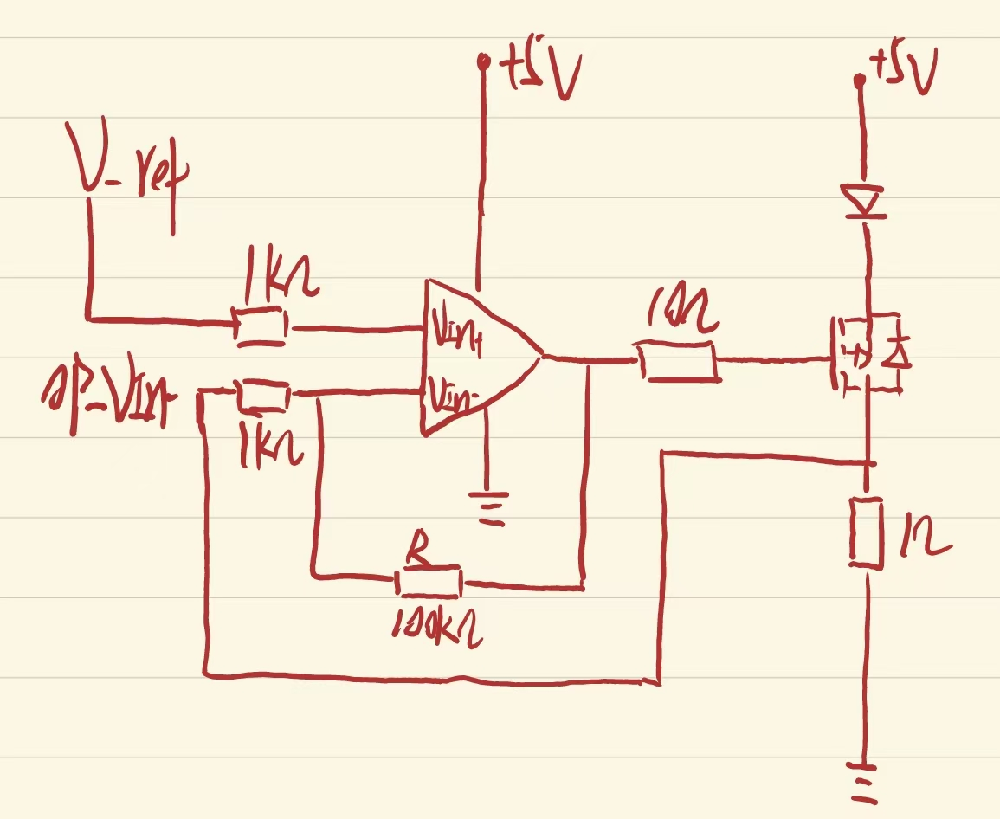

8.恒压控制

电源中常用的线性稳压源就是使用恒压控制，例如LD0低压差线性稳压源就是使用MOS管架构，目前的大功率LDO内部一般是使用NMOS，小功率LD0内部一般是使用PMOS。

NMOS做线性稳压;控制逻辑与恒流控制中类似(恒流控制是检测电流流过采样电阻形成的分压电压;恒压控制可以直接检测电压);输出电压通过分压电阻送入芯片的FB引脚，进入误差运算放大器的反相输入端，运放的同相输入端为0.8V内部参考源，运放输出接NMOS的栅极，通过负反馈保证输出电压准确。

## 电源类

### 12V输入，5V输出，2A电流的DC-DC开关电源电路

一般 DC-DC开关电源都有如下器件:

1.开关电源芯片
2.输入滤波电容（储能+滤波)  一般用MLCC
3.输出滤波电容（储能+滤波）一般用MLCC
4.自举电容 bootstrap cap般为10nF~100nF
5.功率电感
6.反馈电阻
7.续流二极管：非同步开关电源需要肖特基二极管做续流；同步开关电源内部MOS续流不需要外接二极管，在开关管关断的时候，电流形成了一个闭环：电感 -> 负载 -> 地 -> 二极管 -> 回到电感左端。这就是“续流”。

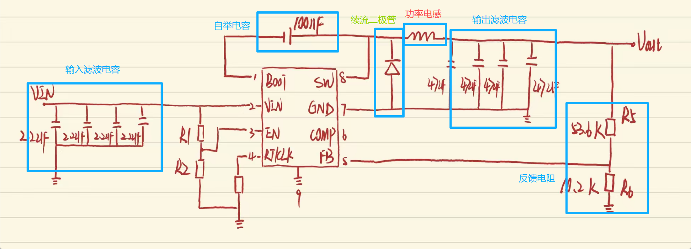

**DC-DC开关电源引脚/网络定义**

1.Vin:电源输入引脚，接输入电源和输入滤波电容
2.GND:电源地，整个电路设计共用GND
3.LX/SW:SW开关引脚，引脚接功率电感一端

4.FB/ADJ：feedback反馈电压引脚，接在FB上下电阻之间。将Vout输出电压通过2个电阻分压后，将分压电压送入FB引脚。**FB分压电阻要用1%精度或更高精度(1%，0.5%，0.1%)**

5.BST/B00T:自举电容bootstrap引脚，自举电容一端接SW引脚，一端接BST引脚

6.Vout网络:电源输出网络，接功率电感另外一端，接输出滤波电容

7.PE/ePAD:有些芯片下面会有一个大方形焊盘PE引脚，是散热用的，一般接到GND网络(可以打几个过孔接到PCB的GND层辅助散热)
8.PG:有些电源芯片有PG(或者叫 PGO0D、POK)引脚，此电平一般为开漏输出，需要增加一个10K~100K的上拉电阻。功能为，芯片上电过程中此引脚为低电平;芯片上电完成(达到输出电压90%~110%范围)此引脚拉高，表示已经上电完成，正常供电

9.EN:使能引脚，高电平电源芯片启动，低电平电源芯片关闭。一般高电平阈值为1V以上，具体值见手册
10.Cff前馈电容:非必须，加上可以提高电源的动态性能，降低电源调节时的过冲，一般是pF级容量，并联在FB上电阻两端(即Vout和FB引脚间)

### DC-DC开关电源的简化设计流程

**A.输入输出滤波电容选型**：一般均使用MLCC多个并联，输入选10uF*1~2+100nF*1~2，输出根据电流容量计算，一般1A放22uF*1或10uF*2，2A放47uF或22uF*2,3A放100uF或22uF*3，外加固定100nF * 1~2用于高频滤波。注意电容耐压，一般都按照实际电压翻倍选型即50%降额(例如输入12V，输出5V，则输入电容耐压要>12 * 2=24V，选择25V耐压档;
**B.输入使能**：要看EN引脚耐压，如果耐压够可以直接使用10~100K电阻上拉到Vin;如果耐压不够，则需要从Vin用电阻分压后接到EN，注意EN分到的电压要在耐压范围内，且高于使能阈值。推荐在EN引脚放一个对地0402的电容工位，用于调整上电延迟

**C.电感选型：**电感感值可以参考datasheet里面的取值范围，也可以自行计算，公式如下$$L = \frac{V_{OUT} \cdot (V_{IN} - V_{OUT})}{V_{IN} \cdot f_{SW} \cdot \Delta I_L}$$

$V_{OUT}$为输入电压，$$f_{sw}$$为电源芯片开关频率，**ΔIL为纹波电流，一般设定为输出电流的10~40%**

这个公式告诉我们要确定的电感值 $L$ 取决于：
1.  **电压差**：$(V_{IN} - V_{OUT})$ 越大，需要的电感越大（因为压差大，电流涨得快，需要更大的电感来抑制）。
2.  **输出电压**：$V_{OUT}$ 越高（意味着占空比大，导通时间长），需要的电感越大。
3.  **频率**：$f_{SW}$ 越高，周期越短，电流来不及变化太多，所以可以用更小的电感。
4.  **纹波电流**：$\Delta I_L$ 允许越大，电感可以选得越小。

电感选型除了感值还要考虑电感的SAT和RMS参数(第一章第9题电感参数)，防止电感过流、过热或磁饱和:电感的SAT值需大于电感电流峰值即$I_{out}+ΔIL/2$(例如上面的2A输出工况，电感SAT需大于2+0.4/2=2.2A)，电感的RMS值需大于$I_{out}$(其实电感中热效应电流值$I_{rms}$与输出电流Iout并不严格相等，但是计算较为复杂，且实际是较为接近的，故使用lout估算即可)，且需要留一定余量(建议50%~100%)，例如上例电感选取SAT>3.3A,RMS>3A的电感。

### 同步BUCK电路拓扑

BUCK为降压电路。最简单的同步BUCK电路拓扑主要由于输入滤波电容、2个MOS管(有集成于芯片内部的，也有外接独立器件的)、功率电感、输出滤波电容、负载组成(省略了反馈、自举、控制等部分)
充电时，上管Q1导通，下管Q2截止，SW电压约等于$V_{in}$，电流环路如下图中紫色箭头，外部供电V给电感充电，给负载供电。此时电感中电流线性上升。(此过程中电容既有充电又有放电)

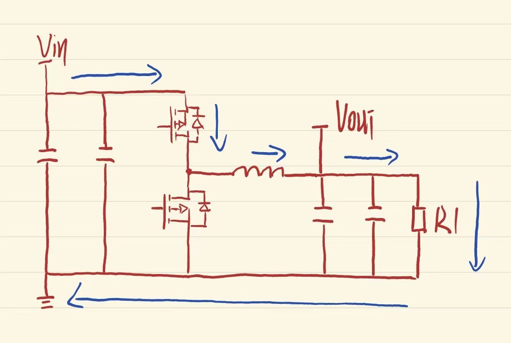

续流时，上管Q1截止，下管Q2导通，SW电压约等于0V，电流环路如下图中橙色箭头，$V_{in}$被断开，电感放电，给负载供电。此时电感中电流线性下降。(此过程中电容既有充电又有放电)

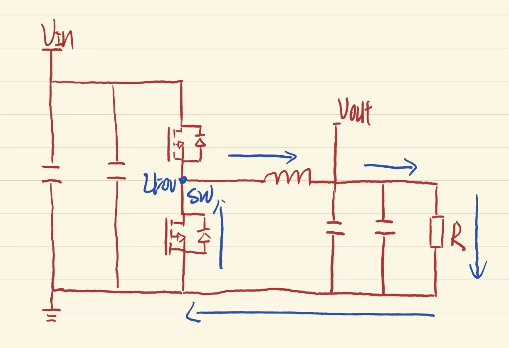

BUCK拓扑主要需要关注SW 电压(即L1电感左侧与MOS连接的节点)和I电感电流。下图为SW电压(紫色波形)与$I_{L}$波形(绿色波形);充电时Q1导通、Q2截止，SW电压约等于$V_{in}$，$I_{L}$线性上升，电感被充电，电感储存的能量增大;续流时Q1截止、Q2导通，SW电压约等于0V(Q2导通，近似sW节点与GND短接)，$I_{L}$线性下降，电感放电，电感储存的能量减小。

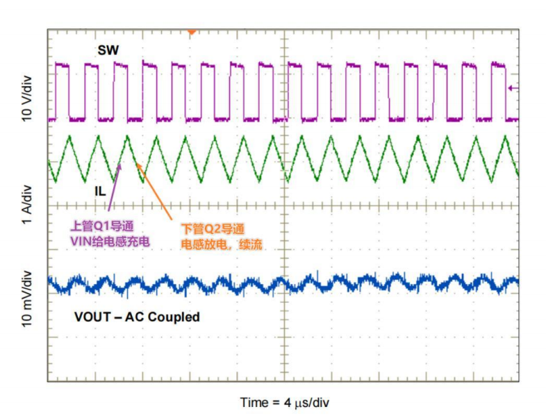

BUCK降压电路之所以是开关电源的一种，就是因为它的2个MOS管(上管Q1和下管Q2)在不断的做开关切换。上管Q1和下管Q2不能同时导通，否则会$V_{in}$-GND短路，故需要做死区控制.
以上的拓扑是同步BUCK电路，续流使用下管MOS管。例外还有一种非同步 BUCK电路，续流使用肖特基二极管，肖特基二极管不需要控制，故电源芯片成本会更低，但是由于肖特基二极管的导通损耗较高，故电源的效率会略低。

### 非同步BUCK电路拓扑

非同步BUCK电路拓扑与同步BUCK拓扑基本相同，唯一区别在于续流时使用肖特基二极管续流（二极管替代了下管MOS）
充电时，上管Q3导通，二极管D1反向截止，SW电压约等于$V_{in}$，电流环路如下图中蓝色箭头，外部供电V给电感充电，给负载供电。此时电感中电流线性上升。（此过程中电容既有充电又有放电）

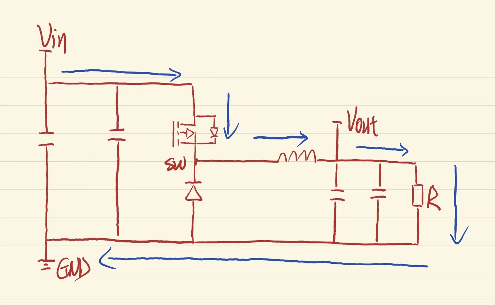

续流时，上管Q3截止，续流肖特基二极管D1导通，SW电压约等于0V，电流环路如下图中橙色箭头，$V_{in}$被断开，电感放电，给负载供电。此时电感中电流线性下降。(此过程中电容既有充电有放电）

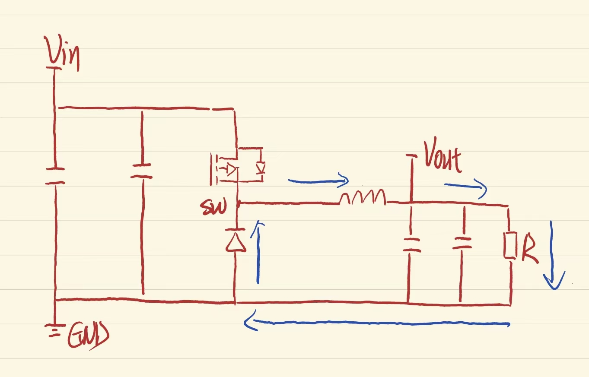

### BOOST电路拓扑

BO0ST电路为升压。最简单的BO0ST拓扑由输入滤波电容、功率电感、1个MOS管、1个肖特基二极管、输出滤波电容组成。
充电时，MOS管Q4导通，二极管D2反向截止(Q4导通时，D2左侧电压接近0V，右侧为$V_{OUT}$，故二极管D2截止，防止输出滤波电容对地放电)，SW电压约等于0V，电流环路如下图中紫色箭头，外部供电$V_{in}$给电感充电，此时电感中电流线性上升。此时负载的供电由输出滤波电容C5，C6提供

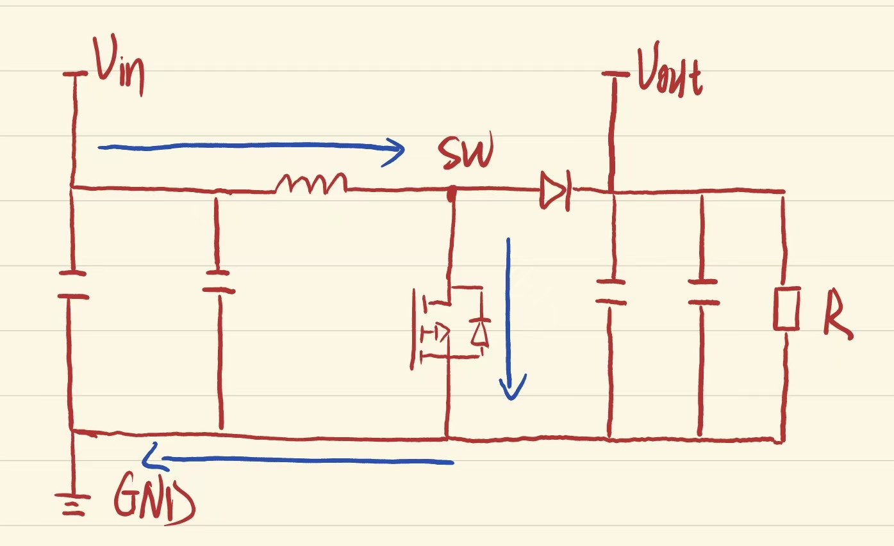

续流时，MOS管Q4截止，二极管D2导通，sw电压约等于$V_{OUT}$(具体来说sw电压=$V_{OUT}$+肖特基D2压降)，电流环路如下图橙色箭头，此时电感中的电流线性下降，电感放电，$V_{in}$和电感一起给负载端$V_{OUT}$供电，故$V_{OUT}$电压会高于$V_{in}$

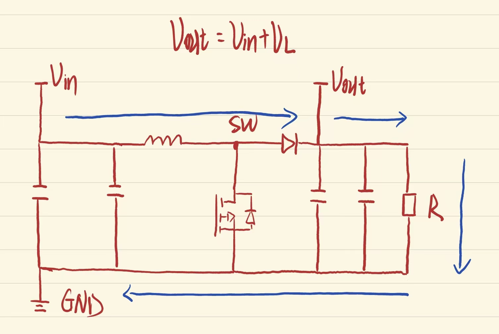

### CCM、DCM模式区别，电源芯片的FCCM模式和轻载高效PSM/PFM模式的区别

#### CCM、DCM模式的区别

CCM模式：(Continuous Conduction Mode)**即连续导通模式**，是指在一个开关周期内，电感电流连续变化，电感电流可以降到0，但不会维持为0(可能会降低到负电流)。

DCM模式：(DiscontinuousConductionMode)**即断续导通模式**，是指在一个开关周期内，电感电流总有一段时间维持为0。
下图中左边为CCM模式，右边为DCM模式

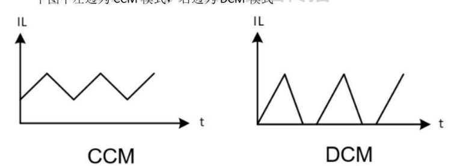

于是根据开关电源工作于CCM模式还是DCM模式(DCM模式一般适用于轻载)，可以将常见的BUCK开关电源芯片分为两大类:FCCM与轻载高效PSM/PFM，两类各有优劣。

#### 电源芯片的FCCM模式与轻载高效PSM/PFM模式

FCCM模式:脉冲宽度调制，**频率固定**，连续工作(电感中一直有电流，属于CCM)下图为FCCM模式工作波形，深蓝色波形为电感中电流，一直在充放电，电流连续。(负载电流lout变大变小时，深蓝色波形会上下移动，变化率基本不变)

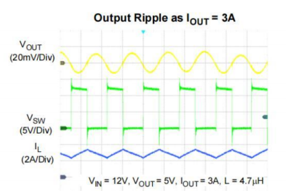

PSM模式:Pulse Skip Modulation，**脉冲跨周期调制**，脉冲时有时无，也叫突发模式(频率是根据负载变化的）
PFM模式:Pulse Frequency Modulation，**脉冲频率调制**，开关电源的开关频率变的非常低(后2种模式大部分时间电感中电流都为0，属于DCM)
下图为PSM模式工作波形，深蓝色为电感波形，可见电流是不连续变化的，大部分时间电流恒定为0;SW频率很低，等效几十kHz;**纹波较大**。

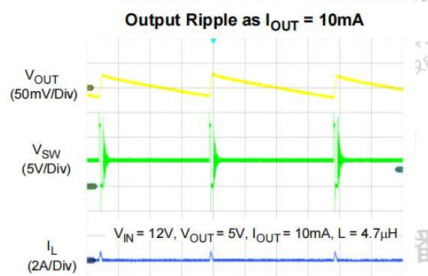

下图为FCCM(左)与PSM(右)效率对比，可见输出电流较低时，FCCM模式效率明显低多(例如12V输入，1.8V输出，0.1A负载时，FCCM模式效率约55%%，PSM模式效率约73%);重载时右图中芯片会自动切到FCCM。

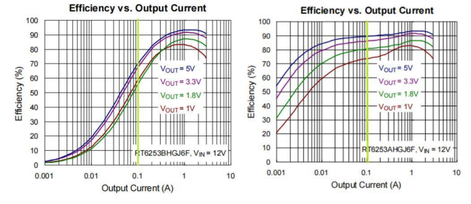

**FCCM模式**
优点是:满载效率高，控制简单-成本低，响应快，纹波小，工作频率固定，EMI频段固定
缺点是:功耗高，轻载时芯片和电感中仍有电流，效率低(这部分会转换为热效应)

**PSM/PFM轻载高效模式**
优点:空载/轻载时效率高
缺点:控制复杂-芯片成本高，响应慢，纹波大;等效工作频率和负载挂钩，会变化，可能引发啸叫/EMI 问题，目前很多电源芯片，会自动切换模式，轻载时PSM/PFM模式，重载时切换到FCCM模式


## 运放基本电路

### 虚短

虚短:指运放处于负反馈(即输出通过电阻接回反相输入IN-引脚)的线性放大状态时(大多数运放电路都工作在此状态)，**理想运放的同相输入IN+和反相输入IN-引脚可以认为是等电位的，故称为“虚短(路)”。**理想运放与运放设计计算时一般可以认为VIN+=VIN-;实际运放芯片的VIN+和VIN-间有电压差**“输入失调电压Vos"**，一般为mV级别，部分高精密度运放可达uV级。

### 虚断

虚断:指运放的同相输入IN+和反相输入IN-引脚**输入阻抗非常大**，故引脚的输入电流非常小，对于理想运放计算时可认为**流入同相输入IN+和反相IN-引脚的电流为0**，IN+ - IN- = 0故称为“虚断”。实际运放芯片的同相输入IN+和反相输入IN-引脚会有电流流入，称为“输入偏置电流I”和“输入失调电流Ios”般为nA~uA级别。

### 虚地

虚地:若同相输入IN+和反相IN-其中任一引脚(通过电阻)接地，通过“虚断”引脚电流为0可得接地引脚的电压为0，再根据“虚短”，Vin+=Vin-.，可得两个输入引脚电压都为0，等同于接在GND上，故称为“虚地”。

### 运放基本电路

#### 同相电压跟随器

#### 同相比例放大器

#### 反相比例放大电路

#### 减法电路

